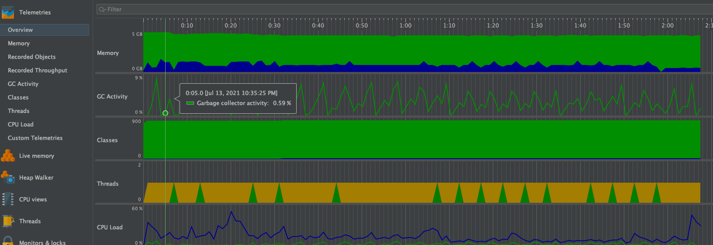
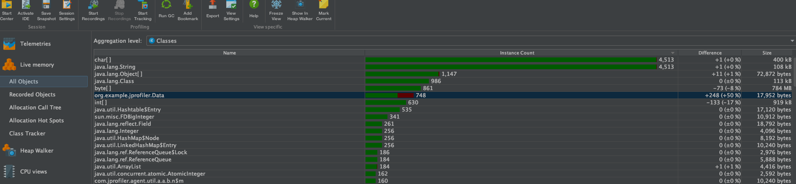

## 代码

```java
public class JProfilerTest {
    public static void main(String[] args) throws InterruptedException {
        while (true){
            ArrayList list = new ArrayList();
            for (int i = 0; i < 500; i++) {
                Data data = new Data();
                list.add(data);
            }
            TimeUnit.MILLISECONDS.sleep(500);
        }
    }
}
class Data{
    private int size=10;
    private byte[] buffer = new byte[1024*1024];//1mb
    private String info = "hello world";
}
```

> 执行一次while循环，list会进行销毁。

## VM参数配置

```bash
-Xms5000m -Xmx5000m -XX:+HeapDumpOnOutOfMemoryError -XX:HeapDumpPath=/Users/mac/auto.hprof
```


## 遥感监测



> 如上图，随着gc的执行，内存有增有减，并没有持续增长。这样就比较良性


## 内存分析



> 在执行gc胡Data对象增长的实例个数全部被回收，并没有持续增长，很良性 