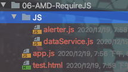

## 作用

* 代码解耦、高可用、高维护  
* 代码复用、按需加载
* 降低代码复杂度

## 进化史

1. 所有的js代码写在一块

	> Global被污染，命名冲突，阅读性极差

2. 简单对象封装--命名空间模式/全局函数模式

	> 减少了Global上的变量数目，但由于是对象可以通过obj.属性操作，一点都不安全

	* 全局函数模式

		```javascript
		//module1.js
		// 全局函数模式、将不同的功能封装成不同的全局函数
		let msg="module1"
		
		function foo(){
		    console.log("foo()",msg);
		}
		
		function bar() {
		    console.log("bar()",msg);
		}
		```

		```html
		//test1.html
		<script type="text/javascript" src="module1.js"></script>
		<script>
		foo();
		bar();
		// 修改全局变量 msg 引发不安全问题
		msg="update";
		foo()
		bar()
		</script>
		```

		

	* 命名空间模式

		```javascript
		// module2.js
		// 命名空间模式、使用对象进行简单封装
		
		let obj={
		    msg:'module2',
		    foo(){
		        console.log("foo()",this.msg);
		    }
		}
		```

		```html
		<script type="text/javascript" src="module2.js"></script>
		<script>
		obj.foo();
		// 修改全局变量 msg 引发不安全问题
		obj.msg="update";
		obj.foo();
		</script>
		```

		

		

3. 匿名闭包：IIFE模式

	> 函数式JavaScript唯一的local scope 

	```javascript
	// IIFE、匿名函数自调用-闭包
	
	// (function () {
	//     let msg="module3";
	//     function foo() {
	//         console.log("foo()",msg);
	//     }
	// })()
	
	// 上面形式：外部访问不到里面的属性msg和函数foo
	(function (window) {
	    let msg="module3";
	    function foo() {
	        console.log("foo()",msg);
	    }
	    window.module3={foo:foo()}//给window对象挂载module3属性
	})(window)
	// 上面形式：访问可通过module3.foo();
	
	```

	```html
	<script type="text/javascript" src="module3.js"></script>
	<script>
	foo();//直接调用访问不到，window对象上并没有foo()函数
	module3.foo();
	</script>
	```

	

4. 在匿名闭包基础上引入依赖: 模块模式

	> 例如 Jquery就是将window全局对象引入操作后返回。

	```javascript
	// IIFE增强、引入依赖 这里使用jQuery
	
	(function (window,$) {
	    let msg="module3";
	    function foo() {
	        console.log("foo()",msg);
	    }
	    window.module4=foo; //module4属性直接指向函数foo
	    $('body').css('background','red');//修改页面背景色
	})(window,jQuery);
	
	
	```

	```html
	<script type="text/javascript" src="jQuery2.24.js"></script>
	<script type="text/javascript" src="module4.js"></script>
	<script>
	module4;
	</script>
	```

## 带来的问题

* js文件数据增多，导致请求次数骤增
* 依赖模糊，比如jQuery和第三方库
* 难以维护

> 如何解决上诉问题，引出模块化开发规范。


## 模块化规范

* CommonJS 

  > node在使用的一个规范

  `说明：`

  * 每个文件都可当做一个模块 , 所有的代码都运行在模块作用域，不会污染全局作用域
  * 在服务器端：模块的加载是`运行时同步加载`的.对于服务端来说没有问题。
  * 在浏览器端：模块需要提前编译打包处理、因为有很多语法浏览器不识别，需要转换成浏览器识别语法
  * 在浏览器端：CommonJS不适用于浏览器端、因为它没有BOM和DOM。详情参看： <a>MD-Book\NodeJS\第二章-介绍.md </a>
  * 模块可以多次加载，但是只会在第一次加载时运行一次，`然后运行的结果就会被缓存了，以后再加载就直接读取缓存结果。要想让模块继续运行，必须清空缓存`
  * 模块加载顺序，按照其在代码中出现的顺序；

  `基本语法`

  * 暴露模块

  	1. module.exports = value

  	2. exports.xxx = value

  		> 暴露的本质：都是暴露exports

  * 引入模块

  	1. 自定义模块

  		require(xxx) xxx为==模块文件路径==

  	2. 第三方模块

  		require(xxx) xxx为==模块名==

  `实现`

  * 服务端实现者

  	1. Node.js   http://nodejs.cn/

  	2. 实现步骤

  		* 创建文件

  			

  		* 在05-CommonJS-Node目录下使用npm安装uniq第三方模块

  			```bash
  			npm install uniq
  			```

  		* 编写文件

  			```javascript
  			//module1.js
  			// modeule.exports = obj 暴露一个对象
  			module.exports = {
  			    msg: 'module1',
  			    foo() {
  			        console.log("foo()",this.msg);
  			    }
  			}
  			//module2.js
  			// modeule.exports = function(){} 暴露一个函数
  			module.exports = function () {
  			    console.log("function()",'module2');
  			}
  			//会覆盖上面的内容
  			module.exports = function () {
  			    console.log("function()",'module2-update');
  			}
  			//module3.js
  			// exports.xxx = value
  			exports.foo = function () {
  			    console.log("f00()",'module3');
  			}
  			
  			exports.bar = function () {
  			    console.log("bar()",'module3');
  			}
  			```

  			```javascript
  			//app.js
  			let module1=require('./modules/module1')
  			let module2=require('./modules/module2')
  			let module3=require('./modules/module3')
  			
  			//使用module1
  			console.log(module1.msg);
  			module1.foo();
  			//使用module2
  			module2();
  			//使用module3
  			module3.foo();
  			module3.bar();
  			```

  		* 执行app.js

  			```bash
  			node app.js
  			```

  			

  		* 使用第三方依赖uniq

  			```javascript
  			//module3.js
  			// exports.xxx = value
  			exports.foo = function () {
  			    console.log("f00()",'module3');
  			}
  			
  			exports.bar = function () {
  			    console.log("bar()",'module3');
  			}
  			//新增变量
  			exports.arr=['1','4','5','1','4','9','5'];
  			```

  			```javascript
  			//app.js
  			//引入第三方模块
  			let uniq = require('uniq')
  			let module1=require('./modules/module1')
  			let module2=require('./modules/module2')
  			let module3=require('./modules/module3')
  			
  			//使用module1
  			console.log(module1.msg);
  			module1.foo();
  			//使用module2
  			module2();
  			//使用module3
  			module3.foo();
  			module3.bar();
  			//使用第三方模块
  			let result=uniq(module3.arr);
  			console.log(result);
  			```

  			

  * 浏览器端使用

  	1. Browserify 打包工具：http://browserify.org/（通常用于Node.js的）==commonjs模块打包为可以在浏览器中使用==。

  	2. 实现步骤

  		* 下载browserify 

  			```bash
  			npm install browserify --save-dev    //局部下载
  			```

  		* 给上面使用commonjs模块的05-CommonJS-Node工程打包js

  			```bash
  			node_modules/.bin/browserify app.js -o ./target/build.js
  			```

  			> 使用命令时需要加上browserify安装路径，否则提示无效命令。

  			

  	

* AMD   - - RequireJS

  `说明：`

  * 专门针对浏览器端，模块的加载都是`异步`的、解决CommonJS偏重`服务端并且同步加载`问题: 因为模块都放在服务器端，等待时间取决于网速的快慢，可能要等很长时间，浏览器处于"假死"状态。
  *  它采用异步方式加载模块，模块的加载不影响它后面语句的运行。`所有依赖这个模块的语句，都定义在一个回调函数中，等到加载完成之后，这个回调函数才会运行`。

  `基本语法`

  * 暴露模块

  	```javascript
  	// 暴露没有依赖的模块
  	define(function({
  		return 模块
  	}))
  	//暴露有依赖的模块
  	define(['module1','module2'],function(m1,m2){
  	  return 模块
  	})
  	```

  * 引入模块

  	```javascript
  	require['module1','module2'],function(m1,m2){
  	  使用m1/m2
  	})
  	```

  `实现`

  * 无规范(RequireJS)实现

  	1. 新建如下文件

  		

  	2. 编写文件

  		```javascript
  		//dataService.js
  		//定义一个没有依赖的模块
  		(function (window) {
  		    let name="dataService.js";
  		    function getName() {
  		        return name;
  		    }
  		    window.dataService={getName};
  		})(window)
  		
  		//alerter.js
  		//定义一个有依赖的模块:依赖dataService.js
  		(function (window,dataService) {
  		    let name="alerter.js";
  		    function showMsg() {
  		        console.log(name,"依赖>>" + dataService.getName())
  		    }
  		    window.alerter={showMsg};
  		})(window,dataService)
  		
  		//app.js
  		//主模块
  		(function (alerter) {
  		    alerter.showMsg();
  		})(alerter)
  		
  		```

  		```html
  		<!DOCTYPE html>
  		<html lang="en">
  		<head>
  		    <meta charset="UTF-8">
  		    <title>Title</title>
  		</head>
  		<body>
  		<!--注意先后顺序-->
  		<script type="text/javascript" src="./JS/dataService.js"></script>
  		<script type="text/javascript" src="./JS/alerter.js"></script>
  		<script type="text/javascript" src="./app.js"></script>
  		
  		</body>
  		</html>
  		```

  	3. 结果

  		

  * 使用规范(RequireJS)实现

  	1. 创建文件

  		

  	2. 编辑文件

  		```javascript
  		//require.js
  		百度下载即可
  		
  		//jquery-3.5.1.js
  		百度下载即可
  		
  		//dataService.js
  		//定义一个没有依赖的模块
  		define(function () {
  		    let name='dataService.js';
  		    function getName() {
  		        return name;
  		    }
  		    //暴露模块
  		    return {getName};
  		})
  		
  		//alerter.js
  		//定义一个有依赖的模块:依赖dataService.js和第三方模块jQuery
  		//定义一个有依赖的模块:依赖dataService.js
  		define(['dataService','jquery'],function (dataService,$) {
  		    let msg='alerter.js';
  		    function showMsg() {
  		        console.log(msg,dataService.getName());
  		    }
  		    $('body').css('background','red');
  		    //暴露模块
  		    return {showMsg};
  		})
  		
  		
  		//main.js
  		(function () {
  		    requirejs.config({
  		        // baseUrl: 'js/libs',//基本路径,省掉页面js模块先后引入
  		        paths: { //当解析模块文件发现依赖模块则在该配置中寻找
  		            dataService: './modules/dataService',
  		            alerter: './modules/alerter',
  		            jquery: './libs/jquery-3.5.1'//jquery遇到AMD规范必须使用小写jquery，因为jQuery默认支持AMD
  		        }
  		    })
  		    requirejs(['alerter'],function (alerter) {
  		        alerter.showMsg();
  		    })
  		})()
  		
  		```

  		```html
  		<!DOCTYPE html>
  		<html lang="en">
  		<head>
  		    <meta charset="UTF-8">
  		    <title>Title</title>
  		</head>
  		<body>
  		<!--引入require.js 并指定js主文件的入口-->
  		<script data-main="js/main.js" src="js/libs/require.js"></script>
  		</body>
  		</html>
  		
  		```

  		

* CMD

	> 阿里云规范，可忽略

* ES6

	`说明：`

	* 依赖模块需要编译打包处理。
	
	* 应用最广泛
	
	*  ES6 在语言标准的层面上，实现了模块功能，而且实现得相当简单，完全可以取代 CommonJS 和 AMD 规范，成为`浏览器和服务器`通用的模块解决方案。 
	
	* ES6 模块化`采用静态编译`，使得编译时就能确定模块的依赖关系，以及输入和输出的变量。CommonJS 和 AMD 模块，都只能在运行时确定这些东西。 例如：ES6可以只加载特定模块中需要的的函数。而CommonJS和AMD全部导入后获取需要的函数。
	
	* ES6`export`语句输出的接口，与其对应的值是动态绑定关系，即通过该接口，可以取到模块内部的值。 当内部的值发生变化后，对应的接口也会变化
	
	  ```javascript
	  export var foo = 'bar';
	  setTimeout(() => foo = 'baz', 500);
	  ```
	
	  > 上面代码输出变量`foo`，值为`bar`，500 毫秒之后变成`baz`。`与CommonJS完全不同，CommonJS输出接口是值的缓冲`。ES6对应Java中的`引用传递`而CommonJS对应Java中的`值传递`

`基本语法`
	
* 暴露模块
	
	```javascript
	export
	```
	```javascript
	export default
	// export-default.js
	export default function () {
	  console.log('foo');
	}
	
	`` 其他模块加载该模块时，import命令可以为该匿名函数指定任意名字。
	
	// import-default.js
	import customName from './export-default';
	customName(); // 'foo'
	```
	
* 引入模块
	
	```javascript
	import
	~~~ import命令输入的`变量`都是只读的，因为它的本质是输入接口。也就是说，不允许在加载模块的脚本里面，改写接口变量。`而如果导入对象则修改对象属性是可以的`
	```
	```javascript
	import * as circle from './circle';
	~~~ 整体导入
	```

`实现`
	

* 浏览器端
	
	1. 使用Babel将ES6编译为ES5代码(下面支持情况并不是完全百分之百支持！)
	
			| Browser | Version | Date     |
			| ------- | ------- | -------- |
			| Chrome  | 58      | Apr 2017 |
			| Firefox | 54      | Jun 2017 |
			| Edge    | 14      | Aug 2016 |
			| Safari  | 10      | Sep 2016 |
		| Opera   | 55      | Aug 2017 |
	
	2. 使用Browserify编译打包js
	
		
	

`实现步骤`
	
1. 创建文件
	
	
	
2. 编辑文件
	
	```javascript
	//.babelrc  
	{
	  "presets": ["es2015"]
	}
	
	//package.json
	{
	  "name": "08-ES6-Babel-Browerify",
	  "version": "1.0.0",
	}
	
	//module1.js 
	// 暴露模块   分别暴露
	export function foo() {
	    console.log("foo() module1");
	}
	
	export function bar() {
	    console.log("foo() module1");
	}
	
	export let arr = [1,5,3,9];
	  
	//module2.js
	// 暴露模块   统一暴露
	function foo() {
	    console.log("foo() modul2");
	}
	
	function bar() {
	    console.log("foo() module2");
	}
	
	let arr = [1,5,3,9,6];
	
	export {foo,bar,arr};
	```
	
	```javascript
	//main.js
	//引入其他模块
	// import module1 from './module1';
	// import module2 from './module2';
	// console.log(module1,module2);
	
	//如果使用上面方式，则无法使用module1和module2中任何数据。必须使用解构赋值方式进行获取
	import {foo,bar,arr} from './module1';
	import {foo2,bar2,arr2} from './module2';
	
	foo();
	bar();
	console.log(arr);
	
	foo2();
	bar2();
	console.log(arr2);
	```
	```html
	//index.html
	<!DOCTYPE html>
	<html lang="en">
	<head>
	<meta charset="UTF-8">
	<title>Title</title>
	</head>
	<body>
	<script type="text/javascript" src="./modules/main.js"></script>
	
	</body>
	
	</html>
	```
	
3. 安装babel-cli、babel-preset-es2015和browserify
	
	```bash
	npm install babel-cli browserify
	npm install babel-preset-es2015 --save-dev
	```
	
4. 运行index.html
	
	> 浏览器提示：main.js:2 Uncaught SyntaxError: Cannot use import statement outside a module
	
5. 使用Babel将ES6转ES5

   ```bash
   node_modules/.bin/babel modules -d modules/build # 将modules下所有js都转化到modules/build目录下
   ```
   

6. 使用browserify将es5语法js文件打包为浏览器可识别js

   ```bash
   node_modules/.bin/browserify modules/build/main.js -o ./modules/target/build.js
   ```

7. 修改index.html 为打包后的build.js

   ```html
   <script type="text/javascript" src="./modules/target/build.js"></script>
   ```

8. 执行

  

9. 使用module1和module2需要用到解构赋值方式，有没有其他方式更轻松方式获取模块中数据？使用默认暴露模式

  * 编辑module3.js

    ```javascript
    //暴露模块  默认暴露：暴露什么数据就收到什么数据并且只能暴露一次
    //语法 export default value;
    export default {
        msg:'我是默认暴露',
        foo(){
            console.log(this.msg);
        }
    }
    ```

  * main.js新增

    ```javascript
    import module3 from './module3';
    module3.foo();
    ```

  * 重新==转化==、==编辑打包==结果如下:

	


  	

10. 如何使用第三方依赖呢？

   * 下载第三放模块 这里使用jQuery

     ```bash
     npm install jquery@1.12.4
     ```

   * 在main.js中新增

     ```javascript
     import $ from 'jquery'
     $('body').css('background','green')
     ```

   * 重新==转化==、==编辑打包==结果如下:

   	
   	
   	​	

## Babel

 [Babel](https://babeljs.io/) 是一个广泛使用的 ES6 转码器，可以将 ES6 代码转为 ES5 代码，从而在老版本的浏览器执行。这意味着，你可以用 ES6 的方式编写程序，又不用担心现有环境是否支持。 

### 配置文件.babelrc

Babel 的配置文件是`.babelrc`，存放在项目的根目录下。使用 Babel 的第一步，就是配置这个文件。

该文件用来设置转码规则和插件，基本格式如下。

```javascript
{
  "presets": [],
  "plugins": []
}
```

`presets`字段设定转码规则，官方提供以下的规则集，你可以根据需要安装。

```bash
# 最新转码规则
$ npm install --save-dev @babel/preset-env

# react 转码规则
$ npm install --save-dev @babel/preset-react
```

然后，将这些规则加入`.babelrc`。

```javascript
  {
    "presets": [
      "@babel/env",
      "@babel/preset-react"
    ],
    "plugins": []
  }
```

注意，以下所有 Babel 工具和模块的使用，都必须先写好`.babelrc`。


* Babel 也可以用于浏览器环境，使用[@babel/standalone](https://babeljs.io/docs/en/next/babel-standalone.html)模块提供的浏览器版本，将其插入网页。

  ```html
  <script src="https://unpkg.com/@babel/standalone/babel.min.js"></script>
  <script type="text/babel">
  // Your ES6 code
  </script>
  ```

  > 注意，网页实时将 ES6 代码转为 ES5，对性能会有影响。生产环境需要加载已经转码完成的脚本