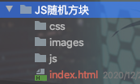
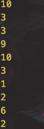
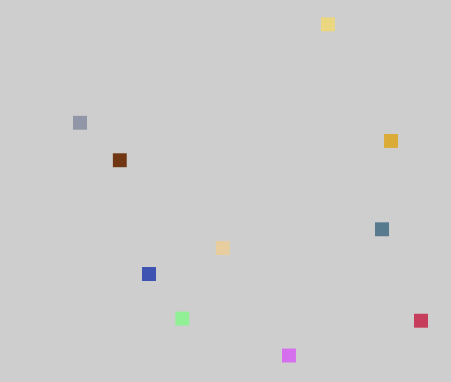

## 随机方块

### 1、项目目录



### 2、思路

​	对象：方块

​	工具类：随机数生成

### 3、实现

1. 首页

	```html
	<!DOCTYPE html>
	<html lang="en">
	<head>
	    <meta charset="UTF-8">
	    <title>Title</title>
	    <link rel="stylesheet" href="css/style.css"></link>
	</head>
	<body>
	    <div id="container">
	
	    </div>
	</body>
	</html>
	```

2. css

	```css
	#container{
	    width: 800px;
	    height: 600px;
	    background-color: lightgray;
	    position: relative;
	}
	```

3. 工具类-randomUtil.js

	```javascript
	//todo 使用字面量来创建工具类对象
	let randomUtil={
	    getRandomIntInclusive:function (min,max) {
	        min = Math.ceil(min);
	        max = Math.floor(max);
	        return Math.floor(Math.random() * (max - min + 1) + min); //The maximum is inclusive and the minimum is inclusive
	    }
	}
	```

4. 工具类-test.js

	```javascript
	for(var i=0;i<10;i++){
	    console.log(randomUtil.getRandomIntInclusive(1, 10));
	}
	```

	

5. 方块对象-box.js

	```javascript
	function Box(parent,options) {//父节点、参数对象
	    options=options || {};
	    //属性
	    this.name=options.name || "demo";
	    this.width=options.width || "20";
	    this.height=options.height || "20";
	    this.x=options.x || "0";
	    this.y=options.y || "0";
	    this.background_color=options.background_color || "blue";
	
	    //创建div
	    this.div=document.createElement('div');
	    parent.appendChild(this.div);
			this.parent=parent;
	  
	    this.init();
	}
	//初始化
	Box.prototype.init=function () {
	    var div=this.div;
	    div.style.backgroundColor=this.background_color;
	    div.style.width=this.width+'px';
	    div.style.height=this.height+'px';
	    div.style.left=this.x+'px';
	    div.style.top=this.y+'px';
	
	    //脱离文档流
	    div.style.position='absolute'
	}
	
	```


6. 首页引入

	```html
	<script type="text/javascript" src="./js/randomUtil.js"></script>
	<script type="text/javascript" src="./js/box.js"></script>
	<script>
	    let box=new Box(document.getElementById("container"));
	    box.init();
	</script>
	```

	


7. 方块对象新增随机位置生成

	```javascript
	//随机生成方块位置
	Box.prototype.random=function () {
	    let x=randomUtil.getRandomIntInclusive(0,this.parent.offsetWidth-this.width) ;
	    let y=randomUtil.getRandomIntInclusive(0,this.parent.offsetHeight-this.height) ;
	    this.div.style.left=x+'px';
	    this.div.style.top=y+'px';
	}
	```

8. 首页调用

	```javascript
	<script>
	<script>
	    for (var i=0;i<10;i++){
	        let r=randomUtil.getRandomIntInclusive(0,255);
	        let g=randomUtil.getRandomIntInclusive(0,255);
	        let b=randomUtil.getRandomIntInclusive(0,255);
	
	
	        let box=new Box(document.getElementById("container"),{
	            background_color:'rgb('+r+','+g+','+b+')'
	        });
	        box.init();
	        box.random();
	    }
	</script>
	</script>
	```

	

9. 定时器执行

	```javascript
	<script>
	    var array=[];
	    for (var i=0;i<10;i++){
	        let r=randomUtil.getRandomIntInclusive(0,255);
	        let g=randomUtil.getRandomIntInclusive(0,255);
	        let b=randomUtil.getRandomIntInclusive(0,255);
	
	
	        let box=new Box(document.getElementById("container"),{
	            background_color:'rgb('+r+','+g+','+b+')'
	        });
	        box.init();
	        array.push(box);
	    }
	    setInterval(function () {
	        for (var i=0;i<array.length;i++){
	            var box=array[i];
	            box.random();
	        }
	    },500);
	</script>
	```


## 模块化实现