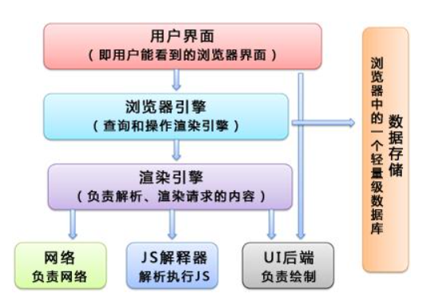

## JS单线程和浏览器多线程



*   浏览器是多进程的其中有`网络线程`,`js解析器线程`,`渲染线程`等等。
*   js代码的解析工作全由`js解析器线程`负责。


## JS异步编程

JS是单线程同步执行的，即所有的任务只能一个一个去处理，如果某一个任务耗时很长，那么浏览器就会处于假死状态。

为了解决这个问题，JavaScript将任务的执行模式分类`同步模式`和`异步模式`

`异步模式`

异步模式中每个任务都有一个或多个回调函数，前一个任务结束后不是执行后一个任务，而是执行回调函数。

*    回调函数： 

    ```javascript
    f1();
    f2();
    
    function f1(callback){
        setTimeout(function(){
            callback();
        })
    }
    
    f1(f2);
    ```

    

