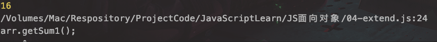

## 扩展内置对象

`原因：`

> JS内置对象中方法不足时。可以在对象原型上添加方法予以补充

`作用域：`

> 全局。但是使用前必须扩充方法已添加到原型对象上

`代码：`

```JavaScript
// JS内置对象中方法不足时。可以在对象原型上添加方法予以补充
// let arr=[1,8,6,2,9];

Array.prototype.getSum=function () {
    let result=0;
    for (var i=0;i<this.length;i++){
        if (this[i]%2===0){
            result+=this[i];
        }
    }
    return result;
}
let arr=[1,8,6,2,9]; //放置前后无关系
console.log(arr.getSum());
// 此种形式会替换内置对象的所有方法，但是Array对象有限制：不得替换只能添加。
Array.prototype={
    getSum1:function () {
        console.log("getSum1()");
    },
    getSum2:function () {
        console.log("getSum2()");
    }
}
arr.getSum1();
arr.getSum2();
```



