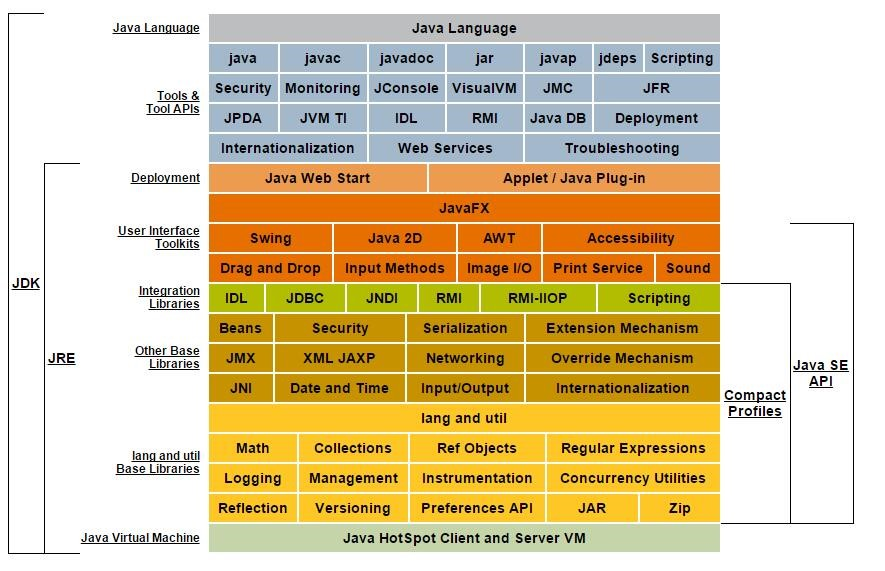

## Java两种和新机制
1. Java虚拟机(Java Virtal Machine)
        JVM是一个虚拟的计算机，具有指令集并使用不同的存储区域。负责执行指令，管理数据、内存、寄存器。
        对于不同的平台，有不同的虚拟机。
        Java虚拟机机制屏蔽了底层运行平台的差别，实现了“一次编译，到处运行”
2. 垃圾收集机制  (Garbage Collection)
        不再使用的内存空间应回收—— 垃圾回收。
        在C/C++等语言中，由程序员负责回收无用内存。
        Java 语言消除了程序员回收无用内存空间的责任：它提供一种系统级线程跟踪存储空间的分配情况。并在JVM空闲时，检查并释放那些可被释放的存储空间。垃圾回收在Java程序运行过程中自动进行，程序员无法精确控制和干预

> 什么是jdk？
>> JDK是提供给Java开发人员使用的，其中包含了java的开发工具，也包括了JRE。所以安装了JDK，就不用在单独安装JRE了。
其中的开发工具：编译工具(javac.exe)  打包工具(jar.exe)等

> 什么是jre？
>> 包括Java虚拟机(JVM Java Virtual Machine)和Java程序所需的核心类库等，如果想要运行一个开发好的Java程序，计算机中只需要安装JRE即可。

    简单而言，使用JDK的开发工具完成的java程序，交给JRE去运行。

## jdk、jre和jvm关系图：

    JDK=jre+开发工具集(javac、jar等)
    jre=jvm+java se标准类库

## 注释

1. 单行注释

        格式： //注释文字

2. 多行注释

        格式： 	/*  注释文字 */

3. 文档注释

        格式：/**
	   	    * @author  指定java程序的作者
	 	      * @version  指定源文件的版本
	           *
	           */
