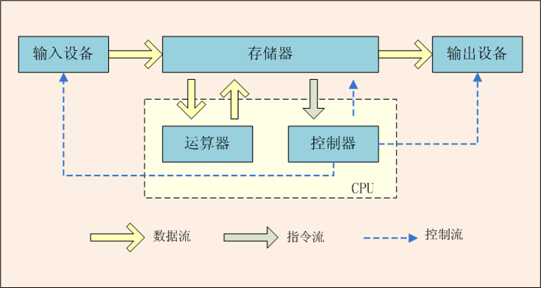

## 计算机硬件

### 中央处理器

中央处理器(Central Processing Unit,CPU)是计算机的大脑。它从内存中获取指令，然后执行这些指令。

包含了<code>控制单元</code> 和<code>算数/逻辑单元</code>。
1. 控制单元
        用于控制和协调其他组件的动作,向输入、输出以及存储器发出控制流并接受存储器指令流。
2. 算数/逻辑单元
        用于完成数值运算(+、-、*、/)和逻辑运算(比较)，向存储器接受和发出都是数据流。

**CPU性能**：
1. 每台计算机都有一个内部时钟，该时钟以固定速度发射电子脉冲。时钟速度越快，在给定的时间段内执行的指令就越多。速度的计量单位是赫兹(Hz)，1Hz相当于每秒1个脉冲。随着CPU速度不断提高，目前以千兆赫(GHz)也叫主频来表述

2. 多核

### 比特(bit)和字节(byte)

>数据是如何在计算机中存储的？
>>1. 计算机就是一系列的电路开关。每个开关存在两种状态：关(off)和开(on)。如果电路是开的，它的值是1。如果电路是关的，它的值是0。
>>2. 一个0或者一个1存储为一个比特(bit)。
>>3. 计算机中字节(byte)是最基本的存储单元，每个字节由8个比特构成。
>>4. 计算机的存储能力是以字节和多字节来衡量的。如下：
>>          千字节(kilobyte,KB)  = 1024B
>>          兆字节(megabyte,MB) = 1024KB
>>          千兆字节(gigabyte,GB) = 1024MB
>>          万亿字节(terabyte,TB) = 1024GB

### 内存

* 内存(也叫 Random-Access Memory,RAM)：由一个有序的字节序列组成，用于存储程序及程序需要的数据。

* 一个程序和它的数据在被CPU执行前必须移到计算机的内存中。

* 每个字节都有一个唯一的地址即<code>内存地址</code>。使用这个地址确定字节的位置，以便于存储和获取数据。

### 存储设备

>为何需要存储设备？
  >>内存中的信息在断电时会丢失。那我们可以考虑将程序和数据永久的保存在存储设备上。当计算机确实需要这些数据时，再移入内存，因为从内存中读取比从存储设备读取要快得多。

  存储设备主要有以下三种：
  1. 磁盘驱动器
          每台计算机至少有一个硬盘驱动器。硬盘(hard disk)用于永久的保存数据和程序。
  2. 光盘驱动器(CD和DVD)
          CD的容量可达700MB。DVD的容量可达4.7GB。
  3. USB闪存驱动器
          USB: Universal Serial  Bus，通用串行总线。

          可以使用USB将打印机、数码相机、鼠标、外部硬盘驱动器连接到计算机上。

          USB闪存驱动器很小，可用于存储和传输数据的设备。

### 输入和输出设备

  1. 输入设备
          键盘（keyboard）和鼠标（mouse）
  2. 输出设备
          显示器（monitor）和打印机（printer）

### 通信设备

计算机可以通过通信设备进行联网。常见设备有：

1. 拨号调制解调器：使用的是电话线，传输速度可达56 000bps(bps:每秒比特)
2. DSL（数字用户线）：使用的也是电话线，但传输速度叫上面的快20倍
3. 电缆调制解调器：利用有线电视电缆进行数据传输，通常速度比DSL快。
4. 网络接口卡（NIC）：将计算机接入局域网（LAN）的设备。局域网通常用于大学、商业组织和政府组织。速度甚至可达1000Mbps
5. 无线网络：在家庭、商业和学校中极其常见。计算机可通过无线适配器连接到局域网或internet上。

### 计算机编程语言

1. 第一代语言
        机器语言。指令以二进制代码形式存在。
2. 第二代语言
        汇编语言。使用助记符表示一条机器指令。
3. 第三代语言：高级语言
        C、Pascal、Fortran面向过程的语言

        C++面向过程/面向对象

        Java跨平台的纯面向对象的语言

        .NET跨语言的平台
        。。。
