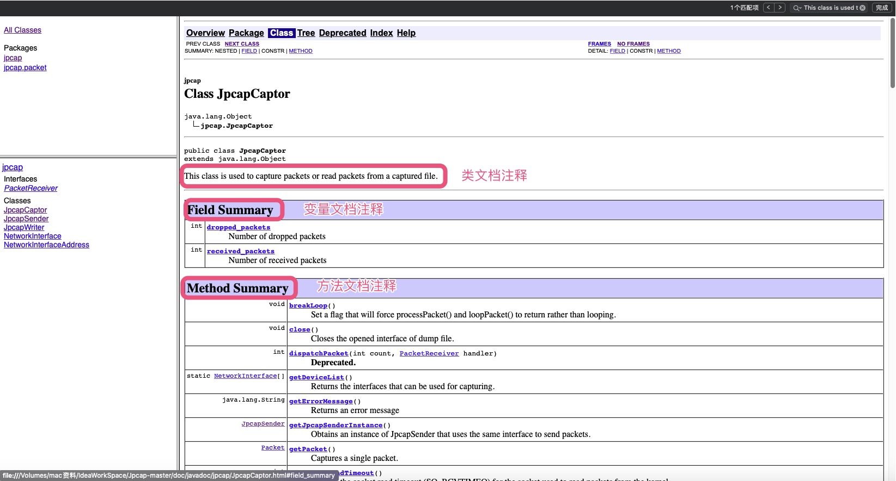

## 注释文档

### 作用
    文档注释负责描述类、接口、方法、构造器、成员属性。可被JDK提供的工具 javadoc 所解析，自动生成一套以网页文件形式体现该程序说明文档的注释。
    简单的来说，就是为自己的代码或项目生成类似JDK API的使用文档，方便日后的维护和他人的接管。

### 使用

1. 第一步：在类和方法以及变量前使用文档注释`/***/`申明
```java
package java.lang;
/**
 * Opens the specified network interface, and returns an instance of this class.
 * @author kfujii
 * @param intrface The network interface to capture packets
 * @param snaplen  Max number of bytes captured at once
 * @param promisc  If true, the inferface becomes promiscuous mode
 * @param to_ms    Timeout of
 *                 {@link #processPacket(int, PacketReceiver) processPacket()}.
 *                 Not all platforms support a timeout; on platforms that don't,
 *                 the timeout is ignored.
 *                 On platforms that support a timeout, a zero value will cause Jpcap
 *                 to wait forever to allow enough packets to arrive, with no timeout.
 * @return an instance of this class Jpcap.
 * @throws java.io.IOException Raised when the specified interface cannot be opened
 */
 public static JpcapCaptor openDevice(NetworkInterface intrface,int snaplen, boolean promisc, int to_ms) throws java.io.IOException {}
```
    在注释中出现以@开头的东东被称之为Javadoc文档标记，是JDK定义好的如@author、@version、@since、@see、@link、@code、@param、@return、@exception、@throws等,下面会做详细介绍。
2. 第二步：使用工具提取文档注释中的内容即可
<code><font color=#ff85c0>工具：</font></code>Javadoc命令或者idea中tools> >Generate Javadoc

3. 第三步：效果图


### Javadoc文档标记

1. <font size='5'>@link</font>：{@link 包名.类名#方法名(参数类型)} 用于快速链接到相关代码
<code><font color=#ff85c0>@link</font></code>的使用语法{@link 包名.类名#方法名(参数类型)}，其中当包名在当前类中已经导入了包名可以省略，可以只是一个类名，也可以是仅仅是一个方法名，也可以是类名.方法名，使用此文档标记的类或者方法，点击即可跳转到标记处，相当于HTML中的锚
  ```java
  /**
   * Updates {@link #received_packets received_packets} and
   * {@link #dropped_packets dropped_packets}.
   */
  public native void updateStat();
  ```

2. <font size='5'>@code</font>： {@code text} 将文本标记为code
<code><font color=#ff85c0>@code</font></code>的使用语法{@code text} 会被解析成代码片段
将文本标记为代码样式的文本，在code内部可以使用 < 、> 等不会被解释成html标签, code标签有自己的样式

        一般在Javadoc中只要涉及到类名或者方法名，都需要使用@code进行标记。
3. <font size='5'>文档说明</font>
Javadoc可以解析HTML标签，通常对类方法或变量进行说明都以段落p标签开始。如<a href='#diyibu'>第一步</a>`Opens the specified network interface, and returns an instance of this class.`对方法进行说明表明其目的。

4. <font size='5'>@param</font>
一般类中支持泛型时会通过<code><font color=#ff85c0>@param</font></code>来解释泛型的类型或者对方法参数进行说明
```java
/**
 * Analyzes a packet.<BR>
 * <BR>
 * This method is called everytime a packet is captured.
 *
 * @param p A packet to be analyzed
 */
public void receivePacket(Packet p);
```
5. <font size='5'>@author</font>
类前面一般使用@author来标记作者，如果一个文件有多个作者来维护就标记多个<code><font color=#ff85c0>@author</font></code>，<code><font color=#ff85c0>@author</font></code>后面可以跟作者姓名(也可以附带邮箱地址)、组织名称(也可以附带组织官网地址)
```java
/**
 * This class represents a network interface.
 *
 * @author kfujii
 */
public class NetworkInterface {}
```
6. <font size='5'>@see 另请参阅</font>
<code><font color=#ff85c0>@see</font></code> 一般用于标记该类相关联的类,@see即可以用在类上，也可以用在方法中有对象参数时。
```java
/**
 * Number of received packets
 *
 * @see #updateStat()
 */
public int received_packets;
```
7. <font size='5'>@since 从以下版本开始</font>
<code><font color=#ff85c0>@since</font></code> 一般用于标记文件创建时项目当时对应的版本，一般后面跟版本号，也可以跟是一个时间，表示文件当前创建的时间
```java
package java.util.stream;

/**
* @since 1.8
*/
public interface Stream<T> extends BaseStream<T, Stream<T>> {}

```
8. <font size='5'>@version 版本</font>
<code><font color=#ff85c0>@version</font></code>用于标记当前版本，默认为1.0
```java
package java.util.stream;

/**
* @since 1.8
*/
public interface Stream<T> extends BaseStream<T, Stream<T>> {}
```
9. <font size='5'>@throws</font>
<code><font color=#ff85c0>@throws</font></code> 跟异常类型 异常描述 , 用于描述方法内部可能抛出的异常
```java
/**
 * Open a raw IP socket to send a packet.<BR>
 * When sending a packet via a raw socket, the datalink header of the packet is ignored
 * (= automatically generated by OS).<P>
 * Note: the implementation and behavior of a raw socket may vary in different OS.
 * Also, you can only open one raw socket at a time.
 *
 * @return intstance of this class (JpcapSender)
 * @throws IOException Raised when initialization of the interface failed
 */
 @Deprecated
 public static JpcapSender openRawSocket() throws IOException {
    JpcapSender sender = new JpcapSender();
    sender.nativeOpenRawSocket();
    sender.ID = RAW_SOCKET_ID;

    return sender;
}
```
10. <font size='5'>@exception</font>
<code><font color=#ff85c0>@exception</font></code> 用于描述方法签名throws对应的异常
```java
package com.sun.jmx.remote.security;
/**
 * @exception LoginException if the logout fails.
 */
public boolean logout() throws LoginException {}

```

11. <font size='5'>@deprecated</font>
<code><font color=#ff85c0>@deprecated</font></code> 用于标注一个类或成员已过期,通常配合{<code><font color=#ff85c0>@link</font></code>}使用
```java
/**
* @deprecated as of 5.0.4, in favor of {@link Locale#toLanguageTag()}
*/
@Deprecated
public static String toLanguageTag(Locale locale) {
return locale.getLanguage() + (hasText(locale.getCountry()) ? "-" + locale.getCountry() : "");
}

```
12. <font size='5'>@value</font>
<code><font color=#ff85c0>{@value}</font></code> 用于标注在常量上用于表示常量的值

```java
/** 默认数量 {@value} */
private static final Integer QUANTITY = 1;
```
13. <font size='5'>@inheritDoc</font>
@inheritDoc 用于注解在重写方法或者子类上，用于继承父类中的Javadoc
    * 基类的文档注释被继承到了子类
    * 子类可以再加入自己的注释（特殊化扩展）
    * <code><font color=#ff85c0>@return </font></code><code><font color=#ff85c0>@param</font></code> <code><font color=#ff85c0>@throws</font></code> 也会被继承

### 参考样例
```java
package com.example.javadocdemo;

import java.math.BigDecimal;
import java.util.Objects;

/**
 * 类 {@code OrderService} 订单服务层.
 *
 * <p> 主要包括 创建订单、取消订单、查询订单等功能更
 *
 * @see Order
 * @author <a href="mailto:lerryli@foxmail.com">Lerry Li</a>
 * @since 2019/05/06
 */
public class OrderService {

    /** 默认数量 {@value} */
    private static final Integer QUANTITY = 1;

    /**
     * 创建订单.
     *
     * <p> 创建订单需要传用户id和商品列表(商品id和商品数量).
     *
     * <pre>{@code
     *  演示如何使用该方法
     *  List<Goods> items = new ArrayList<>();
     *  Goods goods = new Goods(1L, BigDecimal.ONE);
     *  Goods goods2 = new Goods(2L, BigDecimal.TEN);
     *  items.add(goods);
     *  items.add(goods2);
     *
     *  Order order1 = new Order();
     *  order.setUserId("1");
     *  order.setItems(items);
     *  OrderService#createOrder(order);
     * }
     * </pre>
     *
     * @param order 订单信息
     * @throws NullPointerException 参数信息为空
     * @exception IllegalArgumentException  数量不合法
     * @return 是否创建成功
     * @version 1.0
     * @see Order
     */
    public boolean createOrder(Order order) throws IllegalArgumentException{
        Objects.requireNonNull(order);

        List<Goods> items = order.getItems();
        items.forEach(goods -> {
            BigDecimal quantity = goods.getQuantity();
            if (quantity == null || BigDecimal.ZERO.compareTo(quantity) == 0) {
                throw new IllegalArgumentException();
            }
        });

        System.out.println("create order...");

        return true;
    }
}
样例来自：https://blog.csdn.net/lsy0903/article/details/89893934
```
