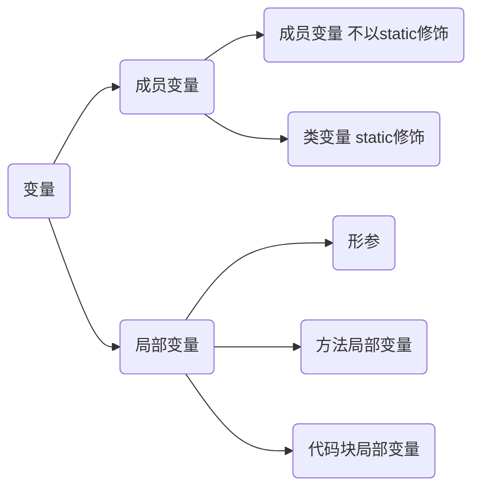
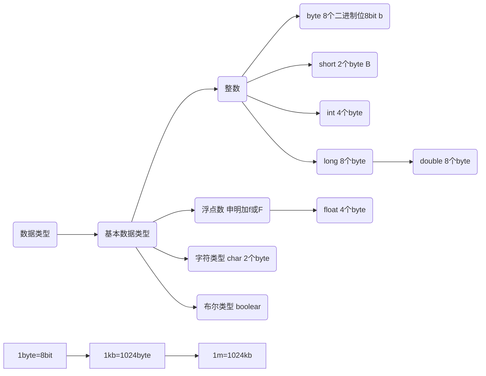

## 变量

##### 定义
- 变量就是初中数学的代数的概念，例如一个简单的方程，x，y都是变量：
- 在Java中，变量分为两种：基本类型的变量和引用类型的变量

##### 作用

- 保存数据

##### 特点
- 内存中的一个存储区域，易丢失
- 该区域有自己的名称（变量名）和类型（数据类型）
- Java中每个变量必须先声明，后使用
- 该区域的数据可以在同一类型范围内不断变化

##### 分类
Java中变量分为<code>成员变量</code>和<code>局部变量</code>

    成员变量存储在对象所在的堆内存，所有实例都可访问，其属于对象。有默认初始化
    局部变量必须显式初始化(除非只申明不调用)

## 关键字
##### 定义
- 被Java语言赋予了特殊含义，用做专门用途的字符串（单词）

##### 特点
- 关键字中所有字母都为小写

##### 总揽图

<table>
<tr>
    <td rowspan="2"> 类,方法和变量修饰符 
    <td>abstract</td>
    <td>class</td>
    <td>extends</td>
    <td>final</td>
    <td>implements</td>
    <td>interface</td>
    <td>native</td>
</tr>
<tr>
    <td>new</td>
    <td>static</td>
    <td>strictfp</td>
    <td>synchronized</td>
    <td>transient</td>
    <td>volatile</td>
</tr>
<tr>
    <td rowspan="2"> 程序控制</td>
    <td>break</td>
    <td>continue</td>
    <td>return</td>
    <td>do</td>
    <td>while</td>
    <td>if</td>
</tr>
<tr>
    <td>else</td>
    <td>for</td>
    <td>instanceof</td>
    <td>switch</td>
    <td>case</td>
    <td>default</td>
</tr>
<tr>
    <td rowspan="2">基本类型</td>
    <td>boolean</td>
    <td>byte</td>
    <td>char</td>
    <td>double</td>
    <td>float</td>
    <td>int</td>
</tr>
<tr>
    <td>long</td>
    <td>short</td>
    <td>null</td>
    <td>true</td>
    <td>false</td>
</tr>
<tr>
    <td rowspan="1">错误处理</td>
    <td>try</td>
    <td>catch</td>
    <td>throw</td>
    <td>throws</td>
</tr>
<tr>
    <td rowspan="1">变量引用</td>
    <td>super</td>
    <td>this</td>
    <td>void</td>
</tr>
<tr>
    <td rowspan="1"> 访问控制 
    <td>private</td>
    <td>protected</td>
    <td>public</td>
</tr>
<tr>
    <td rowspan="1">包相关</td>
    <td>import</td>
    <td>package</td>
</tr>
<tr>
    <td rowspan="1">保留字</td>
    <td>goto</td>
    <td>const</td>
</tr>
</table>

## 数据类型
Java中数据类型分为<code>基本数据类型</code>和<code>引用数据类型</code>

    byte：计算机中最基本的存储单元。bit ：计算机中最小的存储单元

    char类型可以直接使用‘\u000a’表示，其中000a是一个十六进制数

    char类型可以进行运算，因为它都有对应的Unicode码

    整数基本数据类型有时有符号的

    两个高精度计算的类BigInteger和BigDecimal，没有对应的基本数据类型

    不可以使用0和1代替boolean值，jvm并没有提供boolean专用字节码指令，编译后使用0和1代替。和js Python保持一致，区别于c等其他语言

    基本数据类型自动转换byte->short->int->long->float->double
## 转义字符

<table>
  <tr>
    <th>转义字符</th>
    <th>说明</th>
  </tr>
  <tr>
    <td>\b</td>
    <td>退格符</td>
  </tr>
  <tr>
    <td>\n</td>
    <td>换行符</td>
  </tr>
  <tr>
    <td>\r</td>
    <td>回车符</td>
  </tr>
  <tr>
    <td>\t</td>
    <td>制表符</td>
  </tr>
  <tr>
    <td>\"</td>
    <td>双引号</td>
  </tr>
  <tr>
    <td>\'</td>
    <td>单引号</td>
  </tr>
  <tr>
    <td>\\</td>
    <td>反斜线</td>
  </tr>
</table>
