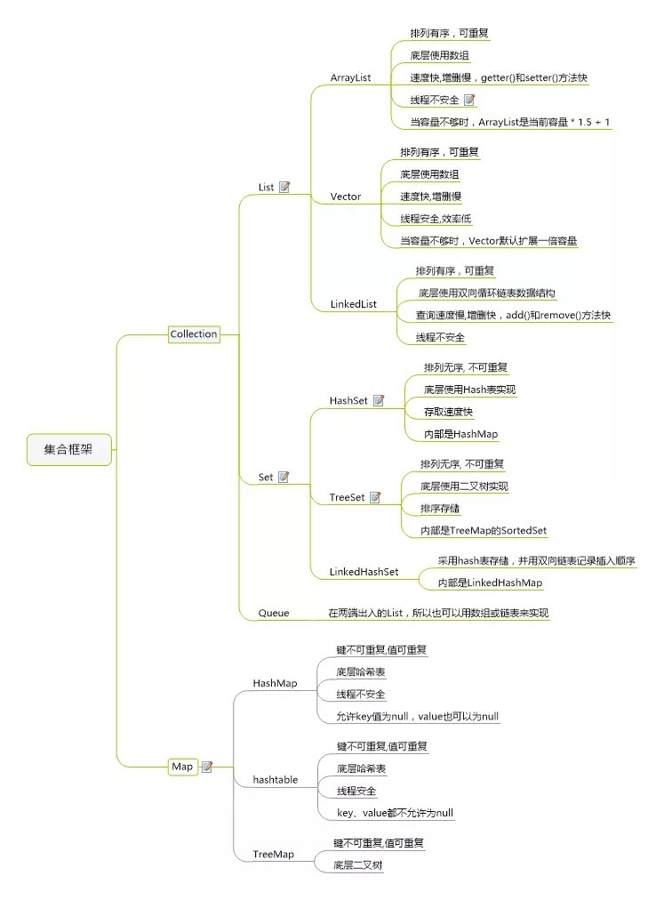

## 持有对象

#### Collectron
集合的顶层接口不能被实例化

#### List
以特定的顺序保存删除元素(有序)，且允许重复

1. ArrayList

       数组，随机访问元素快，插入删除慢，线程不安全
2. LinkedList

        链表，随机访问慢，插入删除快，线程不安全
3. Vector

        数组,同步,线程安全

均按照插入的顺序保存元素。

#### set
 1. HashSet

        查询快
 2. TreeSet

        按结果排序
 3. LinkedHashSet

        按插入顺序

#### map
1. Hashtable

       同步,线程安全,不可以null的key和value
2. Hashmap

       无同步,线程不安全.可以接受null的key和value
       数组：存储区间连续，占用内存严重，寻址容易，插入删除困难；
       链表：存储区间离散，占用内存比较宽松，寻址困难，插入删除容易；
       HashMap综合应用了这两种数据结构，实现了寻址容易，插入删除也容易。

3. LinkedHashMap

       按插入顺序

#### Stack（过时）

    先进后出
    LinkedList可以实现所有Stack所有功能的方法

#### Queue  

    先进先出
    LinkedList提供了方法以支持队列的行为，并且它实现了Queue接口，因此LinkedList可以用作Queue的一种是先，通过将linkedlist向上转型为Queu。

#### PriorityQueue

    优先级队列
    调用offer方法插入对象时，这个对象默认会按照自然顺序排序进行插入。也可使提供自己的Comparator来修改这个顺序。来确保当调用peek、poll和remove方法时获取的元素都是优先级最高的元素。  

### 迭代器

大多数情况下我们都是创建了容器并很快的使用它，add和get足矣。
但是如果容器再往上抽像一层，我们并不知道容器的具体类型，那么迭代器就显得尤为重要。

#### Iterator

    只能单向移动

  
创建了任何实现Iterable的类，都可以将它用于foreach语句中。

#### ListIterator

    功能更加强大的Iterator的子类型，之鞥能用于各种list的访问，并且能够双向移动。

