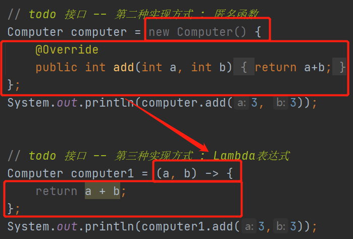

## 是什么

是JDK8中一个新特性，说白了就是一个匿名函数简化版。


## 能做什么

能够更加简洁的==实现接口==。即我们在使用接口的时候尽可能的使用Lambda。


## 使用要求

*   接口中抽象方法只能有一个。


## Lambda表达式声明

`问题:`

>   上面说到，要想使用Lambda表达式，接口中抽象方法只能有一个，我们写好一个接口并且使用Lambda进行简单实现。如果其他人在这个接口中新增方法，那么就会导致我们在使用时出现问题。

`解决办法:`

使用 JDK提供的注解 `@FunctionalInterface` 进行声明。规范此接口只能有一个抽象方法，不得添加。

## 接口实现类、匿名函数、Lambda

```java
/* 接口 - 计算器 */
@FunctionalInterface
interface Computer{
    int add(int a,int b);
}

class ComputerImpl implements Computer{
    @Override
    public int add(int a, int b) {
        return a+b;
    }
}

public class Lambda1 {
    public static void main(String[] args) {
        // todo 接口 -- 第一种实现方式 : 接口实现类
        System.out.println(new ComputerImpl().add(3, 3));
        
        // todo 接口 -- 第二种实现方式 : 匿名函数
        Computer computer = new Computer() {
            @Override
            public int add(int a, int b) {
                return a+b;
            }
        };
        System.out.println(computer.add(3, 3));


        // todo 接口 -- 第三种实现方式 : Lambda表达式
        Computer computer1 = (a, b) -> a + b;
        System.out.println(computer1.add(3,3));
    }
}
```


## 语法介绍

`背景:`

既然Lambda是来替换匿名函数的。则如下图:




`() :` 用来描述参数列表的。

```java
# 无参
()      
# 单个参数
(param)     
# 多个参数    
(param1,param2,param3)    
```

`{} : `用来描述方法体

```java
# 一行语句  可以省略   {}
@FunctionalInterface
interface demo{
    void add();
}
demo demo = () -> System.out.println("aaa");
demo.add();
# 多行语句 不可省略
demo demo = () -> {
    System.out.println("aaa");
    System.out.println("bbbb");
};
demo.add();
```


`-> : ` 用来连接方法体和参数列表


## 语法精简

*   Lambda参数列表中的参数类型可以省略
*   Lambda参数列表中的参数只有一个，则()可以省略
*   Lambda方法体中只有一行代码，则{}可以省略
*   Lambda方法体中只有一行代码并且为return语句，省略{}的同时必须省略掉return


## 语法进阶

### 1、方法引用

`由来:`

>   我们知道Lambda表达式的使用分类两个步骤，①函数式接口声明。②接口Lambda方式实现以及调用，如果我们在多处使用接口，那么就会有很多个实现及调用，不便维护。


`解决:`

>   使用一个公共方法来替代接口的方法体。实现修改一处，多次调用。
>
>   语法：方法的隶属者（类、对象）::方法名        # 下面以实例方法和静态方法演示两种格式。
>
>   >   封装方法的参数类型和数量要和接口中定义的方法保持一致
>   >
>   >   封装方法的返回值类型和接口方法保持一致

```java
@FunctionalInterface
interface Keyboard{
    int typing(int a,int b);
}

@FunctionalInterface
interface Mouse{
    int click(int a,int b);
}

class MouseMethod{
    /* 封装接口实现方法 -- 实例方法*/
    public int clickMethod(int a,int b){
        System.out.println("使用clickMethod方法 -- 实例方法 来替代Lambda表达式方法体");
        return a+b;
    }
}

public class Lambda2 {
    public static void main(String[] args) {
        // 方法代替Lambda表达式的方法体   --  第一种语法格式
        Keyboard keyboard = (a, b) -> typeMethod(a,b);
        System.out.println(keyboard.typing(3,3));

        // 方法代替Lambda表达式的方法体   --  第二种语法格式  方法的隶属者（类、对象）::方法名
        Mouse mouse = new MouseMethod()::clickMethod;
        System.out.println(mouse.click(3,3));
    }
    /* 封装接口实现方法 -- 静态方法*/
    public static int typeMethod(int a,int b){
        System.out.println("使用typeMethod方法 -- 静态方法 来替代Lambda表达式方法体");
        return a+b;
    }
}
```


### 2、构造方法引用

>   适用于：当接口方法返回类型为对象时。可使用  无参构造  和  有参构造来实现对象类型返回值

```java
import lombok.Data;

import lombok.NonNull;
import lombok.extern.slf4j.Slf4j;

/*
 * @Author No1.shuai
 * @Description //TODO Lambda表达式构造方法引用   -- 接口方法返回类型为对象
 * @Date 14:43 14:43
 **/
@Data
class Person{
    @NonNull
    private String name;
    @NonNull
    private int age;

    public Person(String name,int age){
        this.name=name;
        this.age=age;
    }

    public Person() {

    }
}
/* 无参构造 */
@FunctionalInterface
interface PersonCreate{
    Person createPerson();
}

@FunctionalInterface
interface PersonCreate1{
    Person createPerson(String name,int age);
}


@Slf4j
public class Lambda3 {
    public static void main(String[] args) {
        // todo 无参构造 -- Lambda返回类型为对象
        PersonCreate personCreate = ()->new Person();
        log.debug(personCreate.createPerson().toString());

        // todo 有参构造 -- Lambda返回类型为对象
        PersonCreate personCreate1 = ()->new Person("王五",45);
        log.debug(personCreate1.createPerson().toString());
    }
}

```


## 案例

>   <font color=ff00aa>jdk8容器中提供了很多函数式接口方法。例如 foreach、removeif</font>

### 1、集合排序 -- list   set

```java
import lombok.Data;
import lombok.NonNull;
import org.junit.Test;

import java.util.ArrayList;
import java.util.List;
import java.util.Set;
import java.util.TreeSet;

/*
 * @Author No1.shuai
 * @Description //TODO 集合排序
 * @Date 20:09 20:09
 **/
@Data
class Person{
    @NonNull
    private String name;
    @NonNull
    private int age;

    public Person(String name,int age){
        this.name=name;
        this.age=age;
    }

    public Person() {

    }
}
public class SetSorting {
    @Test
    public void listSort(){
        List<Person> list = new ArrayList<>();
        list.add(new Person("demo1",15));
        list.add(new Person("demo1",16));
        list.add(new Person("demo1",17));
        list.add(new Person("demo1",18));
        list.add(new Person("demo1",19));
        list.add(new Person("demo1",20));

        // 排序
        list.sort((o1,o2) -> o2.getAge()-o1.getAge());

        System.out.println(list);
    }

    @Test
    public void setSort(){
        Set<Person> set = new TreeSet<Person>((o1,o2)->{
            return o2.getAge()-o1.getAge();
        });
        set.add(new Person("demo1",10));
        set.add(new Person("demo1",11));
        set.add(new Person("demo1",12));
        set.add(new Person("demo1",13));
        set.add(new Person("demo1",14));

        System.out.println(set);
    }
}
```


### 2、 foreach -- 遍历时对数据进行处理

```java
/*
 * @Author No1.shuai
 * @Description //TODO 集合元素遍历时进行数据处理
 * @Date 21:02 21:02
 **/
public class forEach {
    @Test
    public void foreach(){
        List<Integer> list = new ArrayList<>();
        Collections.addAll(list,1,5,8,9,6,5,8,9,3,5,456,68);

        // todo 输出集合中所有偶数元素
        list.forEach(ele ->{
            if (ele%2 == 0) {
                System.out.println(ele);
            }
        });
    }
}
```


### 3、removeIf -- 删除容器中元素

```java
/*
 * @Author No1.shuai
 * @Description //TODO 删除容器中元素
 * @Date 21:14 21:14
 **/

import lombok.extern.slf4j.Slf4j;
import org.junit.Test;

import java.util.ArrayList;
import java.util.Collections;
import java.util.Iterator;
import java.util.List;

@Slf4j
public class RemoveIf {
    @Test
    public void removeIf(){
        List<Integer> list = new ArrayList<>();
        Collections.addAll(list,1,5,89,3,246,3,1,7,63,3);

        //todo 删除元素  Iterator
        Iterator<Integer> iterator = list.iterator();
        while (iterator.hasNext()){
            Integer ele = iterator.next();
            if (ele%2 == 0){
                iterator.remove();
            }
        }
        log.debug("使用Iterator删除元素 --- {}",list);

        //todo 删除元素  removeIf
        list.removeIf(ele -> ele>10);
        log.debug("使用removeIf删除元素 --- {}",list);
    }
}

```


### 4、线程实例化

```java
/* Runnable函数式接口，无参无返回 */
@Test
public void thread(){
    new Thread(() -> {
        for (int i=0;i<100;i++){
            System.out.println(i);
        }
    }).start();
}
```


## 内置函数式接口


| 函数式接口                                             | 参数类型                | 返回类型                 | 用途                                                         |
| ------------------------------------------------------ | ----------------------- | ------------------------ | ------------------------------------------------------------ |
| Consumer消费型接口                                     | T                       | void                     | 对类型为T的对象应用操作，包含方法：void accept(T t)          |
| Supplier供给型接口                                     | T                       | R                        | 返回类型为T的对象，包含方法： T get();                       |
| Function函数型接口                                     | T                       | R                        | 对类型为T的对象应用操作，并返回结果。结果是R类型的对象。包含方法： R apply(T t); |
| Predicate断定型接口                                    | T                       | boolean                  | 确定类型为T的对象是否满足某约束，并返回boolean 值。包含方法boolean test(T t); |
| BiFunction                                             | T, U                    | R                        | 对类型为 T, U 参数应用操作， 返回 R 类型的结果。 包含方法为R apply(T t, U u); |
| UnaryOperator(Function子接口)                          | T                       | T                        | 对类型为T的对象进行一元运算， 并返回T类型的结果。 包含方法为T apply(T t); |
| BinaryOperator(BiFunction 子接口)                      | T,T                     | T                        | 对类型为T的对象进行二元运算， 并返回T类型的结果。 包含方法为T apply(T t1, T t2); |
| BiConsumer                                             | T,U                     | void                     | 对类型为T, U 参数应用操作。 包含方法为void accept(T t, U u)  |
| ToIntFunction<br />ToLongFunction<br/>ToDoubleFunction | T                       | int<br/> long<br/>double | 分 别 计 算 int 、 long 、double、 值的函数                  |
| Predicate断定型接口                                    | int<br/>long<br/>double | R                        | 参数分别为int、 long、double 类型的函数                      |
|                                                        |                         |                          |                                                              |

