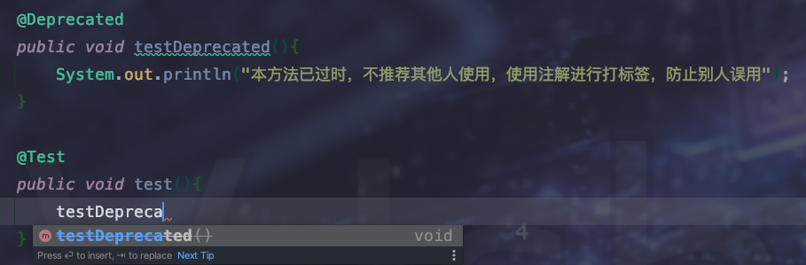

## 什么是注解

* 不是程序本身，可以对程序作出解释   ：  这一点和注释 效果一样
* 可以被其他程序(编译器)读取，然后对注解的代码进行约束和打标签
* 简单来讲，注解类似于标签，能够赋予代码一定的含义以及功能


## 作用

有如下作用但不限于


1.  标签 - 给代码块标识 已过时不推荐使用

	

	

	

2. 抑制告警

	`抑制前:`

	

	> 绿色波浪线以及 demo 变量灰色

	`抑制后:`

	


## 元注解

作用就是负责注解 其他注解，标识注解的作用范围以及级别等信息，是注解的组成单元。

* `@Target `： 用以描述注解的适用范围，比如该注解只对变量有效、或者方法有效等等。

* `@Retention` : 标识需要在什么级别保存该注解信息,用以标识注解的生命周期

	  runtime > class > sources

* @Documented：说明该注解将被包含在javadoc[Java注释文档]中

* @Inherited：标识子类可以继承父类的该注解


## 自定义注解 以及 使用流程

### 1、定义注解

```java
//todo 1. @interface 声明一个注解 类型
//todo 2. @Target 标识此注解只对 字段、方法有效。作用在类上会报错
//todo 3. @Retention 标识生命周期，一般使用 RUNTIME 有效
//todo 4. @Documented 和 @Inherited 看需求可加可不加
//todo 5. 设置注解的参数 格式：参数类型 + 参数名 + （）+ 默认值[default xx]
    //如果一个注解参数默认值，则使用注解时不必要为参数进行赋值，如果没有默认值则必须在使用注解时为其赋值
    //如果一个注解没有参数，则可以不用赋值。类似于 分组校验 AddGroup
@Target(value ={ElementType.FIELD,ElementType.METHOD} )
@Retention(value = RetentionPolicy.RUNTIME)
@Documented
@Inherited
public @interface MyAnnotation {
    String name() default "hello";
    int age();
    String[] schools() default {"a","b","c"};
}
```


### 2、使用注解

```java
@MyAnnotation(age = 15)//必须赋值 age
public void test(){

}
```

