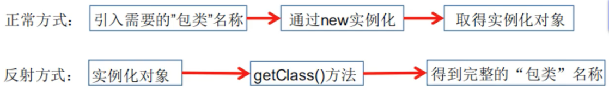
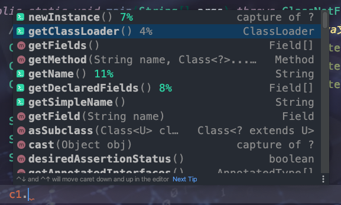

`引言:`

* 静态语言

	编译阶段进行类型判断或者是语法检查。例如C 、C++、Java

* 动态语言

	类型的检查是在运行时做的，即没有编译错误，只有运行错误，并且在程序运行时可以改变其结构，包括引进新的函数、对象或者删除其函数等。例如JavaScript、Ruby、Python、OC等

	> 虽然说Java是一个静态语言，但是它有一些机制使其 拥有了动态语言的特性。其机制 便是 ==反射==
	>
	> 这个机制允许程序在运行时透过反射取得任何一个已知名称的class的内部信息，包括：正在运行中的类的属性信息，正在运行中的类的方法信息，正在运行中的类的构造信息，正在运行中的类的访问修饰符，注解等等。

	```javascript
	let code = "let a=1;let b=2;alert(a+b)";
	eval(code);
	```

	

## 什么是反射

* 反射是Java被视为动态语言的关键==反射机制==允许程序在执行期间使用反射 ==获取到任何类的内部信息==。并能够直接操作任意对象的内部属性以及方法。
* ==类加载机制== 将 类加载并存入内存后，会在==方法区==存放该类的 ==类元数据模板==(类信息)，我们一般new出==对象的对象头中==包含了==类型指针== 指向方法区中类元数据模板。即正常new对象都是通过类元数据模板进行实例化数据的。
* 而反射 必须先要==有一个对象==，然后通过对象看到 ==类元信息==。然后通过==类元数据模板==进行==实例化对象==。




## 反射提供的功能

* 在运行时判断任意一个对象所属的类
* 在运行时构造任意一个类的对象
* 在运行时判断任意一个类所具有的成员变量和方法
* 在运行时获取泛型信息
* 在运行时调用任意一个对象的成员变量和方法
* 在运行时处理注解
* 生成动态代理


## 优缺点

`优点:`

可以实现动态创建对象和编译，体现出很大的灵活性


`缺点:`

对性能有影响，相对于一般new 慢了十几倍


## 反射主要API

```java
java.lang.Class : 代表一个类
java.lang.reflect.Method : 代表类的方法
java.lang.reflect.Field : 代表类的成员变量
java.lang.reflect.Constructor : 代表类的构造器
```


### 1、Class 类元数据模板对象

> 所有的类型都有Class元数据模板对象

* Class : 外部类、内部类、静态内部类、匿名内部类等各种类
* interface 
* 基本数据类型
* [] 数组 String 等引用类型
* enum
* annotation
* void


#### 获取Class对象

```java
//todo 通过如下方式获取类元数据模板 - 方法区   ： 一个Java文件懒加载并且只被加载一次，即jvm方法区中只保存了一份Class对象
// 1. 通过对象获得
Class<? extends Person> c1 = new Person().getClass();
// 2. 通过forName获得
Class<?> c2 = Class.forName("org.example.jvm.createObj.Person");
// 3. 通过类名.class获得
Class<Person> c3 = Person.class;

System.out.println(c1.hashCode());
System.out.println(c2.hashCode());
System.out.println(c3.hashCode());
//225534817
//225534817
//225534817
```


#### 获取Class对象信息



* 构造该Class对象的实例
* 获取此Class的类加载器
* 获取Class对象的字段、方法、注解、类名称、等等

> 其中getFields() 只能获取到public 信息
>
> getDeclaredField 获取到所有字段信息


#### 反射实例化对象

1. 通过 Class对象实例化对象

	`要求:`

	* 类必须有一个无参构造器

		* 没有无参构造器，可以使用 调用类的构造器来实例化对象

			```java
			Class<?> c1 = Class.forName("org.example.jvm.createObj.Person");
			Constructor<?> constructor = c1.getDeclaredConstructor(String.class, int.class, String.class);
			Person person = (Person) constructor.newInstance("测试", 99, "男");
			System.out.println(person);
			person.method();
			```

	* 类的构造器访问权限要足够

		* name.setAccessible(true);//关闭安全监测

	```java
	@Data
	//@AllArgsConstructor
	public class Person{
	    private String name;
	    private int age;
	    private String sex;
	
	    public void method(){
	        System.out.println("Fsdfs");
	    }
	
	}
	
	    public static void main(String[] args) throws ClassNotFoundException, IllegalAccessException, InstantiationException, NoSuchFieldException, InvocationTargetException, NoSuchMethodException {
	        Class<?> c1 = Class.forName("org.example.jvm.createObj.Person");
	        Person person = (Person) c1.newInstance();
	        //todo 获取方法并执行
	        Method method = c1.getDeclaredMethod("method");
	        method.invoke(person, null);
	
	        //todo 调用属性 私有属性报错，不允许直接设置，关闭安全监测即可 方通用
	        Field name = c1.getDeclaredField("name");
	        name.setAccessible(true);//关闭安全监测
	        name.set(person, "测试");
	
	        System.out.println(person.toString());
	    }
	
	//Fsdfs
	//Person(name=测试, age=0, sex=null)
	```

	

## 反射性能分析


```java
public static void main(String[] args) throws ClassNotFoundException, NoSuchMethodException, InvocationTargetException, InstantiationException, IllegalAccessException {
        new sync().test01();
        new sync().test02();
        new sync().test03();
    }
    //普通方式
    public void test01(){
        Person person = new Person("test", 15, "男");
        long start = System.currentTimeMillis();

        for (int i = 0; i < 1000000000; i++) {
            person.getName();
        }

        long end = System.currentTimeMillis();

        System.out.println("普通方法执行10亿次 ： "+(end-start) + " ms");
    }

    //反射方式
    public void test02() throws ClassNotFoundException, IllegalAccessException, InstantiationException, NoSuchMethodException, InvocationTargetException {
        Class<?> c1 = Class.forName("org.example.jvm.createObj.Person");
        Person person = (Person) c1.newInstance();
        Method getName = c1.getDeclaredMethod("getName", null);
        long start = System.currentTimeMillis();

        for (int i = 0; i < 1000000000; i++) {
            getName.invoke(person);
        }

        long end = System.currentTimeMillis();

        System.out.println("普通方法执行10亿次 ： "+(end-start) + " ms");
    }

    //反射方式 - 关闭 安全检查
    public void test03() throws ClassNotFoundException, IllegalAccessException, InstantiationException, NoSuchMethodException, InvocationTargetException {
        Class<?> c1 = Class.forName("org.example.jvm.createObj.Person");
        Person person = (Person) c1.newInstance();
        Method getName = c1.getDeclaredMethod("getName", null);
        getName.setAccessible(true);
        
        long start = System.currentTimeMillis();
        for (int i = 0; i < 1000000000; i++) {
            getName.invoke(person);
        }

        long end = System.currentTimeMillis();

        System.out.println("普通方法关闭安全检查执行10亿次 ： "+(end-start) + " ms");
    }
```


> 程序中非必要不要使用 反射，如果使用关闭安全检查