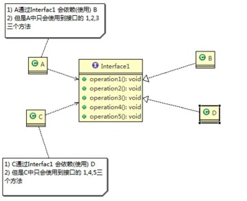
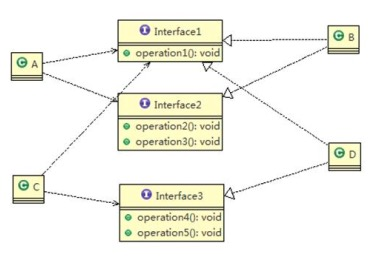

### 设计模式是什么

软件工程中， 设计模式（design pattern） 是对软件设计中普遍存在（反复出现） 的各种问题， 所提出的解决方
案

### 为什么使用设计模式

1) 代码重用性 (即： 相同功能的代码， 不用多次编写)
2) 可读性 (即： 编程规范性, 便于其他程序员的阅读和理解)
3) 可扩展性 (即： 当需要增加新的功能时， 非常的方便， 称为可维护)
4) 可靠性 (即： 当我们增加新的功能后， 对原来的功能没有影响)
5) 使程序呈现高内聚， 低耦合的特性


### 设计模式七大原则

设计模式原则， 其实就是程序员在编程时， 应当遵守的原则， 也是各种设计模式的基础(即： 设计模式为什么这样设计的依据)

#### 1) 单一职责原则

对类来说的， 即一个类应该只负责一项职责。 如类 A 负责两个不同职责： 职责 1， 职责 2。 当职责 1 需求变更
而改变 A 时， 可能造成职责 2 执行错误， 所以需要将类 A 的粒度分解为 A1， A2

总结

>1) 降低类的复杂度， 一个类只负责一项职责。
2) 提高类的可读性， 可维护性
3) 降低变更引起的风险
4) 通常情况下， 我们应当遵守单一职责原则， 只有逻辑足够简单， 才可以在代码级违反单一职责原则； 只有类中
方法数量足够少， 可以在方法级别保持单一职责原则

#### 2) 接口隔离原则

客户端不应该依赖它不需要的接口， 即<font color=ffaa00>一个类对另一个类的依赖应该建立在最小的接口上</font>

<center>
    
    <br>
    <div style="color:orange; border-bottom: 1px solid #d9d9d9;
    display: inline-block;
    color: #999;
    padding: 2px;">接口隔离原则</div>
</center>


```java
//A 类通过接口 Interface1 依赖(使用) B 类， 但是只会用到 1,2,3 方法
//因此对于此种情况，B类全部实现了Interface1的5个方法，其中4，5是多余的，因此将接口interface1拆分为两个，一接口包含123方法，二接口包含45方法

class A{
    public void depend1(Interface1 i) {
        i.operation1();
    }
    public void depend2(Interface1 i) {
        i.operation2();
    }
    public void depend3(Interface1 i) {
        i.operation3();
    }
}

class C { //C 类通过接口 Interface1 依赖(使用) D 类， 但是只会用到 1,4,5 方法
    public void depend1(Interface1 i) {
        i.operation1();
    }
    public void depend4(Interface1 i) {
        i.operation4();
    }
    public void depend5(Interface1 i) {
        i.operation5();
    }
}
```

通过接口隔离原则重新设计类图如下：

此时B 和D 类只需要实现A 和 B中依赖的方法。并不需要全部实现。

<center>
    
    <br>
    <div style="color:orange; border-bottom: 1px solid #d9d9d9;
    display: inline-block;
    color: #999;
    padding: 2px;">接口隔离原则</div>
</center>

####3) 依赖倒转(倒置)原则

依赖倒转原则(Dependence Inversion Principle)是指：

1) 高层模块不应该依赖低层模块， 二者都应该依赖其抽象

    > 原因在于修改类后导致的不确定因素。而接口或抽象相对固定。因此底层模块需要接口或抽象类指定规则，然后由高层模块调用。

2) 抽象不应该依赖细节， 细节应该依赖抽象

    > 此 ‘细节’ 指实现代码细节即实现类或者底层模块。底层代码中也不应该调用其他类，而是通过接口来进行操作

3) <font color=ffaa00>依赖倒转(倒置)的中心思想是面向接口编程</font>

4) 依赖倒转原则是基于这样的设计理念： 相对于细节的多变性， 抽象的东西要稳定的多。 以抽象为基础搭建的架构比以细节为基础的架构要稳定的多。 在 java 中， 抽象指的是接口或抽象类， 细节就是具体的实现类

5) 使用接口或抽象类的目的是制定好规范， 而不涉及任何具体的操作， 把展现细节的任务交给他们的实现类去完成.

        假定一个场景，一个人发送消息，需要构建两个类，Persion -> 包含receive方法。Email类作为receive方法的参数，而如果随着项目的发展需要发送微信或其他种类的消息，又该如何呢？

        因此receive方法接收参数可修改为接口，然后各种种类的消息实现类均可支持。

依赖关系传递的三种方式和应用案例

    1) 接口传递   如上所示。

    2) 构造方法传递    在Persion的构造方法中实例消息接口对象    聚合

    3) setter 方式传递  在Persion的setter方法中实例接口对象或者接受消息接口对象。   组合


> 1) 低层模块尽量都要有抽象类或接口， 或者两者都有， 程序稳定性更好.而不是在底层模块中直接实例化类。
2) <font color=ffaa00>变量的声明类型尽量是抽象类或接口, 这样我们的变量引用和实际对象间， 就存在一个缓冲层， 利于程序扩展和优化</font>
3) 继承时遵循里氏替换原则

####4) 里氏替换原则  Liskov Substitution Principle

> 1OO 中的继承性的思考和说明

1) 继承包含这样一层含义： 父类中凡是已经实现好的方法， 实际上是在设定规范和契约， 虽然它不强制要求所有的子类必须遵循这些契约， 但是如果子类对这些已经实现的方法任意修改， 就会对整个继承体系造成破坏。

2) 继承在给程序设计带来便利的同时， 也带来了弊端。 比如使用继承会给程序带来侵入性， 程序的可移植性降低，增加对象间的耦合性， 如果一个类被其他的类所继承， 则当这个类需要修改时， 必须考虑到所有的子类， 并且父类修改后， 所有涉及到子类的功能都有可能产生故障

3) 问题提出： 在编程中， 如何正确的使用继承? => 里氏替换原则

> 基本介绍

1) 里氏替换原则(Liskov Substitution Principle)在 1988 年， 由麻省理工学院的以为姓里的女士提出的。
2) 如果对每个类型为 T1 的对象 o1， 都有类型为 T2 的对象 o2， 使得以 T1 定义的所有程序 P 在所有的对象 o1 都代换成 o2 时， 程序 P 的行为没有发生变化， 那么类型 T2 是类型 T1 的子类型。 换句话说， 所有引用基类的地方必须能透明地使用其子类的对象。
3) 在使用继承时， 遵循里氏替换原则， 在子类中尽量不要重写父类的方法
4) 里氏替换原则告诉我们， 继承实际上让两个类耦合性增强了， 在适当的情况下， 可以通过聚合， 组合， 依赖 来解决问题。

####5) 开闭原则 Open Closed Principle

1) 开闭原则是编程中最基础、 最重要的设计原则

2) <font color=ff00ff>一个软件实体如类， 模块和函数应该对扩展开放(对提供方)， 对修改关闭(对使用方)。 用抽象构建框架， 用实现扩展细节。</font>

3) <font color=ff00ff>当软件需要变化时， 尽量通过扩展软件实体的行为来实现变化， 而不是通过修改已有的代码来实现变化。</font>

4) 编程中遵循其它原则， 以及使用设计模式的目的就是遵循开闭原则。

####6) 迪米特法则  Demeter Principle

1) 一个对象应该对其他对象保持最少的了解

2) 类与类关系越密切， 耦合度越大

3) 迪米特法则(Demeter Principle)又叫最少知道原则， 即一个类对自己依赖的类知道的越少越好。 <font color=ffaa00>也就是说， 对于被依赖的类不管多么复杂， 都尽量将逻辑封装在类的内部。 对外除了提供的 public 方法， 不对外泄露任何信息.即是自己类相关的实现放在自己类中即可</font>

4) 迪米特法则还有个更简单的定义：<font color=ffaa00> 只与直接的朋友通信</font>

5) 直接的朋友： 每个对象都会与其他对象有耦合关系， 只要两个对象之间有耦合关系， 我们就说这两个对象之间是朋友关系。 耦合的方式很多， 依赖， 关联， 组合， 聚合等。 其中， <font color=ff00ff>我们称出现``成员变量``， ``方法参数``， ``方法返回值``中的类为直接的朋友， 而出现在``局部变量``中的类不是直接的朋友。 也就是说， 陌生的类最好不要以局部变量的形式出现在类的内部</font>

```java
//分析 SchoolManager 类的直接朋友类有哪些 Employee、 CollegeManager
//CollegeEmployee 不是 直接朋友 而是一个陌生类， 这样违背了 迪米特法则
class SchoolManager {
    //返回学校总部的员工
    public List<Employee> getAllEmployee() {
        List<Employee> list = new ArrayList<Employee>();  //这里的Employee 作为list返回值中类型，是方法返回值，因此Employee类是直接朋友
        for (int i = 0; i < 5; i++) {
            Employee emp = new Employee();
            emp.setId("学校总部员工 id= " + i);
            list.add(emp);
        }
        return list;
    }
    //该方法完成输出学校总部和学院员工信息(id)
    void printAllEmployee(CollegeManager sub) {  //CollegeManager作为参数   是直接朋友
        //分析问题
        //1. 这里的 CollegeEmployee 不是 SchoolManager 的直接朋友
        //2. CollegeEmployee 是以局部变量方式出现在 SchoolManager
        //3. 违反了 迪米特法则
        //获取到学院员工
        List<CollegeEmployee> list1 = sub.getAllEmployee(); //这里的list与getAllEmployee方法中list类似，但是它没有作为返回值，不是直接朋友。因此需要把 输出学院员工这块代码放到 CollegeEmployee类中
        System.out.println("------------学院员工------------");
        for (CollegeEmployee e : list1) {
            System.out.println(e.getId());
        } //
        获取到学校总部员工
        List<Employee> list2 = this.getAllEmployee();
        System.out.println("------------学校总部员工------------");
        for (Employee e : list2) {
            System.out.println(e.getId());
        }
    }
}
```

####7) 合成复用原则  Composite Reuse Principle

原则是尽量使用合成/聚合的方式， 而不是使用继承

1) 找出应用中可能需要变化之处， 把它们独立出来， 不要和那些不需要变化的代码混在一起。

2) 针对接口编程， 而不是针对实现编程。

3) 为了交互对象之间的松耦合设计而努力
