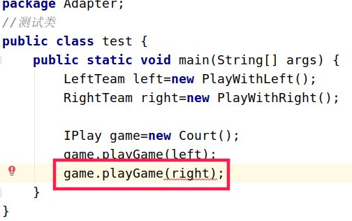

## 适配器模式

### 1、定义

使接口不兼容的那些类可以一起工作，其别名为为包装器（Wrapper）。将某个类的接口转换成客户端期望的另一个接口表示， 主的目的是兼容性， 让原本因接口不匹配不能一起工作的两个类可以协同工作。 其别名为包装器(Wrapper)，类似于充电器。将220v电压转为设备适用的安全电压

### 2、为什么使用适配器

>简单理解为：在项目开发中一般接口作为功能集合(定义功能模块中需要的功能，并对外提供服务)。两个功能模块A、B需要对接时，客户端或者调用者需要兼容两个不同的类(一般指抽象类)或接口(为什么要兼容呢，如果该客户端或者调用者是代理类，而该代理类接受的参数是A模块中的类或其父类，则B模块中的类不能使用)。

>此时怎么办呢？当然你可以在A和B模块中的类再往上扩展一个父类。然后修改代理类为该父类即可。但是这样做有个缺陷，因为你修改了两个类的结构，指不定这两个类已经extends了父类，那该如何呢。你或许会说添加内部类，这样更不行了，现在不光污染了代码的结构甚至污染了代码的内容。大大的不行。更何况两个功能模块加入是两个jar包呢。你怎么办？

因此最好的方式是在不修改两个功能模块的结构和内容的基础上来完成代理类适配两个类或接口。

### 3、使用适配器模式的姿势
网上看到一个适配器例子：使用的是足球运动员举得例子，很是生动形象，我也就不客气了，向前辈致敬。

加入有两个足球运动员，A使用左脚踢球，B使用右脚踢球。足协为比赛做好了一切准备，以上的2名选手也想参加比赛，怎么办呢？这时候，适配器可以登场了。以下的这个适配器类就像一个球队，不仅遵循足协的规定，并且把2名选手招致麾下。

```java
package Adapter;
/**左脚踢球的球队*/
public interface LeftTeam {
    void play();
}

package Adapter;
/**右脚踢球的球队*/
public interface RightTeam {
    void playWithRigh();
}

package Adapter;
/**隶属于LeftTeam球队*/
public class PlayWithLeft implements LeftTeam{
    public void play() {
        System.out.println("我是左脚选手");
    }
}
package Adapter;
/**隶属于RightTeam球队*/
public class PlayWithRight implements RightTeam{
    public void playWithRigh() {
        System.out.println("我是右脚选手");
    }
}

package Adapter;
/** 足协*/
public interface IPlay {
  //足协规定球场上只能是左脚踢球的球队可以进入赛场
    void playGame(LeftTeam team);
}

package Adapter;
/**足球场*/
public class Court implements IPlay {

    @Override
    public void playGame(LeftTeam team) {
        team.play();
    }
}

```
<center>
    
    <br>
    <div style="color:orange; border-bottom: 1px solid #d9d9d9;
    display: inline-block;
    color: #999;
    padding: 2px;">适配器模式背景</div>
</center>


#### 1、类适配器模式
> 摆在眼前的问题：

  1.  足球协会只接受左脚踢球的球队，因此右脚踢球的无法进入。
  2.  如果使得右脚踢球的球队拥有左脚球队的类型那么问题迎刃而解

继承和接口都拥有多态性，因此只需要一个中间类继承左脚球队。则该中间类允许进入赛场踢球。那怎么和右脚球队关联呢？继续使用次中间类实现右脚球队的接口。那么该中间类既可以在‘只允许左脚球队的赛场’进行比赛也可以在‘只允许右脚球队的赛场’进行比赛。  

>核心：利用了继承和接口的多态性。

```java
package Adapter;
/** 球队 同适配器  */
public class Team extends PlayWithRight implements  LeftTeam {

    @Override
    public void play() {
        playWithRigh();
    }

    @Override
    public void playWithRigh() {
        super.playWithRigh();
    }
}

### test
public static void main(String[] args) {
        LeftTeam left=new PlayWithLeft();
//        RightTeam right=new PlayWithRight();
        Team right=new Team();

        IPlay game=new Court();
        game.playGame(left);
        game.playGame(right);

        game.playGameWithRirht(right);

    }
```

#### 2、对象适配器模式

一般常用的就是对象适配器模式，很少用类适配器。

```java
package Adapter;
/** 球队 对象适配器 基于组合  */
public class ObjectTeam implements  LeftTeam {
    private final PlayWithRight right;
    public ObjectTeam(){
        right=new PlayWithRight();
    }
    @Override
    public void play() {
        right.playWithRigh();
    }

}
```

>必须继承或者实现LeftTeam 否则中间类将得不到LeftTeam的类型


#### 3、双向适配器模式

```java
package Adapter;

import java.net.BindException;

/** 球队 双向适配器 基于接口和组合  */
public class BidirectionalTeam implements RightTeam,LeftTeam{
    private final RightTeam right;
    private final LeftTeam left;
    public BidirectionalTeam(){
        right=new PlayWithRight();
        left=new PlayWithLeft();
    }
    @Override
    public void play() {
        left.play();
    }

    @Override
    public void playWithRigh() {
        right.playWithRigh();
    }
}

### test
BidirectionalTeam team=new BidirectionalTeam();

IPlay game=new Court();
game.playGame(team);
game.playGameWithRirht(team);
```

#### 4、缺省适配器模式

缺省适配器模式是适配器模式一种变体。

定义：当不想要实现一个接口所提供的所有方法时，可以设计一个抽象类实现该接口，并为每个接口提供一个默认实现，那么该抽象类的子类可以选择性覆盖父类中的方法，它适用于不想使用一个接口中的所有方法的情况，又称为单接口适配器模式。

简单的理解就是当适配者（Adaptee）有大量的方法时，那么每个适配器（Adapter）都要去实现接口中的这些方法，这样就感觉太费劲。所以这种情况下，可以考虑实现个默认的适配器，然后根据实际目标角色接口的类集成这个默认适配器，然后选择性的实现默认适配器中的一些方法。

> 选择继承也可以使用组合聚合方式实现。

```java
package Adapter;
public interface Port {

    // 远程SSH端口22
    public void SSH();

    // 网络端口80
    public void NET();

    // Tomcat容器端口8080
    public void Tomcat();

    // Mysql数据库端口3306
    public void Mysql();

    // Oracle数据库端口1521
    public void Oracle();

    // 文件传输FTP端口21
    public void FTP();
}
```
```java
package Adapter;

/**抽象类*/
public abstract class Wrapper implements Port{

    @Override
    public void SSH(){};

    @Override
    public void NET(){};

    @Override
    public void Tomcat(){};

    @Override
    public void Mysql(){};

    @Override
    public void Oracle(){};

    @Override
    public void FTP(){};
}
```

```java
package Adapter;

public class Chat extends Wrapper {
    @Override
    public void SSH() {
        super.SSH();
    }

    @Override
    public void NET() {
        super.NET();
    }

    @Override
    public void FTP() {
        super.FTP();
    }
}

```


```java

package Adapter;

public class Server extends Wrapper {
    @Override
    public void Tomcat() {
        super.Tomcat();
    }

    @Override
    public void Mysql() {
        super.Mysql();
    }

    @Override
    public void Oracle() {
        super.Oracle();
    }
}

```

### 总结

类适配器模式 ：适配器（Adapter）跟适配者（Adaptee）(即右脚踢球队员和Team)是一种继承关系。

对象适配器模式：适配器（Adapter）跟适配者（Adaptee）(即右脚踢球球队和Team)是一种组合关系。

双向适配器模式 ：双向适配器是对象适配器模式的一种变体， 该模式的适配器（Adapter）不仅引用了适配者（Adaptee）,还对目标类（Target）引用。所以这种模式目标类和适配者之间互相适配。

缺省适配器模式：当适配者接口中出现大量的方法时，就可以考虑这种模式。

1、优点

类适配器模式和对象适配器模式都具有的优点：

    将目标类（Target）和 适配者类（Adaptee）解耦， 引用一个适配器类（Adapter）就可以对适配者进行重用。
    增加了类的透明性和复用性，将具体的业务实现过程封装在适配者类中，对客户端来而言是透明的，而且提高了适配者的复用性，同一个适配者类可以在多个不同的系统中复用。

对象适配器模式优点：

    一个对象适配器可以把多个适配者适配到同一目标。
    可以适配一个适配者的子类，由于适配器和适配者之间是组合关系，根据“里氏代换原则”，适配者的子类也可以通过该适配器进行适配。

2、缺点

类适配器模式缺点：

    因为Java不支持多重继承，一次最多适配一个适配者类，不能同时适配多个适配者。
    适配者类不能为最终类，即适配者类不能用final关键字修饰。
    类适配器模式中的目标类(左脚球队)只能为接口，不能为类。

对象适配器模式缺点：

    与类适配器模式相比，要在适配器中置换适配者类的某些方法比较麻烦（因为类适配器模式是基于继承的，可以重写适配者类的方法，对象适配器模式则不能），如果一定要置换掉适配者类的方法，可以先做一个适配者的子类，将适配者类的方法置换掉，然后再把适配者的子类当作真正的适配者进行适配，实现过程较为复杂。

3、适用场景

系统需要使用一些现有的类，而这些类的接口（如方法名）不符合需要。
想创建一个可以重用的类，用于与一些彼此之间没有太大的关联的一些类，包括一些可能再将来引进的类一起工作。

参考：

链接：https://www.jianshu.com/p/2c3af5103669
