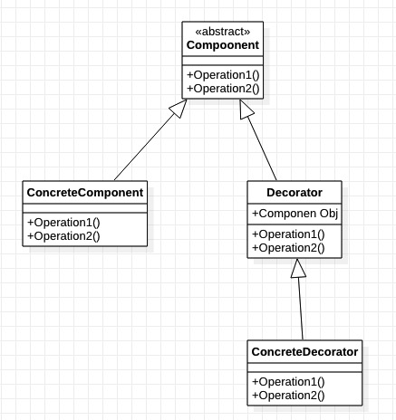
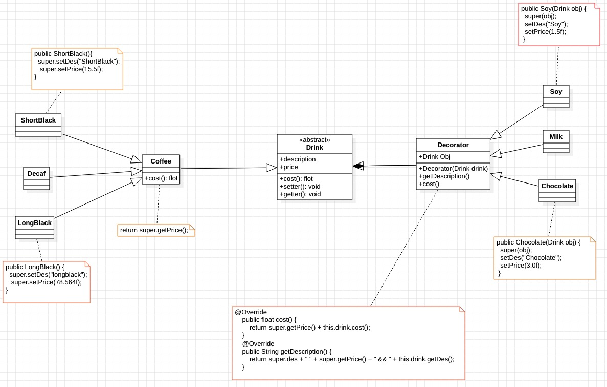

### 装饰者模式

需求 ：

1) 咖啡种类/单品咖啡： Espresso(意大利浓咖啡)、 ShortBlack、 LongBlack(美式咖啡)、 Decaf(无因咖啡)
2) 调料： Milk、 Soy(豆浆)、 Chocolate
3) 要求在扩展新的咖啡种类时， 具有良好的扩展性、 改动方便、 维护方便
4) 使用 OO 的来计算不同种类咖啡的费用: 客户可以点单品咖啡， 也可以单品咖啡+调料组合。

#### 方式一 ：普通方式

1. 设计一个Drink抽象类 包含了描述、价格等属性以及获取各种调料的方法。

2. 各种咖啡继承Drink抽象类。

缺点 ： 新增调料 -> 改动Drink方法，后期维护差点。

#### 方式二 ：装饰者模式

含义：

装饰者模式： 动态的将新功能附加到对象上。 在对象功能扩展方面， 它比继承更有弹性， 装饰者模式也体现了开闭原则(ocp) ‘面向切入式开发’

原理：

1) 装饰者模式就像打包一个快递
主体： 比如： 陶瓷、 衣服 (Component) // 被装饰者
包装： 比如： 报纸填充、 塑料泡沫、 纸板、 板(Decorator)
2) Component 主体： 比如类似前面的 Drink抽象层。
3) ConcreteComponent 和 Decorator作为Drink子类 ConcreteComponent： 主体实现类，比如前面的各个单品咖啡
4) Decorator: 装饰者， 比如各调料.在如图的 Component 与 ConcreteComponent 之间， 如果 ConcreteComponent（装饰者类实现类）类很多,还可以设计一个缓冲层， 将共有的部分提取出来， 抽象层一个类。

    
     
    
装饰者模式类图

使用装饰者模式解决上面的需求

    
     
    
装饰者模式

> 源码：git@gitee.com:gadeGG/ProjectCode.git   

>ProjectCode/ maven-Java / src / main / java / design_pattern / decorator
