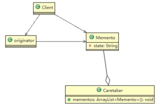
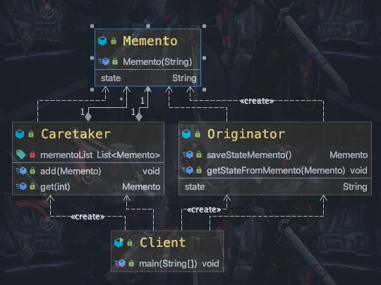

### 备忘录模式

需求 ：

游戏角色有攻击力和防御力， 在大战 Boss 前保存自身的状态(攻击力和防御力)， 当大战 Boss 后攻击力和防御
力下降， 从备忘录对象恢复到大战前的状态


介绍：

1)备忘录模式（Memento Pattern） 在不破坏封装性的前提下， 捕获一个对象的内部状态， 并在该对象之外保存这个状态。 这样以后就可将该对象恢复到原先保存的状态


2) 可以这里理解备忘录模式： 现实生活中的备忘录是用来记录某些要去做的事情， 或者是记录已经达成的共同意见的事情， 以防忘记了。 而在软件层面， 备忘录模式有着相同的含义， 备忘录对象主要用来记录一个对象的某种状态， 或者某些数据， 当要做回退时， 可以从备忘录对象里获取原来的数据进行恢复操作

3) 备忘录模式属于行为型模式

<center>
    
    <br>
    <div style="color:orange; border-bottom: 1px solid #d9d9d9;
    display: inline-block;
    color: #999;
    padding: 2px;">备忘录模式原理图</div>
</center>

1) originator : 对象(需要保存状态的对象)
2) Memento ： 备忘录对象,负责保存好记录， 即Originator 内部状态
3) Caretaker: 守护者对象,负责保存多个备忘录对象， 使用集合管理， 提高效率
4) 说明： 如果希望保存多个 originator 对象的不同时间的状态， 也可以， 只需要要 HashMap <String, 集合>

使用备忘录模式解决上面的需求：

<center>
    
    <br>
    <div style="color:orange; border-bottom: 1px solid #d9d9d9;
    display: inline-block;
    color: #999;
    padding: 2px;">备忘录模式解决需求</div>
</center>

```Java
public class Client {

    public static void main(String[] args) {
		// TODO Auto-generated method stub
		//创建需要保存状态的对象
		Originator originator = new Originator();
		Caretaker caretaker = new Caretaker();

		originator.setState("100");

		//保存状态
		caretaker.add(originator.saveStateMemento());

		originator.setState(" 80 ");
		//保存状态
		caretaker.add(originator.saveStateMemento());

		originator.setState("30");
		//保存状态
		caretaker.add(originator.saveStateMemento());

		System.out.println("当前状态 =" + originator.getState());

		//恢复状态
		originator.getStateFromMemento(caretaker.get(0));
		System.out.println("恢复初始状态 =" + originator.getState());


	}

}
```

##### 特点

1) 给用户提供了一种可以恢复状态的机制， 可以使用户能够比较方便地回到某个历史的状态
2) 实现了信息的封装， 使得用户不需要关心状态的保存细节
3) 如果类的成员变量过多， 势必会占用比较大的资源， 而且每一次保存都会消耗一定的内存, 这个需要注意
4) 适用的应用场景： 1、 后悔药。 2、 打游戏时的存档。 3、 Windows 里的 ctri + z。 4、 IE 中的后退。 4、 数
据库的事务管理
