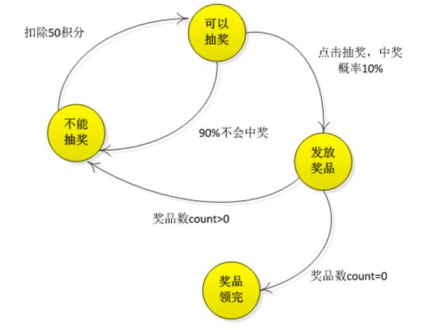
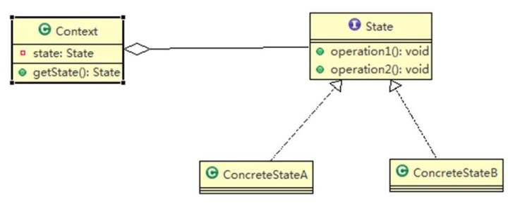
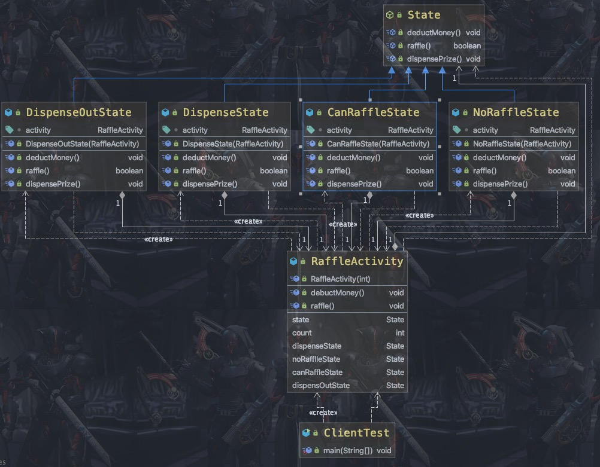

### 状态模式

需求 ：

1) 假如每参加一次这个活动要扣除用户 50 积分， 中奖概率是 10%
2) 奖品数量固定， 抽完就不能抽奖
3) 活动有四个状态: 可以抽奖、 不能抽奖、 发放奖品和奖品领完
4) 活动的四个状态转换关系图(右图)

<center>
    
    <br>
    <div style="color:orange; border-bottom: 1px solid #d9d9d9;
    display: inline-block;
    color: #999;
    padding: 2px;">状态模式需求图</div>
</center>

介绍：

1) 状态模式（State Pattern） ： 它主要用来解决对象在多种状态转换时， 需要对外输出不同的行为的问题。 <font color=ffaa00>状态和行为是一一对应的， 状态之间可以相互转换</font>
2) 当一个对象的内在状态改变时， 允许改变其行为， 这个对象看起来像是改变了其类

<center>
    
    <br>
    <div style="color:orange; border-bottom: 1px solid #d9d9d9;
    display: inline-block;
    color: #999;
    padding: 2px;">状态模式原理图</div>
</center>

1) Context 类为环境角色, 用于维护 State 实例,这个实例定义当前状态
2) State 是抽象状态角色,定义一个接口封装与 Context 的一个特点接口相关行为
3) ConcreteState 具体的状态角色， 每个子类实现一个与 Context 的一个状态相关行为

使用状态模式解决上面的需求：

<center>
    
    <br>
    <div style="color:orange; border-bottom: 1px solid #d9d9d9;
    display: inline-block;
    color: #999;
    padding: 2px;">状态模式解决需求</div>
</center>

```Java
public class Client {

    public static void main(String[] args) {
		// TODO Auto-generated method stub
		// 创建活动对象， 奖品有 1 个奖品
        RaffleActivity activity = new RaffleActivity(1);

        // 参加抽奖， 第一步点击扣除积分
        for (int i = 0; i < 30; i++) {
            System.out.println("--------第" + (i + 1) + "次抽奖----------");
            // 第二步抽奖
            activity.debuctMoney();

            // 第二步抽奖
            activity.raffle();
        }
	}

}
```

##### 特点

1) 代码有很强的可读性。 状态模式将每个状态的行为封装到对应的一个类中
2) 方便维护。 将容易产生问题的 if-else 语句删除了， 如果把每个状态的行为都放到一个类中， 每次调用方法时都要判断当前是什么状态， 不但会产出很多 if-else 语句， 而且容易出错
3) 符合“开闭原则” 。 容易增删状态
4) 会产生很多类。 每个状态都要一个对应的类， 当状态过多时会产生很多类， 加大维护难度
5) 应用场景： 当一个事件或者对象有很多种状态， 状态之间会相互转换， 对不同的状态要求有不同的行为的时候，可以考虑使用状态模式
