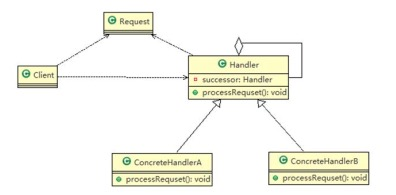
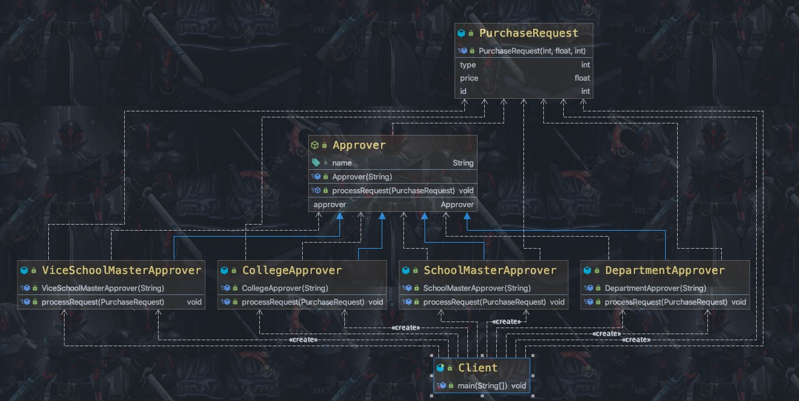

### 职责链模式

需求 ：

采购员采购教学器材
1) 如果金额 小于等于 5000, 由教学主任审批 （0<=x<=5000）
2) 如果金额 小于等于 10000, 由院长审批 (5000<x<=10000)
3) 如果金额 小于等于 30000, 由副校长审批 (10000<x<=30000)
4) 如果金额 超过 30000 以上， 有校长审批 ( 30000<x)
请设计程序完成采购审批项目

#### 1）传统模式

if else if  else

传统模式问题：
1) 传统方式是： 接收到一个采购请求后， 根据采购金额来调用对应的 Approver (审批人)完成审批。
2) 传统方式的问题分析 : 客户端这里会使用到 分支判断(比如 switch) 来对不同的采购请求处理， 这样就存在如下问题 (1) 如果各个级别的人员审批金额发生变化， 在客户端的也需要变化 (2) 客户端必须明确的知道 有多少个审批级别和访问
3) 这样 对一个采购请求进行处理 和 Approver (审批人) 就存在强耦合关系， 不利于代码的扩展和维护

#### 2）职责链模式

介绍：

1) 职责链模式（Chain of Responsibility Pattern） , 又叫 责任链模式， 为请求创建了一个接收者对象的链(简单示意
图)。 这种模式对请求的发送者和接收者进行解耦。
2) <font color=ffaa00>职责链模式通常每个接收者都包含对另一个接收者的引用。 如果一个对象不能处理该请求， 那么它会把相同的请求传给下一个接收者， 依此类推。</font>
3) 这种类型的设计模式属于行为型模式

<center>
    
    <br>
    <div style="color:orange; border-bottom: 1px solid #d9d9d9;
    display: inline-block;
    color: #999;
    padding: 2px;">职责链模式原理图</div>
</center>

1) Handler : 抽象的处理者, 定义了一个处理请求的接口, 同时含义另外 Handler
2) ConcreteHandlerA , B 是具体的处理者, 处理它自己负责的请求， 可以访问它的后继者(即下一个处理者), 如果
可以处理当前请求， 则处理， 否则就将该请求交个 后继者去处理， 从而形成一个职责链
3) Request ， 含义很多属性， 表示一个请求

<center>
    
    <br>
    <div style="color:orange; border-bottom: 1px solid #d9d9d9;
    display: inline-block;
    color: #999;
    padding: 2px;">职责链模式解决需求</div>
</center>

```Java
public class Client {

    public static void main(String[] args) {
		// TODO Auto-generated method stub
		//创建一个请求
		PurchaseRequest purchaseRequest = new PurchaseRequest(1, 31000, 1);

		//创建相关的审批人
		DepartmentApprover departmentApprover = new DepartmentApprover("浮点数");
		CollegeApprover collegeApprover = new CollegeApprover("发送");
		ViceSchoolMasterApprover viceSchoolMasterApprover = new ViceSchoolMasterApprover("发");
		SchoolMasterApprover schoolMasterApprover = new SchoolMasterApprover("二位");


		//需要将各个审批级别的下一个设置好 (处理人构成环形: )
		departmentApprover.setApprover(collegeApprover);
		collegeApprover.setApprover(viceSchoolMasterApprover);
		viceSchoolMasterApprover.setApprover(schoolMasterApprover);
		schoolMasterApprover.setApprover(departmentApprover);


		departmentApprover.processRequest(purchaseRequest);
		viceSchoolMasterApprover.processRequest(purchaseRequest);
	}

}
```

##### 特点

1) 将请求和处理分开， 实现解耦， 提高系统的灵活性
2) 简化了对象， 使对象不需要知道链的结构
3) 性能会受到影响， 特别是在链比较长的时候， 因此需控制链中最大节点数量， 一般通过在 Handler 中设置一个最大节点数量， 在 setNext()方法中判断是否已经超过阀值， 超过则不允许该链建立， 避免出现超长链无意识地破坏系统性能尚硅谷 Java 设计模式
4) 调试不方便。 采用了类似递归的方式， 调试时逻辑可能比较复杂
5) 最佳应用场景： 有多个对象可以处理同一个请求时， 比如： 多级请求、 请假/加薪等审批流程、 Java Web 中 Tomcat对 Encoding 的处理、 拦截器
