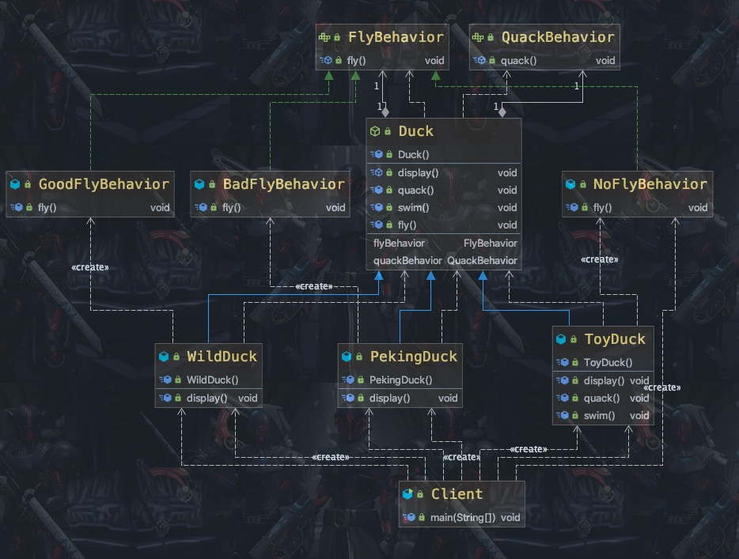

### 策略模式

需求 ：

1) 有各种鸭子(比如 野鸭、 北京鸭、 水鸭等， 鸭子有各种行为， 比如 叫、 飞行等)
2) 显示鸭子的信息

#### 1）传统模式

<center>
    
    <br>
    <div style="color:orange; border-bottom: 1px solid #d9d9d9;
    display: inline-block;
    color: #999;
    padding: 2px;">策略模式传统方式</div>
</center>

传统模式问题：
1) 其它鸭子， 都继承了 Duck 类， 所以 fly 让所有子类都会飞了， 这是不正确的
2) 上面说的 1 的问题， 其实是继承带来的问题： 对类的局部改动， 尤其超类的局部改动， 会影响其他部分。 会有溢出效应
3) 为了改进 1 问题， 我们可以通过覆盖 fly 方法来解决 => 覆盖解决
4) 问题又来了， 如果我们有一个玩具鸭子 ToyDuck, 这样就需要 ToyDuck 去覆盖 Duck 的所有实现的方法 => 解决思路 -》 策略模式 (strategy pattern)

#### 2）策略模式

介绍：

1) 策略模式（Strategy Pattern） 中， 定义算法族（策略组） ， 分别封装起来， 让他们之间可以互相替换， 此模式让算法的变化独立于使用算法的客户
2) 这算法体现了几个设计原则， <font color=ffaa00>第一、 把变化的代码从不变的代码中分离出来； 第二、 针对接口编程而不是具体类（定义了策略接口） ； 第三、 多用组合/聚合， 少用继承（客户通过组合方式使用策略） 。</font>

<center>
    
    <br>
    <div style="color:orange; border-bottom: 1px solid #d9d9d9;
    display: inline-block;
    color: #999;
    padding: 2px;">策略模式原理图</div>
</center>

客户 context 有成员变量 strategy 或者其他的策略接口,至于需要使用到哪个策略， 我们可以在构造器中指定使用状态模式解决上面的需求：

<center>
    
    <br>
    <div style="color:orange; border-bottom: 1px solid #d9d9d9;
    display: inline-block;
    color: #999;
    padding: 2px;">策略模式解决需求</div>
</center>

```Java
public class Client {

    public static void main(String[] args) {
		// TODO Auto-generated method stub
		WildDuck wildDuck = new WildDuck();
		wildDuck.fly();//

		ToyDuck toyDuck = new ToyDuck();
		toyDuck.fly();

		PekingDuck pekingDuck = new PekingDuck();
		pekingDuck.fly();

		//动态改变某个对象的行为, 北京鸭 不能飞
		pekingDuck.setFlyBehavior(new NoFlyBehavior());
		System.out.println("北京鸭的实际飞翔能力");
		pekingDuck.fly();
	}

}
```

##### 特点

1) 策略模式的关键是： <font color=ffaa00>分析项目中变化部分与不变部分</font>
2) 策略模式的核心思想是： 多用组合/聚合 少用继承； 用行为类组合， 而不是行为的继承。 更有弹性
3) 体现了“对修改关闭， 对扩展开放” 原则， 客户端增加行为不用修改原有代码， 只要添加一种策略（或者行为）即可， 避免了使用多重转移语句（if..else if..else）
4) 提供了可以替换继承关系的办法： 策略模式将算法封装在独立的 Strategy 类中使得你可以独立于其 Context 改变它， 使它易于切换、 易于理解、 易于扩展
5) 需要注意的是： 每添加一个策略就要增加一个类， 当策略过多是会导致类数目庞


#### 心得

策略模式封装了变化。

策略模式就是用来封装算法的，<font color=ff00aa>``它可以用来封装几乎任何类型的规则``，``只要在分析过程中听到需要在不同时间应用不同的业务规则，就可以考虑使用策略模式处理这种变化而可能性。``</font>
