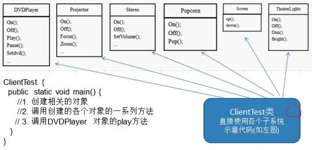
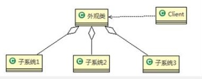
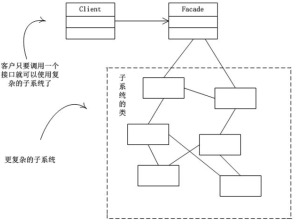

### 外观模式

需求 ：

组建一个家庭影院：
DVD 播放器、 投影仪、 自动屏幕、 环绕立体声、 爆米花机,要求完成使用家庭影院的功能， 其过程为：
直接用遥控器： 统筹各设备开关
开爆米花机
放下屏幕
开投影仪
开音响
开 DVD， 选 dvd
去拿爆米花
调暗灯光
播放
观影结束后， 关闭各种设备

#### 方式一 ：普通方式

    
     
    
传统模式

缺点 ：
1) 在 ClientTest 的 main 方法中， 创建各个子系统的对象， 并直接去调用子系统(对象)相关方法， 会造成调用过程混乱， 没有清晰的过程
2) 不利于在 ClientTest 中， 去维护对子系统的操作
3) 解决思路： 定义一个高层接口， 给子系统中的一组接口提供一个一致的界面(比如在高层接口提供四个方法ready, play, pause, end )， 用来访问子系统中的一群接口
4) 也就是说 就是通过定义一个一致的接口(界面类)， 用以屏蔽内部子系统的细节， 使得调用端只需跟这个接口发生调用， 而无需关心这个子系统的内部细节 => 外观模式

#### 方式二 ：外观模式

含义：

1) 外观模式（Facade） ， 也叫“过程模式： 外观模式为子系统中的一组接口提供一个一致的界面， 此模式定义了一个高层接口， 这个接口使得这一子系统更加容易使用。(此前设计模式中接口大都用作行为规范，而才此模式中用作对外提供服务)
2) 外观模式通过定义一个一致的接口， 用以屏蔽内部子系统的细节， 使得调用端只需跟这个接口发生调用， 而无需关心这个子系统的内部细节

原理：

    
     
    
外观模式

1) 外观类(Facade): 为调用端提供统一的调用接口, 外观类知道哪些子系统负责处理请求,从而将调用端的请求代理给适当子系统对象
2) 调用者(Client): 外观接口的调用者
3) 子系统的集合： 指模块或者子系统， 处理 Facade 对象指派的任务， 他是功能的实际提供者

使用外观模式解决上面的需求：即一个服务下多个子模块不论用什么模式实现，最后使用外观模式对外提供接口调用</fotn>

    
     
    
外观模式解决需求

