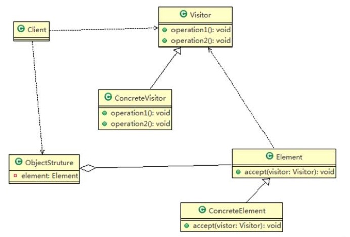
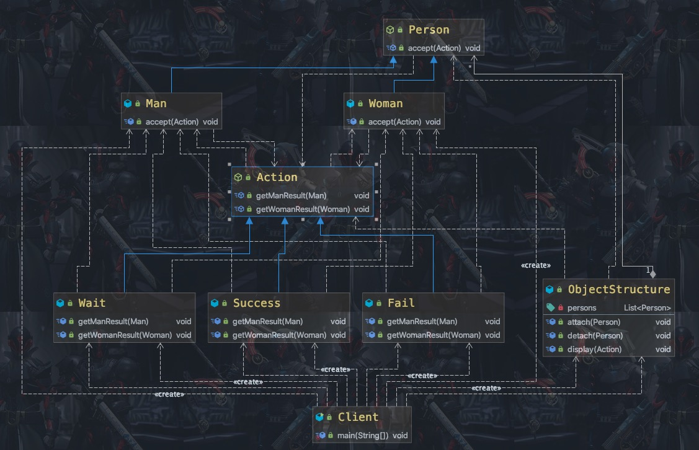

### 访问者模式

需求 ：

1) 将观众分为男人和女人， 对歌手进行测评， 当看完某个歌手表演后， 得到他们对该歌手不同的评价(评价 有不同的种类， 比如 成功、 失败 等)


含义：

1) 访问者模式（Visitor Pattern） ， 封装一些作用于某种数据结构的各元素的操作， 它可以在不改变数据结构的前提下定义作用于这些元素的新的操作。
2) 主要将数据结构与数据操作分离， 解决 数据结构和操作耦合性问题
3) 访问者模式的基本工作原理是： 在被访问的类里面加一个对外提供接待访问者的接口
4) 访问者模式主要应用场景是： <font color=ffaa00>需要对一个对象结构中的数据对象进行很多不同操作(这些操作彼此没有关联)， 同时需要避免让这些操作"污染"这些对象的类， 可以选用访问者模式解决</font>

<center>
    
    <br>
    <div style="color:orange; border-bottom: 1px solid #d9d9d9;
    display: inline-block;
    color: #999;
    padding: 2px;">访问者模式类图</div>
</center>

1) Visitor 是抽象访问者， 为该对象结构中的 ConcreteElement 的每一个类声明一个 visit 操作
2) ConcreteVisitor ： 是一个具体的访问值 实现每个有 Visitor 声明的操作， 是每个操作实现的部分.
3) ObjectStructure 能枚举它的元素， 可以提供一个高层的接口， 用来允许访问者访问元素
4) Element 定义一个 accept 方法， 接收一个访问者对象
5) ConcreteElement 为具体元素， 实现了 accept 方法

使用访问者模式解决上面的需求：

<center>
    
    <br>
    <div style="color:orange; border-bottom: 1px solid #d9d9d9;
    display: inline-block;
    color: #999;
    padding: 2px;">模板方法解决需求</div>
</center>

```Java
public class Client {

	public static void main(String[] args) {
		// TODO Auto-generated method stub
		ObjectStructure objectStructure = new ObjectStructure();

		objectStructure.attach(new Man());
		objectStructure.attach(new Woman());


		Success success = new Success();
		objectStructure.display(success);

		System.out.println("===============");
		Fail fail = new Fail();
		objectStructure.display(fail);

		System.out.println("=======给的是待定的测评========");

		Wait wait = new Wait();
		objectStructure.display(wait);
	}

}
```

##### 优点

1) 访问者模式符合单一职责原则、 让程序具有优秀的扩展性、 灵活性非常高
2) 访问者模式可以对功能进行统一， 可以做报表、 UI、 拦截器与过滤器， 适用于数据结构相对稳定的系统

##### 缺点

1) 具体元素对访问者公布细节， 也就是说访问者关注了其他类的内部细节， 这是迪米特法则所不建议的, 这样造
成了具体元素变更比较困难
2) 违背了依赖倒转原则。 访问者依赖的是具体元素， 而不是抽象元素
3) 因此， 如果一个系统有比较稳定的数据结构， 又有经常变化的功能需求， 那么访问者模式就是比较合适的.
