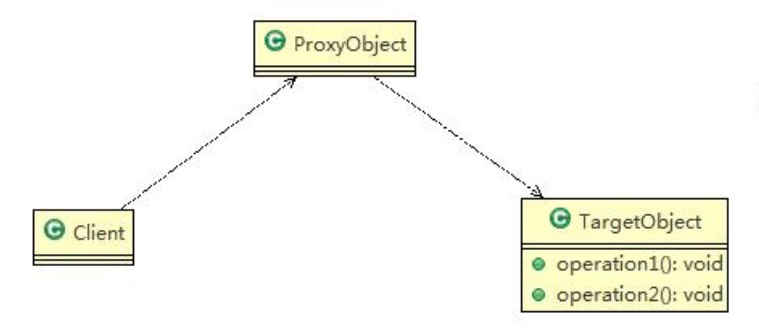
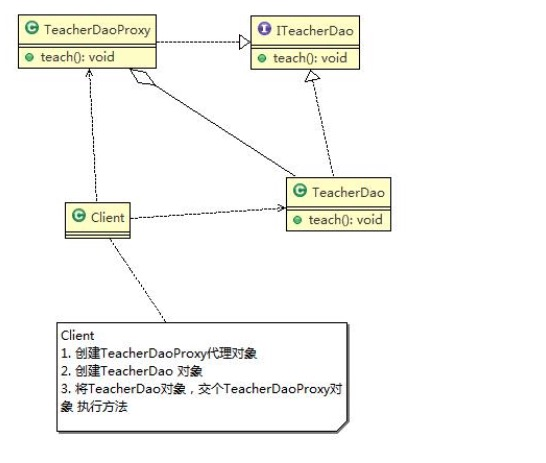
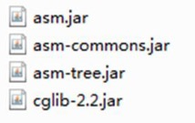
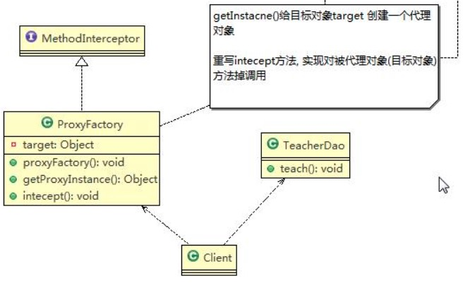

### 代理模式


#### 为什么使用代理？

假设你有一套房子要卖，一种方法是你直接去网上发布出售信息，然后直接带要买房子的人来看房子、过户等一直到房子卖出去，但是可能你很忙，你没有时间去处理这些事情，所以你可以去找中介，让中介帮你处理这些琐碎事情，中介实际上就是你的代理。本来是你要做的事情，现在中介帮助你一一处理，对于买方来说跟你直接交易跟同中介直接交易没有任何差异，买方甚至可能觉察不到你的存在，这实际上就是代理的一个最大好处。

原因一：你可能在外地上班，买房子的人没法找到你直接交易。

对应到我们程序设计的时候就是：客户端无法直接操作实际对象。那么为什么无法直接操作？一种情况是你需要调用的对象在另外一台机器上，你需要跨越网络才能访问，如果让你直接coding去调用，你需要处理网络连接、处理打包、解包等等非常复杂的步骤，所以为了简化客户端的处理，我们使用代理模式，在客户端建立一个远程对象的代理，客户端就象调用本地对象一样调用该代理，再由代理去跟实际对象联系，对于客户端来说可能根本没有感觉到调用的东西在网络另外一端，这实际上就是Web Service的工作原理。另一种情况虽然你所要调用的对象就在本地，但是由于调用非常耗时，你怕影响你正常的操作，所以特意找个代理来处理这种耗时情况，一个最容易理解的就是Word里面装了很大一张图片，在word被打开的时候我们肯定要加载里面的内容一起打开，但是如果等加载完这个大图片再打开Word用户等得可能早已经跳脚了，所以我们可以为这个图片设置一个代理，让代理慢慢打开这个图片而不影响Word本来的打开的功能。申明一下我只是猜可能Word是这么做的，具体到底怎么做的，俺也不知道。

原因二：你不知道怎么办过户手续，或者说除了你现在会干的事情外，还需要做其他的事情才能达成目的。

对应到我们程序设计的时候就是：除了当前类能够提供的功能外，我们还需要补充一些其他功能。最容易想到的情况就是权限过滤，我有一个类做某项业务，但是由于安全原因只有某些用户才可以调用这个类，此时我们就可以做一个该类的代理类，要求所有请求必须通过该代理类，由该代理类做权限判断，如果安全则调用实际类的业务开始处理。可能有人说为什么我要多加个代理类？我只需要在原来类的方法里面加上权限过滤不就完了吗？在程序设计中有一个类的单一性原则问题，这个原则很简单，就是每个类的功能尽可能单一。为什么要单一，因为只有功能单一这个类被改动的可能性才会最小，就拿刚才的例子来说，如果你将权限判断放在当前类里面，当前这个类就既要负责自己本身业务逻辑、又要负责权限判断，那么就有两个导致该类变化的原因，现在如果权限规则一旦变化，这个类就必需得改，显然这不是一个好的设计。被代理的对象可以是远程对象、 创建开销大的对象或需要安全控制的对象

#### 代理模式三种形式
代理模式有不同的形式, 主要有三种 静态代理、 动态代理 (JDK 代理、 接口代理)和 Cglib 代理 (可以在内存动态的创建对象， 而不需要实现接口， 他是属于动态代理的范畴) 。


<center>
    
    <br>
    <div style="color:orange; border-bottom: 1px solid #d9d9d9;
    display: inline-block;
    color: #999;
    padding: 2px;">代理类图</div>
</center>

#### 静态代理类

<font color=ffaa00>静态代理在使用时,需要定义接口或者父类,被代理对象(即目标对象)与代理对象一起实现相同的接口或者是继承相同父类</font>


实现步骤：

1) 定义一个接口:ITeacherDao
2) 目标对象 TeacherDAO 实现接口 ITeacherDAO
3) 使用静态代理方式,就需要在代理对象 TeacherDAOProxy 中也实现 ITeacherDAO
4) 调用的时候通过调用代理对象的方法来调用目标对象.
5) 特别提醒： 代理对象与目标对象要实现相同的接口,然后通过调用相同的方法来调用目标对象的方法

<center>
    
    <br>
    <div style="color:orange; border-bottom: 1px solid #d9d9d9;
    display: inline-block;
    color: #999;
    padding: 2px;">静态代理类图</div>
</center>


```Java
public class TeacherDaoProxy implements ITeacherDao{

	private ITeacherDao target; // 聚合   目标类实现接口


	public TeacherDaoProxy(ITeacherDao target) {
		this.target = target;
	}

	@Override
	public void teach() {
		// TODO Auto-generated method stub
		System.out.println("老师授课前准备工作 ");//方法增强  可以加一些校验过滤等
		target.teach();
		System.out.println("�ύ����������");//方法增强
	}

}
```

>优点： 在不修改目标对象的功能前提下, 能通过代理对象对目标功能扩展
>缺点： 因为代理对象需要与目标对象实现一样的接口,所以会有很多代理类。一旦接口增加方法,目标对象与代理对象都要维护

#### 动态代理

1) 代理对象,不需要实现接口， 但是目标对象要实现接口， 否则不能用动态代理
2) 代理对象的生成， 是利用 JDK 的 API， 动态的在内存中构建代理对象。代理类所在包:java.lang.reflect.Proxy
3) 动态代理也叫做： JDK 代理、 接口代理
4) JDK 实现代理只需要使用 newProxyInstance 方法,但是该方法需要接收三个参数,完整的写法是:

>static Object newProxyInstance(ClassLoader loader, Class<?>[] interfaces,InvocationHandler h )

```Java
public class ProxyFactory {

	private Object target;

	public ProxyFactory(Object target) {

		this.target = target;
	}
    //说明
    /*
    * public static Object newProxyInstance(ClassLoader loader,
    Class<?>[] interfaces,
    InvocationHandler h)
    //1. ClassLoader loader ： 指定当前目标对象使用的类加载器, 获取加载器的方法固定
    //2. Class<?>[] interfaces: 目标对象实现的接口类型， 使用泛型方法确认类型
    //3. InvocationHandler h : 事情处理， 执行目标对象的方法时， 会触发事情处理器方法, 会把当前执行
    的目标对象方法作为参数传入
    */
	public Object getProxyInstance() {
		return Proxy.newProxyInstance(target.getClass().getClassLoader(), target.getClass().getInterfaces(),
				new InvocationHandler() {
					@Override
					public Object invoke(Object proxy, Method method, Object[] args) throws Throwable {
						// TODO Auto-generated method stub
						System.out.println("方法执行前 ");
						//反射机制调用目标对象的方法
						Object returnVal = method.invoke(target, args);
						System.out.println("方法执行后");
						return returnVal;
					}
				});
	}
}
test

ITeacherDao target =new TeacherDao();

ITeacherDao proxyInstance = (ITeacherDao)new ProxyFactory(target).getProxyInstance();

System.out.println("proxyInstance=" + proxyInstance.getClass());
```

#### Cglib 代理模式

1) 静态代理和 JDK 代理模式都要求目标对象是实现一个接口,但是有时候目标对象只是一个单独的对象,并没有实现任何的接口,这个时候可使用目标对象子类来实现代理-这就是 Cglib 代理

2) Cglib代理也叫作子类代理,它是在内存中构建一个子类对象从而实现对目标对象功能扩展, 有些书也将Cglib代理归属到动态代理。

3) <font color=ffaa00>Cglib 是一个强大的高性能的代码生成包,它可以在运行期扩展 java 类与实现 java 接口.它广泛的被许多 AOP 的框架使用,例如 Spring AOP， 实现方法拦截</font>

4) 在 AOP 编程中如何选择代理模式：

    1. 目标对象需要实现接口， 用 JDK 代理
    2. 目标对象不需要实现接口， 用 Cglib 代理

5) Cglib 包的底层是通过使用字节码处理框架 ASM 来转换字节码并生成新的类


步骤：

1) 需要引入 cglib 的 jar 文件
<center>
    
    <br>
    <div style="color:orange; border-bottom: 1px solid #d9d9d9;
    display: inline-block;
    color: #999;
    padding: 2px;">cglib代理需要jar</div>
</center>
2) 在内存中动态构建子类， 注意代理的类不能为 final， 否则报错java.lang.IllegalArgumentException:
3) 目标对象的方法如果为 final/static,那么就不会被拦截,即不会执行目标对象额外的业务方法.

<center>
    
    <br>
    <div style="color:orange; border-bottom: 1px solid #d9d9d9;
    display: inline-block;
    color: #999;
    padding: 2px;">cglib代理类图</div>
</center>

```Java
import java.lang.reflect.Method;

import net.sf.cglib.proxy.Enhancer;
import net.sf.cglib.proxy.MethodInterceptor;
import net.sf.cglib.proxy.MethodProxy;

public class ProxyFactory implements MethodInterceptor {
	private Object target;

	public ProxyFactory(Object target) {
		this.target = target;
	}

	public Object getProxyInstance() {
		//1.创建一个工具类
		Enhancer enhancer = new Enhancer();
		//2.设置父类
		enhancer.setSuperclass(target.getClass());
		//3.设置回调函数
		enhancer.setCallback(this);
		//4.创建子类对象， 即代理对象
		return enhancer.create();

	}


	//重写 intercept 方法， 会调用目标对象的方法
	@Override
	public Object intercept(Object arg0, Method method, Object[] args, MethodProxy arg3) throws Throwable {
		// TODO Auto-generated method stub
		System.out.println("Cglib 代理模式 ~~ 开始");
		Object returnVal = method.invoke(target, args);
		System.out.println("Cglib 代理模式 ~~  提交");
		return returnVal;
	}

}

test
//�创建目标对象
TeacherDao target = new TeacherDao();
//获取到代理对象， 并且将目标对象传递给代理对象
TeacherDao proxyInstance = (TeacherDao)new ProxyFactory(target).getProxyInstance();

//ִ执行代理对象的方法， 触发 intecept 方法， 从而实现 对目标对象的调用
String res = proxyInstance.teach();
System.out.println("res=" + res);
```

#### 几种常见的代理模式介绍— 几种变体

1) 防火墙代理

内网通过代理穿透防火墙， 实现对公网的访问。

2) 缓存代理

比如： 当请求图片文件等资源时， 先到缓存代理取， 如果取到资源则 ok,如果取不到资源， 再到公网或者数据库取， 然后缓存。

3) 远程代理

远程对象的本地代表， 通过它可以把远程对象当本地对象来调用。 远程代理通过网络和真正的远程对象沟通信息。

4) 同步代理： 主要使用在多线程编程中， 完成多线程间同步工作

5）安全代理：用来控制真实对象访问时的权限
