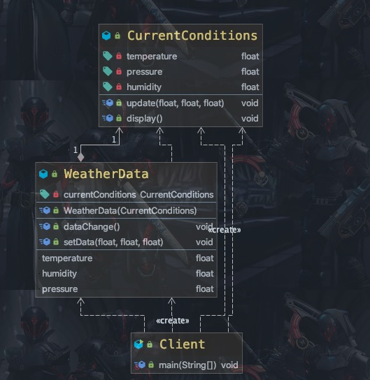
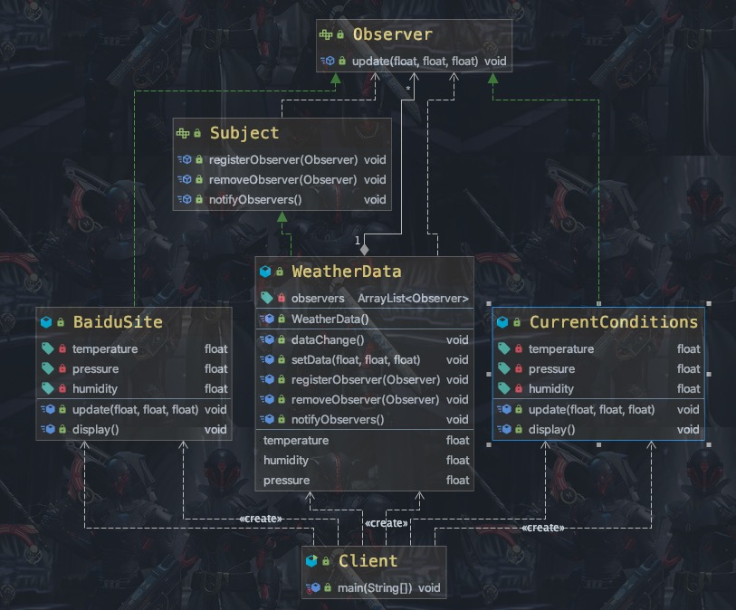

### 观察者模式

需求 ：

1) 气象站可以将每天测量到的温度， 湿度， 气压等等以公告的形式发布出去(比如发布到自己的网站或第三方)。
2) 需要设计开放型 API， 便于其他第三方也能接入气象站获取数据。
3) 提供温度、 气压和湿度的接口
4) 测量数据更新时， 要能实时的通知给第三方


#### 方式一 ：普通方式

<center>
    
    <br>
    <div style="color:orange; border-bottom: 1px solid #d9d9d9;
    display: inline-block;
    color: #999;
    padding: 2px;">传统模式</div>
</center>

```Java
public class Client {
	public static void main(String[] args) {
		//创建接入方 currentConditions
		CurrentConditions currentConditions = new CurrentConditions();
		//创建 WeatherData 并将 接入方 currentConditions 传递到 WeatherData 中
		WeatherData weatherData = new WeatherData(currentConditions);

		//更新天气情况
		weatherData.setData(30, 150, 40);

		//天气情况变化
		System.out.println("============天气情况变化=============");
		Timer timer=new Timer();
		timer.schedule(new TimerTask() {
			public void run() {
				weatherData.setData(40, 160, 20);
				timer.cancel();
			}
		}, 2000);
	}
}
```

数据发生改变时调用setData方法，在setData方法中调用dataChange方法。在dataChange中调用CurrentConditions中的update方法。

#### 方式二 ：观察者模式

含义：

<font color=ff00aa>`Subject`</font>： 登记注册、 移除和通知

    1) registerObserver 注册
    2) removeObserver 移除
    3) notifyObservers() 通知所有的注册的用户， 根据不同需求， 可以是更新数据， 让用户来取， 也可能是实施推送，看具体需求定

<font color=ff00aa>`Observer`</font>： 接收输入

观察者模式： 对象之间多对一依赖的一种设计方案， 被依赖的对象为 Subject， 依赖的对象为 Observer， Subject通知 Observer 变化,比如这里的气象站是 Subject， 是 1 的一方。 第三方是 Observer， 是多的一方。

原理：

<center>
    
    <br>
    <div style="color:orange; border-bottom: 1px solid #d9d9d9;
    display: inline-block;
    color: #999;
    padding: 2px;">观察者模式实现需求</div>
</center>

1) Observer: 观察者->第三方接口
2) Subject: 主题->观察者关注的内容。这里指气象数据
3) WeatherData：气象站

```Java
/**
 * 类是核心
 * 1. 包含最新的天气情况信息
 * 2. 含有 观察者集合， 使用 ArrayList 管理
 * 3. 当数据有更新时， 就主动的调用 ArrayList, 通知所有的（接入方） 就看到最新的信息
 * @author Administrator
 * *
*/
public class WeatherData implements Subject {
	private float temperatrue;
	private float pressure;
	private float humidity;
	//观察者集合
	private ArrayList<Observer> observers;

	//加入新的第三方

	public WeatherData() {
		observers = new ArrayList<Observer>();
	}

	public float getTemperature() {
		return temperatrue;
	}

	public float getPressure() {
		return pressure;
	}

	public float getHumidity() {
		return humidity;
	}

	public void dataChange() {
		//调用 接入方的 update

		notifyObservers();
	}

	//当数据有更新时， 就调用 setData
	public void setData(float temperature, float pressure, float humidity) {
		this.temperatrue = temperature;
		this.pressure = pressure;
		this.humidity = humidity;
		//调用 dataChange， 将最新的信息 推送给 接入方 currentConditions
		dataChange();
	}

	//注册一个观察者
	@Override
	public void registerObserver(Observer o) {
		// TODO Auto-generated method stub
		observers.add(o);
	}

	//移除一个观察者
	@Override
	public void removeObserver(Observer o) {
		// TODO Auto-generated method stub
		if(observers.contains(o)) {
			observers.remove(o);
		}
	}

	//通知观察者
	@Override
	public void notifyObservers() {
		// TODO Auto-generated method stub
		for(int i = 0; i < observers.size(); i++) {
			observers.get(i).update(this.temperatrue, this.pressure, this.humidity);
		}
	}
}

public class Client {

	public static void main(String[] args) {
		// TODO Auto-generated method stub
		//创建一个 WeatherData
		WeatherData weatherData = new WeatherData();

		//创建观察者   订阅者
		CurrentConditions currentConditions = new CurrentConditions();
		BaiduSite baiduSite = new BaiduSite();

		//注册到 weatherData
		weatherData.registerObserver(currentConditions);
		weatherData.registerObserver(baiduSite);

		//测试
		System.out.println("֪ͨ通知各个注册的观察者, 看看信息");
		weatherData.setData(10f, 100f, 30.3f);


		weatherData.removeObserver(currentConditions);
		//测试
		System.out.println("֪ͨ通知各个注册的观察者, 看看信息");
		weatherData.setData(10f, 100f, 30.3f);
	}

}
```
