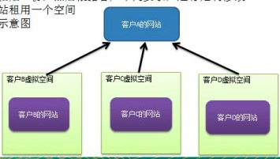
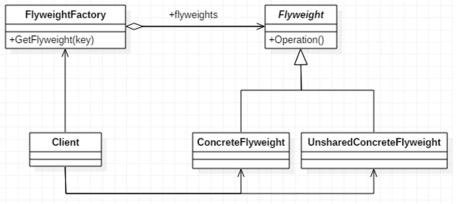
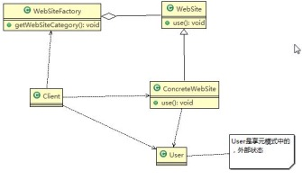

### 享元模式

需求 ：

小型的外包项目， 给客户 A 做一个产品展示网站， 客户 A 的朋友感觉效果不错， 也希望做这样的产品展示网站， 但是要求都有些不同：
1) 有客户要求以新闻的形式发布
2) 有客户人要求以博客的形式发布
3) 有客户希望以微信公众号的形式发布

#### 方式一 ：普通方式

1) 直接复制粘贴一份， 然后根据客户不同要求， 进行定制修改
2) 给每个网站租用一个空间
3) 方案设计示意图

    
     
    
传统模式

缺点 ：
1) 需要的网站结构相似度很高， 而且都不是高访问量网站， 如果分成多个虚拟空间来处理， 相当于一个相同网站的实例对象很多， 造成服务器的资源浪费
2) 解决思路： 整合到一个网站中， 共享其相关的代码和数据， 对于硬盘、 内存、 CPU、 数据库空间等服务器资源都可以达成共享， 减少服务器资源
3) 对于代码来说， 由于是一份实例， 维护和扩展都更加容易
4) 上面的解决思路就可以使用 享元模式 来解决

#### 方式二 ：享元模式

含义：

1) 外观模式（Facade） ， 也叫“过程模式： 外观模式为子系统中的一组接口提供一个一致的界面， 此模式定义了一个高层接口， 这个接口使得这一子系统更加容易使用。(此前设计模式中接口大都用作行为规范，而才此模式中用作对外提供服务)
2) 外观模式通过定义一个一致的接口， 用以屏蔽内部子系统的细节， 使得调用端只需跟这个接口发生调用， 而无需关心这个子系统的内部细节

原理：

    
     
    
享元模式

1) 享元模式（Flyweight Pattern） 也叫 蝇量模式: 运用共享技术有效地支持大量细粒度的对象
2) 常用于系统底层开发， 解决系统的性能问题。 像数据库连接池， 里面都是创建好的连接对象， 在这些连接对象中有我们需要的则直接拿来用， 避免重新创建， 如果没有我们需要的， 则创建一个
3) 享元模式能够解决重复对象的内存浪费的问题， 当系统中有大量相似对象， 需要缓冲池时。 不需总是创建新对象， 可以从缓冲池里拿。 这样可以降低系统内存， 同时提高效率
4) 享元模式经典的应用场景就是池技术了， String 常量池、 数据库连接池、 缓冲池等等都是享元模式的应用， 享元模式是池技术的重要实现方式

##### 内部状态和外部状态

比如围棋、 五子棋、 跳棋， 它们都有大量的棋子对象， 围棋和五子棋只有黑白两色， 跳棋颜色多一点， 所以棋子颜色就是棋子的内部状态； 而各个棋子之间的差别就是位置的不同， 当我们落子后， 落子颜色是定的， 但位置是变化的， 所以棋子坐标就是棋子的外部状态

1) 享元模式提出了两个要求： 细粒度和共享对象。 这里就涉及到内部状态和外部状态了， 即将对象的信息分为两个部分： 内部状态(状态是相对不变的)和外部状态(状态是随时变化的)
2) 内部状态指对象共享出来的信息， 存储在享元对象内部且不会随环境的改变而改变
3) 外部状态指对象得以依赖的一个标记， 是随环境改变而改变的、 不可共享的状态。

使用享元模式解决上面的需求：

    
     
    
享元模式解决需求

