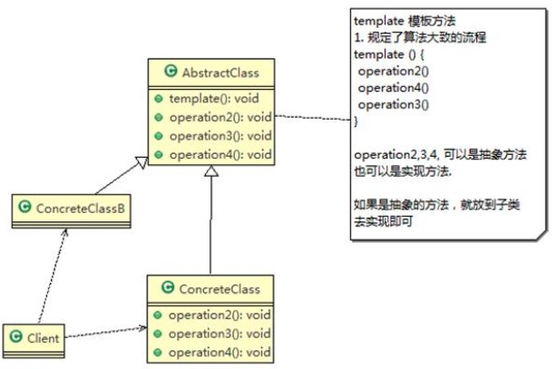
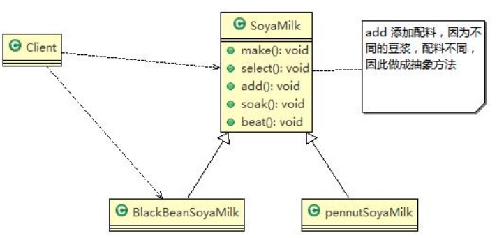

### 模板方法模式

需求 ：

1) 制作豆浆的流程 选材--->添加配料--->浸泡--->放到豆浆机打碎
2) 通过添加不同的配料， 可以制作出不同口味的豆浆
3) 选材、 浸泡和放到豆浆机打碎这几个步骤对于制作每种口味的豆浆都是一样的，因此可以使用模板方法实现


含义：

1) 模板方法模式（Template Method Pattern） ， 又叫模板模式(Template Pattern)， 在一个抽象类公开定义了执行它的方法的模板。 它的子类可以按需要重写方法实现， 但调用将以抽象类中定义的方式进行。

2) 简单说， 模板方法模式 定义一个操作中的算法的骨架， 而将一些步骤延迟到子类中， 使得子类可以不改变一个算法的结构， 就可以重定义该算法的某些特定步骤

3) 这种类型的设计模式属于行为型模式。


原理：

<center>
    
    <br>
    <div style="color:orange; border-bottom: 1px solid #d9d9d9;
    display: inline-block;
    color: #999;
    padding: 2px;">模板方法模式类图</div>
</center>

1) AbstractClass 抽象类， 类中实现了模板方法(template)， 定义了算法的骨架， 具体子类需要去实现 其它的抽象方法 operationr2,3,4 。类似于建造者模式
2) ConcreteClass 实现抽象方法 operationr2,3,4, 以完成算法中特点子类的步骤


使用模板方法解决上面的需求：

<center>
    
    <br>
    <div style="color:orange; border-bottom: 1px solid #d9d9d9;
    display: inline-block;
    color: #999;
    padding: 2px;">模板方法解决需求</div>
</center>

```Java
public abstract class SoyaMilk {

	final void make() {

		select();
		addCondiments();
		soak();
		beat();

	}


	void select() {
		System.out.println("第一步： 选择好的新鲜黄豆");
	}

	//子类实现，添加不同口味的配料
	abstract void addCondiments();


	void soak() {
		System.out.println("第三步， 黄豆和配料开始浸泡， 需要 3 小时");
	}

	void beat() {
		System.out.println("第四步： 黄豆和配料放到豆浆机去打碎");
	}
}
```

####模板方法模式的钩子方法
1) 在模板方法模式的父类中， 我们可以定义一个方法， 它默认不做任何事， 子类可以视情况要不要覆盖它， 该方法称为“钩子” 相当于一个flag。

2) 还是用上面做豆浆的例子来讲解， 比如， 我们还希望制作纯豆浆， 不添加任何的配料， 请使用钩子方法对前面的模板方法进行改造

```Java
public abstract class SoyaMilk {
	final void make() {

		select();
		if(customerWantCondiments()) {
			addCondiments();
		}
		soak();
		beat();

	}

	void select() {
		System.out.println("��һ����ѡ��õ����ʻƶ�  ");
	}

	//子类实现，添加不同的配料
	abstract void addCondiments();


	void soak() {
		System.out.println("�������� �ƶ������Ͽ�ʼ���ݣ� ��Ҫ3Сʱ ");
	}

	void beat() {
		System.out.println("���IJ����ƶ������Ϸŵ�������ȥ����  ");
	}

	//钩子方法， 决定是否需要添加配料
	boolean customerWantCondiments() {
		return true;
	}
}
```

```Java
public class PureSoyaMilk extends SoyaMilk{

	@Override
	void addCondiments() {
		// TODO Auto-generated method stub
		//.....
	}
	//看子类需求，如果需要则覆盖，根据返回值来决定是否启用某道工序
	@Override
	boolean customerWantCondiments() {
		// TODO Auto-generated method stub
		return false;
	}

}
```
