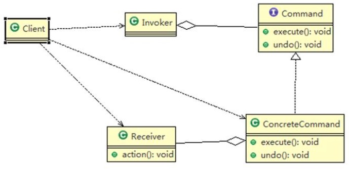

### 命令模式

含义：

1) 命令模式（Command Pattern） ： 在软件设计中， 我们经常需要向某些对象发送请求， 但是并不知道请求的接收者是谁， 也不知道被请求的操作是哪个，我们只需在程序运行时指定具体的请求接收者即可， 此时， 可以使用命令模式来进行设计

2) 命名模式使得请求发送者与请求接收者消除彼此之间的耦合， 让对象之间的调用关系更加灵活， 实现解耦。

3) 在命名模式中， 会将一个请求封装为一个对象， 以便使用不同参数来表示不同的请求(即命名)， 同时命令模式也支持可撤销的操作。

4) 通俗易懂的理解： 将军发布命令， 士兵去执行。 其中有几个角色： 将军（命令发布者） 、 士兵（命令的具体执行者） 、 命令(连接将军和士兵)。Invoker 是调用者（将军） ， Receiver 是被调用者（士兵） ， MyCommand 是命令， 实现了 Command 接口， 持有接收对象

原理：

    
     
    
命令模式类图

1) Invoker 是调用者角色
2) Command: 是命令角色， 需要执行的所有命令都在这里， 可以是接口或抽象类
3) Receiver: 接受者角色， 知道如何实施和执行一个请求相关的操作
4) ConcreteCommand: 将一个接受者对象与一个动作绑定， 调用接受者相应的操作， 实现 execute
