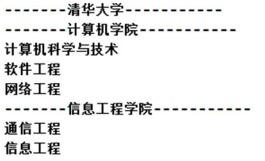
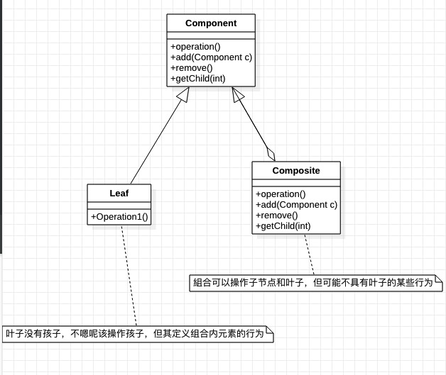
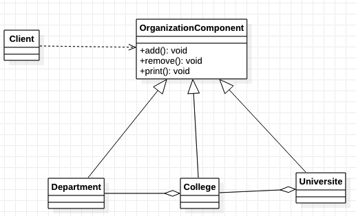

### 组合模式

需求 ：

编写程序展示一个学校院系结构： 需求是这样， 要在一个页面中展示出学校的院系组成， 一个学校有多个学院，一个学院有多个系。 如图：

    
     
    
组合模式需求

#### 方式一 ：普通方式

学校下面分系，系下面分学院，学院下面分系

缺点 ：
1) 将学院看做是学校的子类， 系是学院的子类， 这样实际上是站在组织大小来进行分层次的
2) 实际上我们的要求是 ： 在一个页面中展示出学校的院系组成， 一个学校有多个学院， 一个学院有多个系， 因此这种方案， >不能很好实现的管理的操作， 比如对学院、 系的添加， 删除， 遍历等
3) 解决方案： 把学校、 院、 系都看做是组织结构， 他们之间没有继承的关系， 而是一个树形结构， 可以更好的实现管理操作。 => 组合模式（ztree等插件除外）

#### 方式二 ：組合模式

含义：

1) 组合模式（Composite Pattern） ， 又叫部分整体模式， 它创建了对象组的树形结构， 将对象组合成树状结构以表示“整体-部分” 的层次关系。
2) 组合模式依据树形结构来组合对象， 用来表示部分以及整体层次。
3) 这种类型的设计模式属于结构型模式。
4) 组合模式使得用户对单个对象和组合对象的访问具有一致性， 即： 组合能让客户以一致的方式处理个别对象以及组合对象

原理：

    
     
    
组合模式原理图

1) Component :这是组合中对象声明接口， 在适当情况下， 实现所有类共有的接口默认行为,用于访问和管理Component 子部件, Component 可以是抽象类或者接口
2) Leaf : 在组合中表示叶子节点， 叶子节点没有子节点
3) Composite :非叶子节点， 用于存储子部件， 在 Component 接口中实现 子部件的相关操作， 比如增加(add),
删除。

使用组合模式解决上面的需求

    
     
    
组合模式解决需求

> 源码：git@gitee.com:gadeGG/ProjectCode.git   

>ProjectCode/ maven-Java / src / main / java / design_pattern / decorator
