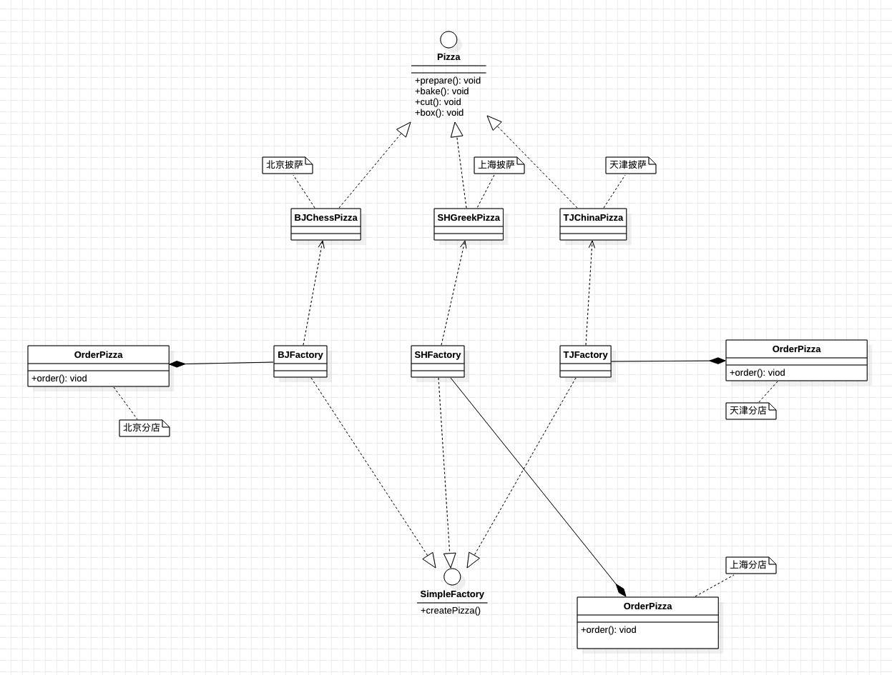

### 工厂设计模式

需求 ： 看一个披萨的项目： 要便于披萨种类的扩展， 要便于维护

    1) 披萨的种类很多(比如 GreekPizz、 CheesePizz 等)

    2) 披萨的制作有 prepare， bake, cut, box

    3) 完成披萨店订购功能。

#### 方式一 ：普通方式实现

    
     
    
无使用工厂设计模式

1) 优点是比较好理解， 简单易操作。

2) 缺点是违反了设计模式的 ocp 原则， 即对扩展开放， 对修改关闭。 即当我们给类增加新功能的时候， 尽量不修
改代码， 或者尽可能少修改代码.

3) 比如我们这时要新增加一个 Pizza 的种类(Pepper 披萨)， 我们需要修改OrderPizza类中getInputAndCreatePizza()方法.而如果有多个OrderPizza类是我们就需要改多处代码。

<code>分析：</code> 修改代码可以接受， 但是如果我们在其它的地方也有创建 Pizza 的代码， 就意味着， 也需要修改， 而创建 Pizza
的代码， 往往有多处。

<code>思路：</code>  把创建 Pizza 对象封装到一个类中， 这样我们有新的 Pizza 种类时， 只需要修改该类就可， 其它有创建到 Pizza对象的代码就不需要修改了.-> 简单工厂模式

#### 方式二 ：简单工厂模式

简单工厂模式是属于创建型模式， 是工厂模式的一种。 简单工厂模式是由一个工厂对象决定创建出哪一种产品类的实例。 简单工厂模式是工厂模式家族中最简单实用的模式。

简单工厂模式： 定义了一个创建对象的类， 由这个类来封装实例化对象的行为(代码)。在软件开发中， 当我们会用到大量的创建某种、 某类或者某批对象时， 就会使用到工厂模式。

    
     
    
简单工厂模式

> 简单工厂模式中创建方法修改为static，则为静态工厂模式。

#### 方式三

如上图所示需求，解决思路：

使用简单工厂模式， 创建不同的简单工厂类， 比如 BJPizzaSimpleFactory、 LDPizzaSimpleFactory 等等.从当前这个案例来说， 也是可以的， 但是考虑到项目的规模， 以及软件的可维护性、 可扩展性并不是特别好，使用 > 工厂方法模式实现。

含义 ：

1) 工厂方法模式设计方案： 将披萨项目的实例化功能抽象成抽象方法， 在不同的口味点餐子类中具体实现。
2) 工厂方法模式： 定义了一个创建对象的抽象方法， 由子类决定要实例化的类。 工厂方法模式将对象的实例化推迟到子类。

    
     
    
工厂方法模式

#### 小结

简单工厂设计模式是对普通方式的第一步抽象 ： 将创造类的代码提取到工厂类中。

静态工厂模式在简单工厂设计模式基础上利用 接口 或 抽象类 设计架构从而达到高维护、高可用的结构。

工厂方法模式是对静态工厂模式的进一步抽象。将其创建方法抽象为抽象方法或接口，然后纵向扩展工厂类结构。
