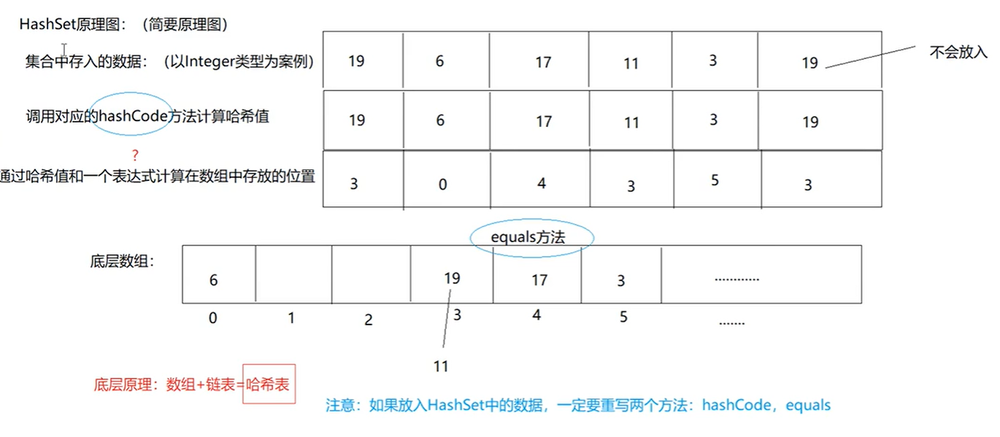
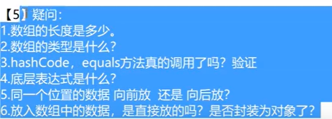

## 知识点

*   存放元素顺序 ：无序 
*   线程是否安全 ： 不安全
*   数组结构 ：数组+链表 = 哈希表

## 原理

>   *   数值 的 HashCode值就等于数值本身
>   *   字符 的 HashCode值就等于字符的 ASCII 值

1.  加入一个元素，调用其类型的hashcode计算哈希值
2.  通过哈希值和一个表达式计算出该元素数组存放的下标
3.  元素不重复则存入 不同的元素hash值有可能一样
4.  元素重复则进行链表存储

>   如果为自定义对象，则一定要重写hashcode和equals方法，如果不重写，在Set比较元素是否一样的时候会认为不一样，导致放入两个一样数据的对象到Set中

## LinkHashSet - 有序

`原理`

在HashSet的基础上新增了一个链表，用以保存存入的数据(有先后顺序)

## 内部比较器和外部比较器

*   内部比较器 comparable

    目标对象中实现 comparable 复写 compare方法自定义比较

    目标对象中只能实现一种比较规则

*   外部比较器 comparator

    新建一个类实现comparator ，并传入两个对象自定义比较

    比较灵活，多个类 可以实现多个比较规则