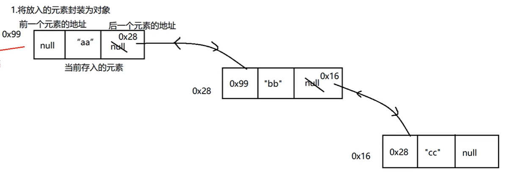

## 知识点

*   存放元素顺序 ：有序
*   线程是否安全 ： 不安全
*   数组结构 ：双向链表
*   查询  ： 下标


## 实现

`源码`

```java
private static class Node<E> {
    E item;
    Node<E> next;
    Node<E> prev;

    Node(Node<E> prev, E element, Node<E> next) {
        this.item = element;
        this.next = next;
        this.prev = prev;
    }
}
```

