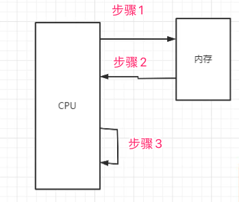
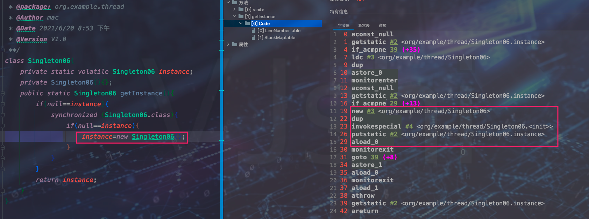

## 线程和进程

* 进程

	是操作系统分配资源的最小单元

* 线程

	是操作系统进行任务分配的最小单元，线程隶属于进程


## Java开启多线程方式

* 继承Thread，重写run方法

* 实现Runnable接口、实现run方法

* 实现Callable接口，实现call方法，并通过FutureTask创建一个线程，获取线程执行的返回值

* 通过线程池来开启线程

	> ThreadPoolExecutor自定义参数或者四种常用线程池

	> 异步编排


## 怎么保证线程安全

* 加锁
	* jvm提供的Synchronized关键字
	* JDK提供的各种代码层面的锁Lock


## Synchronized和Volatile区别

* Synchronized 关键字用来加锁。Volatile只是保持变量在线程中的可见性，通常适用于一个线程写多个线程读

	```java
	@SuppressWarnings("all")
	public class VolatileDemo {
	    public static boolean flag =true;//不使用volatile修饰
	
	    public static void main(String[] args) {
	        new Thread(() -> {
	            while (flag) {
	
	            }
	            System.out.println("End for Thread1");
	        }, "Thread1").start();
	        //必须加上休眠时间，否则子线程Thread1还没有转备好主线程就已经将flas的值重置为了false，然后子线程thread1拿到的变量副本是false
	        try {
	            Thread.sleep(100);
	        } catch (InterruptedException e) {
	            e.printStackTrace();
	        }
	        System.out.println("End for Main Thread");
	        flag=false;
	    }
	}
	```

	> 1. 我们必须加上休眠时间，具体原因上面也说清楚了
	> 2. 我们预期结果是在执行main线程后 将flag=false 后 子线程thread1就会获取到flag的状态然后结束，其实不是这样的。流程如下：
	>
	> * 进入main函数后创建子线程 ，子线程中使用到了变量flag，则子线程进行变量拷贝到子线程中，此时子线程变量为true
	> * 主函数等待100ms后执行输出语句并修改flag值，但是子线程变量副本flag并没有实时刷新过去，然后子线程一直while循环
	>
	> :jack_o_lantern:因此给flag变量添加 volatile修饰符，如果主线程中flag状态发生修改则子线程副本变量会实时修改过去

* Volatile 只能保证线程之间变量副本可见性，即实时修改同步，但是并不能保证线程安全性


## 为什么要在DCL中使用Volatile

### 1、什么是DCL

即Doubler check lock （单例模式中双检查单例模式），如下：

```java
/**
 * TODO:<p> 对于懒汉式加载（线程安全，同步代码块）解决其同步和多实例问题 <p/>
 *
 * @package: design_pattern.singleton
 * @Author mac
 * @Date 2020/5/17 9:14 下午
 * @Version V1.0
 **/
public class SingletonTest06 {
    public static void main(String[] args) {
        for(int i=0;i<100;i++){
            new Thread(() -> System.out.println(Singleton06.getInstance().hashCode())).start();
        }
    }
}

class Singleton06{
    private static volatile Singleton06 instance;
    private Singleton06(){};
    public static Singleton06 getInstance(){
        if(null==instance){
            synchronized (Singleton06.class){
                if(null==instance){
                    instance=new Singleton06();
                }
            }
        }
        return instance;
    }
}
```

> 总体来说，单例模式一般分为 
>
> * 饿汉式加载模式即使用静态变量或者静态代码块直接初始化类实例。
> * 懒汉式加载模式即在使用时去初始化类实例，线程安全的也就是双重检查 懒汉式加载模式
> * 还有两种，一种利用了类加载机制loadclass方法Synchronized线程安全机制，类内部使用内部类初始化类实例
> * 另外一种利用了枚举类中每个实例都是单例特性


### 2、什么是指令重排

在计算机运行时，CPU负责计算，而内存负责数据加载，极简流程大概是CPU接收到处理请求，从内存中加载数据，然后执行计算。但是CPU的执行效率是非常快的，但是不得不等待内存数据加载完毕后再执行。因此出现了指令重排，即在读取内存这段时间，CPU执行其他命令，等待内存加载结束后再执行CPU处理计算。如下图：



> 即 正常情况下 计算机都是 先执行 步骤1--->步骤2----->步骤3 一步步执行，但是这样会浪费CPU性能，因此出现了指令重排。
>
> 指令重排即，CPU先执行 步骤1---->步骤3---->步骤2.  即电脑将你的指令进行重排后处理，提高CPU利用率，一般情况下也很OK，但是有一些特殊的情况就得避免指令重排。


### 3、为什么要避免指令重排？

一般情况指令重排能够给我们带来CPU的利用率，但是有一些情况指令重排会造成我们程序的错误。例如 jvm对象创建。

Java对象创建一般分为

1. 内存分配

2. 对象字段初始化

3. 栈中变量和堆中对象实例建立指针对应关系

	<font color=ff00aa>这个时候指令重排就会造成灾难性的打击，比如我在1、2之间插入了3。在多线程中建立关系后我们直接使用对象字段(这个时候由于对象字段没有初始化，还是默认值)，则会造成数据错误</font>


### 4、为什么DCL中实例变量必须加 Volatile

如 1 中所示 ：

```java
instance=new Singleton06();
```

在jvm层面并不是原子操作，是分为三步的

1. 内存分配  【new 指令】
2. 对象字段初始化    【invokespecial对应的init方法】
3. 栈中变量和堆中对象实例建立指针对应关系    【putstatic 对应的Singleton06.instance】



> 正常情况我们使用步骤1、2、3是完全没有问题的，但是在DCL中多线程模式下，JVM为了提升性能默认指令重排，如果步骤分为了1、3、2 多线程下，A线程执行到了1、3步骤instance变量已经有值。这个时候进来另外一个线程执行代码 if(null==instance){} return instance; 这个时候instance变量已经有值，则直接返回并去使用了，但是这个时候变量instance由于步骤2没有执行，会导致程序错误

