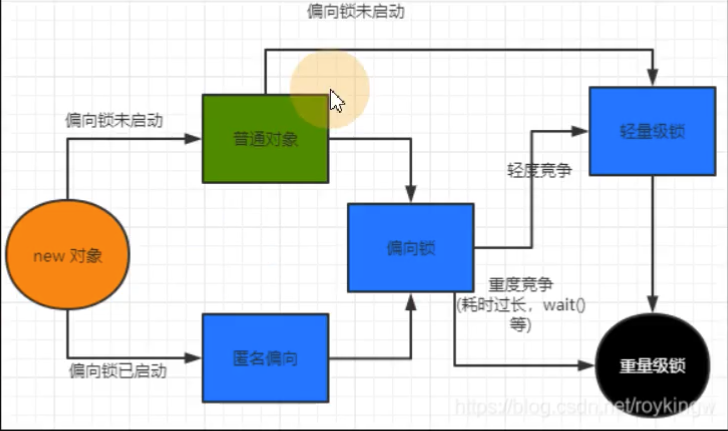

## Java线程锁机制是怎样的？

* 对象头信息如上图，Java锁 synchronized 信息就存放在对象头中

* synchronized 分为方法和代码块

	* 如果synchronized修饰方法则 并没有对应的jvm指令，它是作为修饰符出现的

		

	* 如果synchronized 修饰代码块  则 会产生对应的jvm指令 monitorenter和monitorexit

		

		> :a:注意，简单来说在JVM中monitorenter和monitorexit字节码依赖于底层的操作系统的Mutex Lock来实现的，但是由于使用Mutex Lock需要将当前线程挂起并从用户态切换到内核态来执行，这种切换的代价是非常昂贵的；如果多次遮掩切换会造成性能的大大浪费，因此在JDK1.6的时候对锁做了大量的优化，出现了现在的  偏向锁、轻量级锁、重量级锁

## 偏向锁、轻量级锁、重量级锁有什么区别？锁机制如何升级？

> 偏向锁、轻量级锁、重量级锁 出现是为了解决 synchronized 作为代码块出现时对应的jvm指令monitorenter和monitorexit字节码，由用户态切换为内核态，这种消耗极大。

1. 当线程走到monitorenter和monitorexit 处，会查看锁对象中锁状态，**初次上锁或者线程竞争并不激烈** ，这个时候 锁对象会是 `偏向锁`
2. 当线程竞争激烈时，锁对象中锁信息就会变为 `轻量级锁` 即所有线程不停的轮询查看锁是否没有了，期间什么事也不干，导致CPU就处理线程切换了，这个时候如果线程竞争更加激烈则jvm直接交给系统执行`重量级锁`。

