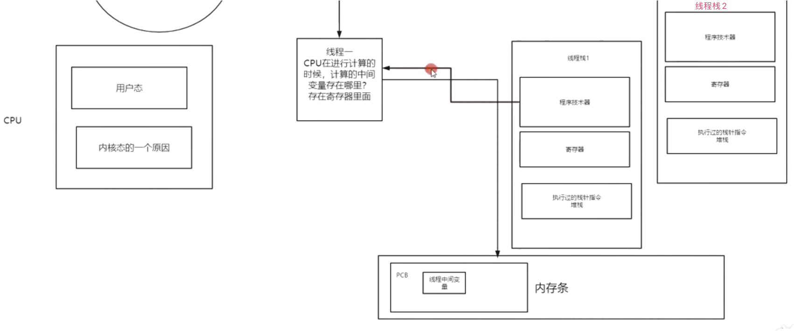

> Synchronized 以及 Lock都是悲观锁，为啥呢？因为Synchronized 使用了监视器monitor  在jvm指令有两个指令锁住了代码块中指令，因此他并没有使用 CAS 去自旋以及乐观，因此是悲观锁，Lock一样

> 上图中主线程写错了是主内存，即堆中数据
>
> * 无锁，性能在高并发下比有锁代码更好
> * 天生死锁免疫

> 背景：
>
> * V=0 为主内存变量，即堆中数据
> * 有两个线程1和2，线程1和线程2中都维护了一个主内存变量V的副本 A  
> * 两个线程1和2   并发修改V的值为B

> 流程：
>
> 1. 两个线程1和2  并发执行并发修改V，但是在时间上总会有先后更新V，比如线程1先进行更新操作
> 2. 利用==CAS== ，比较线程1中A的值是否等于主内存中的V，如果等于则将线程1中B的值修改到主内存V变量
> 3. 此时线程2在线程1修改后马上修改，线程2 去比较 A 的值是否等于主内存中V的值，肯定是不等于的，因为V已经被线程1修改为1了
> 4. 那么此时线程2有两种方式操作，一 返回错误更新失败，二 自旋锁 ：线程2轮询去更新主内存中V的值。
> 5. 当线程2中变量副本A和主内存V的值同步后，则CAS更新成功

> CAS  ABA问题已经在JDK版本中解决

> ABA 问题
>
> * 新增了线程3.。在1线程修改V值后，V值变为1，在线程2进行修改时，巧了，被线程3先一步更新
> * 更巧的是线程3更新V的值正好是V的原始值0
> * 线程2在更新时，本来V已经经过两轮修改了，但是V和线程2中A都是0，那么线程2则更新成功，这肯定是不对的
>
> 解决办法
>
> 主内存V 再维护一个版本信息，即 ==版本号+ 变量==
>
> 线程1修改后 V=1-1
>
> 线程2修改后 V=2-0
>
> 线程3修改后 V=3-2
>
> CAS中的ABA问题已经在JDK版本中已经解决

> 用户态和内核态
>
> CPU划分出两个权限等级，用户态、内核态
>
> * 用户态：所有的用户程序都是用户态，只能受限的访问内存, 且不允许访问外围设备. 占用CPU的能力被剥夺, CPU资源可以被其他程序获取
> * 内核态：CPU可以访问内存所有数据, 包括外围设备, 例如硬盘, 网卡. CPU也可以将自己从一个程序切换到另一个程序，例如Java的io和多线程都是native方法调用

> 线程切换为什么耗资源?
>
> CPU通过时间片分配算法来循环执行任务，当前任务执行一个时间片后会切换到下一个任务。但是，在切换前会保存上一个任务的状态，以便下次切换回这个任务时，可以再次加载这个任务的状态，**从任务保存到再加载的过程就是一次上下文切换**。
>
> * 即线程栈1 执行时遇到终端或者休眠或者锁等被挂起是，需要将==线程栈1存储在CPU上寄存器中数据进行存储到内存条==然后再执行线程栈2，再次切换到线程栈1执行时，需要将内存中数据再次加载到寄存器
> * 为什么有寄存器？这是为了提高CPU执行效率，如果所有的CPU临时计算数据都存储在内存条，那么还需要走线并且耗时，因此每个CPU都带了一个寄存器存放临时数据，提高速度

> Synchronized 实现原理：悲观锁 - 互斥锁  
>
> * 如果是 同步方法则添加修饰符
>
> * 如果是 同步代码块则锁对象关联Monitor监视器
> * 当一个线程执行Synchronized 代码块时,上锁成功
> * 第二个线程执行Synchronized 代码块时,发现锁没有释放则 放入到同步队列等待 , 使用 自旋 一直去轮询
>
> > 悲观锁阻塞、乐观锁自旋

> JVM内置锁的升级

> 随着锁升级，对象头中的锁标志位都是在变化的，并且锁的升级是 Synchronized 代码块触发的再JDK6之后

## Java锁分为两类可以

* 显示锁 ： 需要手动代码去加锁和解锁，例如 Lock
* 隐藏锁 ： 不需要手动加锁和解锁，由jvm去实现，例如 Synchronized  