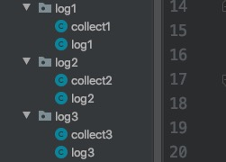

今天碰到一个业务场景：

>之前做好了一个web系统，接到任务需要将一个独立的Java系统嵌入到web系统中，Java系统嵌入顺利完成，此时出现了一个问题`由于Java和web两个系统都使用了日志系统`，造成此前的web系统中日志文件全部定向到嵌入后的Java系统日志输出文件内。

### 原因剖析

<font size=4><strong>web中日志配置文件(log4j.properties)</strong></font>

```properties
log4j.rootLogger=info,A1,R
log4j.appender.A1=org.apache.log4j.ConsoleAppender
log4j.appender.A1.Target=System.out
log4j.appender.common.DatePattern = '.'yyyy-MM-dd
log4j.appender.common.Threshold = INFO
log4j.appender.A1.layout=org.apache.log4j.PatternLayout
log4j.appender.A1.layout.ConversionPattern=[%d{yyyy-MM-dd HH:mm:ss}] [%p] [%c:%L] %m%n

log4j.appender.R=org.apache.log4j.DailyRollingFileAppender
log4j.appender.R.File=../logs/xxx
log4j.appender.R.DatePattern ='-'yyyy-MM-dd'.log'
log4j.appender.R.layout=org.apache.log4j.PatternLayout
log4j.appender.R.Append = true
log4j.appender.R.ImmediateFlush = true
log4j.appender.R.layout.ConversionPattern=[%d{yyyy-MM-dd HH:mm:ss}] [%p] [%c:%L] %m%n

```

<font size=4><strong>Java中日志配置文件(log4j.properties)</strong></font>

```properties
log4j.rootLogger=info,stdout,R
log4j.appender.stdout = org.apache.log4j.ConsoleAppender
log4j.appender.stdout.Target = System.out
log4j.appender.stdout.layout = org.apache.log4j.PatternLayout
log4j.appender.stdout.layout.ConversionPattern = [%-5p] %d{yyyy-MM-dd HH:mm:ss,SSS} method:%l%n%m%n

log4j.appender.R=org.apache.log4j.DailyRollingFileAppender
log4j.appender.R.File=../logs/xxx
log4j.appender.R.DatePattern ='-'yyyy-MM-dd'.log'
log4j.appender.R.layout=org.apache.log4j.PatternLayout
log4j.appender.R.Append = true
log4j.appender.R.ImmediateFlush = true
log4j.appender.R.layout.ConversionPattern=[%d{yyyy-MM-dd HH:mm:ss}] [%p] [%c:%L] %m%n

```

>由于都配置了log R对象因此会被覆盖指向为后者的文件中


### 解决1

```properties
### 根设置###
log4j.rootLogger = info,stdout,D,E

### 输出信息到控制抬 ###
log4j.appender.stdout = org.apache.log4j.ConsoleAppender
log4j.appender.stdout.Target = System.out
log4j.appender.stdout.layout = org.apache.log4j.PatternLayout
log4j.appender.stdout.layout.ConversionPattern = [%-5p] %d{yyyy-MM-dd HH:mm:ss,SSS} method:%l%n%m%n

### 输出DEBUG 级别以上的日志
log4j.appender.D = org.apache.log4j.DailyRollingFileAppender
log4j.appender.D.File = /Users/mac/Documents/Java_log/InfoLog.log
log4j.appender.D.Append = true
log4j.appender.D.Threshold = info
log4j.appender.D.layout = org.apache.log4j.PatternLayout
log4j.appender.D.layout.ConversionPattern = %-d{yyyy-MM-dd HH:mm:ss}  [ %t:%r ] - [ %p ]  %m%n

### 输出ERROR 级别以上的日志
log4j.appender.E = org.apache.log4j.DailyRollingFileAppender
log4j.appender.E.File =/Users/mac/Documents/Java_log/ErrorLog.log
log4j.appender.E.Append = true
log4j.appender.E.Threshold = ERROR
log4j.appender.E.layout = org.apache.log4j.PatternLayout
log4j.appender.E.layout.ConversionPattern = %-d{yyyy-MM-dd HH:mm:ss}  [ %t:%r ] - [ %p ]  %m%n


###新增其他日志文件
#新增log对象'collectLogger'
log4j.logger.collectLogger=info,DefaultCollectLog
#每天生成日志文件类'DailyRollingFileAppender'
log4j.appender.DefaultCollectLog = org.apache.log4j.DailyRollingFileAppender
log4j.appender.DefaultCollectLog.File =/Users/mac/Documents/Java_log/default_collect.log
log4j.appender.DefaultCollectLog.Append = true
log4j.appender.DefaultCollectLog.layout = org.apache.log4j.PatternLayout
log4j.appender.DefaultCollectLog.layout.ConversionPattern = %-d{yyyy-MM-dd HH:mm:ss}  [ %t:%r ] - [ %p ]  %m%n
```

>其中``新增其他日志文件``下扩充了log4j  collectLogger对象，并且设置了该日志对象的等级为info

#### 测试

<center>
    
    <br>
    <div style="color:orange; border-bottom: 1px solid #d9d9d9;
    display: inline-block;
    color: #999;
    padding: 2px;">测试项目目录结构</div>
</center>

假定log1,log2,log3为之前的web系统中类。而collect1,ollect2,ollect3为新增的Java系统中得类。

```java
/**
 * TODO:<p> log1类，其他的两个log2和log3内容一致 <p/>
 *
 * @package: log1
 * @Author mac
 * @Date 2020/4/15 8:14 下午
 * @Version V1.0
 **/
public class log1 {
    private static final Logger logger = Logger.getLogger(log1.class);
    public void run(){
        logger.info("log1 >  >  >  >信息");
        logger.info("log1 >  >  >  >信息");
        logger.info("log1 >  >  >  >信息");
        logger.info("log1 >  >  >  >信息");
        logger.info("log1 >  >  >  >信息");
        logger.info("log1 >  >  >  >信息");
        logger.info("log1 >  >  >  >信息");
    }
}
```

```java
/**
 * TODO:<p> collect1,其余collect2和collect3内容一致 <p/>
 *
 * @package: log1
 * @Author mac
 * @Date 2020/4/15 8:31 下午
 * @Version V1.0
 **/
public class collect1 {
    // 注意，这里是刚刚定义的log4j 对象 ‘collectLogger’
    private static final Logger logger = Logger.getLogger("collectLogger");
    public void run(){
        logger.info("collect1 >  >  >  >信息");
        logger.info("collect1 >  >  >  >信息");
        logger.info("collect1 >  >  >  >信息");
        logger.info("collect1 >  >  >  >信息");
        logger.info("collect1 >  >  >  >信息");
        logger.info("collect1 >  >  >  >信息");
        logger.info("collect1 >  >  >  >信息");
    }
}
```
> java系统类中的日志输出为 ‘default_collect.log’
>>2020-04-15 20:53:57  [ main:9 ] - [ INFO ]  collect1 >  >  >  >信息
2020-04-15 20:53:57  [ main:10 ] - [ INFO ]  collect1 >  >  >  >信息
2020-04-15 20:53:57  [ main:10 ] - [ INFO ]  collect1 >  >  >  >信息
2020-04-15 20:53:57  [ main:10 ] - [ INFO ]  collect1 >  >  >  >信息
2020-04-15 20:53:57  [ main:10 ] - [ INFO ]  collect1 >  >  >  >信息
2020-04-15 20:53:57  [ main:10 ] - [ INFO ]  collect1 >  >  >  >信息
2020-04-15 20:53:57  [ main:11 ] - [ INFO ]  collect1 >  >  >  >信息
2020-04-15 20:53:57  [ main:11 ] - [ INFO ]  collect2 >  >  >  >信息
2020-04-15 20:53:57  [ main:11 ] - [ INFO ]  collect2 >  >  >  >信息
2020-04-15 20:53:57  [ main:11 ] - [ INFO ]  collect2 >  >  >  >信息
2020-04-15 20:53:57  [ main:12 ] - [ INFO ]  collect2 >  >  >  >信息
2020-04-15 20:53:57  [ main:12 ] - [ INFO ]  collect2 >  >  >  >信息
2020-04-15 20:53:57  [ main:12 ] - [ INFO ]  collect2 >  >  >  >信息
2020-04-15 20:53:57  [ main:12 ] - [ INFO ]  collect2 >  >  >  >信息
2020-04-15 20:53:57  [ main:13 ] - [ INFO ]  collect3 >  >  >  >信息
2020-04-15 20:53:57  [ main:13 ] - [ INFO ]  collect3 >  >  >  >信息
2020-04-15 20:53:57  [ main:13 ] - [ INFO ]  collect3 >  >  >  >信息
2020-04-15 20:53:57  [ main:13 ] - [ INFO ]  collect3 >  >  >  >信息
2020-04-15 20:53:57  [ main:14 ] - [ INFO ]  collect3 >  >  >  >信息
2020-04-15 20:53:57  [ main:14 ] - [ INFO ]  collect3 >  >  >  >信息
2020-04-15 20:53:57  [ main:14 ] - [ INFO ]  collect3 >  >  >  >信息

>web系统类中的日志输出为  ‘infoLog.log’
>>2020-04-15 20:53:57  [ main:0 ] - [ INFO ]  log1 >  >  >  >信息
2020-04-15 20:53:57  [ main:2 ] - [ INFO ]  log1 >  >  >  >信息
2020-04-15 20:53:57  [ main:2 ] - [ INFO ]  log1 >  >  >  >信息
2020-04-15 20:53:57  [ main:3 ] - [ INFO ]  log1 >  >  >  >信息
2020-04-15 20:53:57  [ main:3 ] - [ INFO ]  log1 >  >  >  >信息
2020-04-15 20:53:57  [ main:3 ] - [ INFO ]  log1 >  >  >  >信息
2020-04-15 20:53:57  [ main:5 ] - [ INFO ]  log1 >  >  >  >信息
2020-04-15 20:53:57  [ main:5 ] - [ INFO ]  log2 >  >  >  >信息
2020-04-15 20:53:57  [ main:5 ] - [ INFO ]  log2 >  >  >  >信息
2020-04-15 20:53:57  [ main:5 ] - [ INFO ]  log2 >  >  >  >信息
2020-04-15 20:53:57  [ main:6 ] - [ INFO ]  log2 >  >  >  >信息
2020-04-15 20:53:57  [ main:6 ] - [ INFO ]  log2 >  >  >  >信息
2020-04-15 20:53:57  [ main:6 ] - [ INFO ]  log2 >  >  >  >信息
2020-04-15 20:53:57  [ main:6 ] - [ INFO ]  log2 >  >  >  >信息
2020-04-15 20:53:57  [ main:6 ] - [ INFO ]  log3 >  >  >  >信息
2020-04-15 20:53:57  [ main:7 ] - [ INFO ]  log3 >  >  >  >信息
2020-04-15 20:53:57  [ main:8 ] - [ INFO ]  log3 >  >  >  >信息
2020-04-15 20:53:57  [ main:9 ] - [ INFO ]  log3 >  >  >  >信息
2020-04-15 20:53:57  [ main:9 ] - [ INFO ]  log3 >  >  >  >信息
2020-04-15 20:53:57  [ main:9 ] - [ INFO ]  log3 >  >  >  >信息
2020-04-15 20:53:57  [ main:9 ] - [ INFO ]  log3 >  >  >  >信息
2020-04-15 20:53:57  [ main:9 ] - [ INFO ]  collect1 >  >  >  >信息
2020-04-15 20:53:57  [ main:10 ] - [ INFO ]  collect1 >  >  >  >信息
2020-04-15 20:53:57  [ main:10 ] - [ INFO ]  collect1 >  >  >  >信息
2020-04-15 20:53:57  [ main:10 ] - [ INFO ]  collect1 >  >  >  >信息
2020-04-15 20:53:57  [ main:10 ] - [ INFO ]  collect1 >  >  >  >信息
2020-04-15 20:53:57  [ main:10 ] - [ INFO ]  collect1 >  >  >  >信息
2020-04-15 20:53:57  [ main:11 ] - [ INFO ]  collect1 >  >  >  >信息
2020-04-15 20:53:57  [ main:11 ] - [ INFO ]  collect2 >  >  >  >信息
2020-04-15 20:53:57  [ main:11 ] - [ INFO ]  collect2 >  >  >  >信息
2020-04-15 20:53:57  [ main:11 ] - [ INFO ]  collect2 >  >  >  >信息
2020-04-15 20:53:57  [ main:12 ] - [ INFO ]  collect2 >  >  >  >信息
2020-04-15 20:53:57  [ main:12 ] - [ INFO ]  collect2 >  >  >  >信息
2020-04-15 20:53:57  [ main:12 ] - [ INFO ]  collect2 >  >  >  >信息
2020-04-15 20:53:57  [ main:12 ] - [ INFO ]  collect2 >  >  >  >信息
2020-04-15 20:53:57  [ main:13 ] - [ INFO ]  collect3 >  >  >  >信息
2020-04-15 20:53:57  [ main:13 ] - [ INFO ]  collect3 >  >  >  >信息
2020-04-15 20:53:57  [ main:13 ] - [ INFO ]  collect3 >  >  >  >信息
2020-04-15 20:53:57  [ main:13 ] - [ INFO ]  collect3 >  >  >  >信息
2020-04-15 20:53:57  [ main:14 ] - [ INFO ]  collect3 >  >  >  >信息
2020-04-15 20:53:57  [ main:14 ] - [ INFO ]  collect3 >  >  >  >信息
2020-04-15 20:53:57  [ main:14 ] - [ INFO ]  collect3 >  >  >  >信息


<font color=ffaa00>问题：该方案中web系统日志文件包含了java系统的输出日志，如并且java系统日志文件时独立的，如果你想要这种效果那么可以使用该方案</font>

原因是：由于log4j.rootLogger = info,stdout,D,E中‘rootLogger’为根对象，所有的日志对象都继承于该对象，因此新增的log4j collectLogger对象也属于根对象的子类，并且子类中输出的内容也要输出到根对象配置的日志文件中。

### 解决二

```properties
## Global logging configuration 开发时候建议使用 debug
#log4j.rootLogger=DEBUG, stdout
## Console output...
#log4j.appender.stdout=org.apache.log4j.ConsoleAppender
#log4j.appender.stdout.layout=org.apache.log4j.PatternLayout
#log4j.appender.stdout.layout.ConversionPattern=%5p [%t] - %m%n
##log4j.appender.A1.File=/Volumes/mac资料/IdeaWorkSpace/maven-Java/src/main/java/thread_lean/threadSafety/logFile.log
#log4j.appender.A1.File=../logs/logFile.log

### 根设置###
log4j.rootLogger = info,stdout,D,E

### 输出信息到控制抬 ###
log4j.appender.stdout = org.apache.log4j.ConsoleAppender
log4j.appender.stdout.Target = System.out
log4j.appender.stdout.layout = org.apache.log4j.PatternLayout
log4j.appender.stdout.layout.ConversionPattern = [%-5p] %d{yyyy-MM-dd HH:mm:ss,SSS} method:%l%n%m%n

### 输出DEBUG 级别以上的日志
log4j.appender.D = org.apache.log4j.DailyRollingFileAppender
log4j.appender.D.File = /Users/mac/Documents/Java_log/InfoLog.log
log4j.appender.D.Append = true
log4j.appender.D.Threshold = info
log4j.appender.D.layout = org.apache.log4j.PatternLayout
log4j.appender.D.layout.ConversionPattern = %-d{yyyy-MM-dd HH:mm:ss}  [ %t:%r ] - [ %p ]  %m%n

### 输出ERROR 级别以上的日志
log4j.appender.E = org.apache.log4j.DailyRollingFileAppender
log4j.appender.E.File =/Users/mac/Documents/Java_log/ErrorLog.log
log4j.appender.E.Append = true
log4j.appender.E.Threshold = ERROR
log4j.appender.E.layout = org.apache.log4j.PatternLayout
log4j.appender.E.layout.ConversionPattern = %-d{yyyy-MM-dd HH:mm:ss}  [ %t:%r ] - [ %p ]  %m%n


###新增其他日志文件：即系统中分模块来进行日志控制，不同的模块设定不一样的日志文件
#新增log对象'collectLogger'
log4j.logger.collectLogger=info,DefaultCollectLog
#每天生成日志文件类'DailyRollingFileAppender'
log4j.appender.DefaultCollectLog = org.apache.log4j.DailyRollingFileAppender
log4j.appender.DefaultCollectLog.File =/Users/mac/Documents/Java_log/default_collect.log
log4j.appender.DefaultCollectLog.Append = true
log4j.appender.DefaultCollectLog.layout = org.apache.log4j.PatternLayout
log4j.appender.DefaultCollectLog.layout.ConversionPattern = %-d{yyyy-MM-dd HH:mm:ss}  [ %t:%r ] - [ %p ]  %m%n


###新增log对象'com.logtest'
#com.logtest 是包名，这个包里面的log日志会打到下面配置的路径下，且这个包里的日志文件不会再打到上面配置的总的log日志路径里
log4j.logger.com.logtest=info, service
log4j.additivity.com.logtest=false
log4j.appender.service=org.apache.log4j.DailyRollingFileAppender
log4j.appender.service.File=/Users/mac/Documents/Java_log/server.log
log4j.appender.service.Append=true
log4j.appender.service.layout=org.apache.log4j.PatternLayout
log4j.appender.service.layout.ConversionPattern=%d{yyyy-MM-dd HH:mm:ss} [%-5p][%c{1}] [%t] - %m%n
log4j.appender.service.encoding=UTF-8

```

>其中``新增log对象'com.logtest'``下扩充了log4j  com.logtest对象，并且设置了该日志对象的等级为info

#### 测试

```Java
/**
 * TODO:<p> 在此前测试类基础上新增test1用以测试 com.logtest对象<p/>
 *
 * @package: com.logtest
 * @Author mac
 * @Date 2020/4/15 8:43 下午
 * @Version V1.0
 **/
public class test1 {
    private static final Logger logger = Logger.getLogger(test1.class);
    public void run(){
        logger.info("test1 >  >  >  >信息");
        logger.info("test1 >  >  >  >信息");
        logger.info("test1 >  >  >  >信息");
        logger.info("test1 >  >  >  >信息");
        logger.info("test1 >  >  >  >信息");
        logger.info("test1 >  >  >  >信息");
        logger.info("test1 >  >  >  >信息");

    }
}
```

>server.log
>>2020-04-15 20:53:57 [INFO ][test1] [main] - test1 >  >  >  >信息
2020-04-15 20:53:57 [INFO ][test1] [main] - test1 >  >  >  >信息
2020-04-15 20:53:57 [INFO ][test1] [main] - test1 >  >  >  >信息
2020-04-15 20:53:57 [INFO ][test1] [main] - test1 >  >  >  >信息
2020-04-15 20:53:57 [INFO ][test1] [main] - test1 >  >  >  >信息
2020-04-15 20:53:57 [INFO ][test1] [main] - test1 >  >  >  >信息
2020-04-15 20:53:57 [INFO ][test1] [main] - test1 >  >  >  >信息

<font color=ffaa00>注意点</font>

1. 该方案中web系统中的InfoLog.log文件中并不会包含server.log中的内容

2. 该方案适用于迁移有日志系统的程序时使用，因为该方案中com.logtest日志对象对应的就是包名，因此你只需要设置该方案中com.logtest对象为你迁移的项目包名即可全部修改该包下所有的日志输出配置。

3. 该方案中com.logtest对象由于使用了‘log4j.additivity.com.logtest=false’会导致控制台中不会输出该包下所有的日志输出内容。
