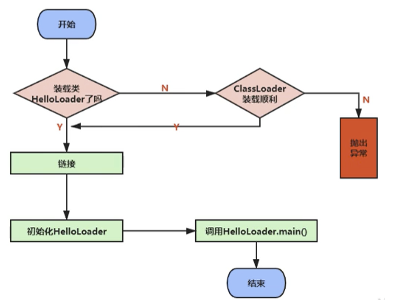
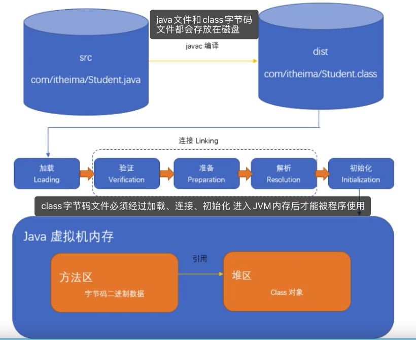

`引言:`

一个Java文件从编码到最终执行，一般主要包括两个过程

* 编译

	即我们把写好的Java文件，通过javac命令编译为字节码文件(.class文件)

* 运行

	即把编译后的.class字节码文件交给虚拟机执行。

## 类加载

指JVM虚拟机把.class文件中类信息加载进内存，并进行解析生成对应的class对象的过程。

> 举个通俗点的例子来说，JVM在执行某段代码时，遇到了class A， 然而此时内存中并没有class A的相关信息，于是JVM就会到相应的class文件中去寻找class A的类信息，并加载进内存中，这就是我们所说的类加载过程。

> 由此可见，JVM不是一开始就把所有的类都加载进内存中，而是只有第一次遇到某个需要运行的类时才会加载，且只加载一次。

## 加载class的方式

* 从本地系统中直接加载
* 通过网络获取，典型场景：Web Applet
* 从zip压缩包中读取，成为日后jar、war格式的基础
* 运行时计算生成，使用最多的是：动态代理技术
* 由其他文件生成，典型场景：JSP应用从专有数据库中提取.class文件，比较少见
* 从加密文件中获取，典型的防Class文件被反编译的保护措施

## 类加载过程

**1. 类加载**

1. 通过类的`完全限定名（包名和类名）`查找此类的字节码文件

2. 把类的.class文件中的二进制字节流数据读入到内存中，将这个字节流所代表的`静态存储结构`转化为`方法区的运行时数据结构`  

3. 然后利用`字节码文件`创建一个`java.lang.Class对象`，用来`封装类在方法区内的数据结构`并`存放在堆区内`，作为方法区这个类的各种数据的`访问入口(即对象引用)`。这个过程是由类加载器完成的，

	> 简单来说，加载指的是把class字节码文件从各个来源通过类加载器装载入内存中。其中 `类加载器` 将class字节码文件中的`静态存储结构`作为`NDA元数据模板`存放在`方法区`，将根据此`元数据模板`创建的`一个代表该类的java.lang.Class大类`存放在`堆`中作为访问各种类数据的入口

**2. 连接**

- 验证：确保被加载类的正确性。class 文件的字节流中包含的信息符合当前虚拟机要求，不会危害虚拟机自身的安全。四种验证格式：`文件格式验证`、`元数据验证`、`字节码验证`、`符号引用验证`

	- 文件格式验证: 比如常量中是否有不被支持的常量？文件中是否有不规范的或者附加的其他信息？
	- 元数据验证: 比如该类是否继承了被final修饰的类？类中的字段，方法是否与父类冲突？是否出现了不合理的重载？
	- 字节码验证: 保证程序语义的合理性，比如要保证类型转换的合理性。
	- 符号引用验证: 比如校验符号引用中通过全限定名是否能够找到对应的类？校验符号引用中的访问性（private，public等）是否可被当前类访问？

- 准备：

  主要是为`类变量`（注意，不是实例变量）分配内存，并且赋予初值。（不同的数据类型默认值也不一样。例如整数位0、浮点型0.0、char类型-u0000、布尔类型false、引用类型null）。

  * 对于`static修饰的成员变量`，在准备阶段赋予初值。

  - 对于` final static 修饰的变量即常量`，在`准备阶段显示初始化`。

  	> 这里`不会为实例变量初始化`，`类变量会分配在方法区`，而`实例变量会随着对象一起分配在堆内存中`。

- 解析：将`常量池`内的`符号引用`替换为`直接引用`的过程。

	- `符号引用`。即一个字符串，但是这个字符串给出了一些能够唯一性识别一个方法，一个变量，一个类的相关信息。
	- `直接引用`。可以理解为一个内存地址，或者一个偏移量。比如类方法，类变量的直接引用是指向方法区的指针；而实例方法，实例变量的直接引用则是从实例的头指针开始算起到这个实例变量位置的偏移量

	> 简单理解为  一个为对象的变量，在Java中对象变量都是：变量存放在栈，对象存放在堆。而变量为符号引用，直接引用为栈中存放的对象内存地址。

**3. 初始化**

类加载最后阶段，`类变量`进行初始化操作

> 初始化阶段就是执行类构造器方法Clinit（）的过程

* 此方法不需定义，是javac编译器自动收集类中的`所有类变量`的赋值动作和`静态代码块中的语句`合并而来。
* 若该类具有父类，JVM会保证子类的Clinit（）执行前，父类的Clinit（）已经执行完毕。

- 任何一个类在声明后，都有生成一个构造器，默认是空参构造器
- 虚拟机必须保证一个类的Clinit（）在多线程下被同步加锁(类似于double check，多个线程同时初始化时只有一个线程进入方法，其他线程阻塞，执行完成后其他线程不会再进入方法)

