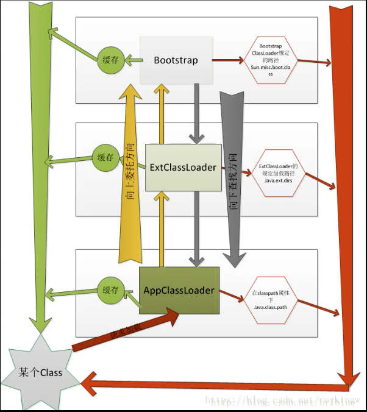
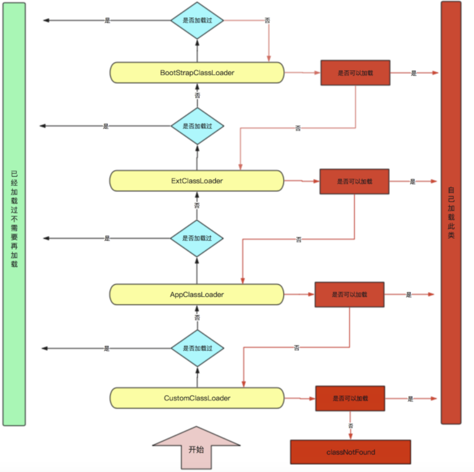

## 类加载器


`类的加载是由类加载器完成的`。类加载器可以分为两种

* 第一种是Java虚拟机自带的类加载器，分别为启动类加载器、扩展类加载器和系统类加载器。
* 第二种是用户自定义的类加载器，是java.lang.ClassLoader的子类实例。

	> - 一方面是由于java代码很容易被反编译，如果需要对自己的代码加密的话，可以对编译后的代码进行加密，然后再通过实现自己的自定义类加载器进行解密，最后再加载。
	> - 另一方面也有可能从非标准的来源加载代码，比如从网络或者数据库指定来源，那就需要自己实现一个类加载器，从指定源进行加载。

### JVM自带类加载器

* 根类加载器（Bootstrap）

	根类加载器是最底层的类加载器，是虚拟机的一部分，它是由C++语言实现的，且没有父加载器，也没有继承 java.lang.ClassLoader 类。**它主要负责加载由系统属性 "sun.boot.class.path" 指定的路径下的核心类库（即<JAVA_HOME>\jre\lib）**，出于安全考虑，根类加载器只加载 java、javax、sun开头的类。

	```java
	ClassLoader classLoader = Object.class.getClassLoader();
	//todo 打印来出的是null  因为c++实现属于jvm一部分，其并没有父加载器
	System.out.println(classLoader);
	```

* 扩展类加载器（Extension）

	扩展类加载器是指由原SUN公司实现的 sun.misc.Launcher$ExtClassLoader类（JDK9是 jdk.internal.loader.ClassLoaders$PlatformClassLoader类），它是由java语言编写，父加载器是根类加载器。**负责加载<JAVA_HOME>\jre\lib\ext目录下的类库或者系统变量"java.ext.dirs"指定目录下的类库**。

* 系统类加载器（AppClassLoader）

	系统类加载器也称之为应用类加载器，也是纯java类，是原SUN公司实现的 sun.misc.Launcher$AppClassLoader 类（JDK9是 jdk.internal.loader.ClassLoaders$AppClassLoader）。它的父加载器是扩展类加载器。**它负责从classpath环境变量或者系统属性java.class.path所指定的目录中加载类，它是用户自定义的类加载器的默认父加载器。一般情况下，该类加载器是程序中默认的类加载器，可以通过ClassLoader.getSystemClassLoader() 直接获得**。

	```java
	ClassLoader loader = ClassLoaderDemo1.class.getClassLoader();
	System.out.println(loader);
	```

	

> :alarm_clock:  <font color=ff00aa>总结：</font>
>
> * JVM自带了三个类加载器，每个加载器负责加载不同路径下的  jar  核心类库，第三个即AppClassLoader负责加载我们自定义的类。
> * JVM类加载  为   `按需加载`，即需要使用到该类时才进行加载
> * JVM类加载  采用的是   `双亲委派机制`


### 双亲委派机制  -- 向上委派向下查找





> 如果一个类加载器收到了类加载的请求，它首先不会自己去尝试加载这个类，而是把这个请求委派给父类加载器去完成，每一个层次的类加载器都是如此，因此所有的加载请求最终都应该传递到顶层的启动类加载器中，只有当父类加载器反馈自己无法完成这个请求（它的搜索范围中没有找到所需的类）时，子加载器才会尝试自己去加载。

1. 首先会到`自定义加载器`中查找，看是否已经加载过，如果已经加载过，则返回字节码。(所有的类只加载一次)
2. 如果自定义加载器没有加载过，则询问上一层加载器(即`AppClassLoader`)是否已经加载过Test.class,`即缓存中是否存在此类`。
3. 如果没有加载过，则询问上一层加载器（`ExtClassLoader`）是否已经加载过。
4. 如果没有加载过，则继续询问上一层加载（`BoopStrap ClassLoader`）是否已经加载过。
5. 如果BoopStrap ClassLoader依然没有加载过，则到`自己指定类加载路径`下（"sun.boot.class.path"）查看是否有Test.class字节码，有则返回，没有通知下一层加载器ExtClassLoader到自己指定的类加载路径下（java.ext.dirs）查看。
6. 依次类推，最后到自定义类加载器指定的路径还没有找到Test.class字节码，则抛出异常ClassNotFoundException。
	

> :alarm_clock:  <font color=ff00aa>总结：</font>
>
> * 每次类加载，都会由AppClassLoader   委派   到 Bootstrap， 然后再由Bootstrap    查找    到AppClassLoader

#### 双亲委派机制  合理在哪？

* 避免类重复加载

	三个类加载器都有缓存， 向上     委派     的过程就是避免子加载器重复加载父加载器已经加载过的类

* 安全，避免核心类被其他类替换

	每次类加载都会到    Bootstrap和ExtClassLoader类加载器    而这两个正是加载核心类库。比如自定义了 java.lang.Object类，委派     到Bootstrap发现其可以查找到或者缓存中已加载过，则直接返回啊，并不会去加载自定义的类。


## 自定义类加载器

#### ClassLoader

所有的类加载器（除了根类加载器）都必须继承 java.lang.ClassLoader


#### UELClassLoader

在 java.net 包中，JDK提供了一个更加易用的类加载器URLClassLoader，它扩展了 ClassLoader，能够从`本地`或者`网络`上指定的位置加载类，我们可以使用该类作为自定义的类加载器使用。


`本地类加载`

1. 创建本地类

	```java
	package org.example.classloader;
	
	public class Demo {
	    public Demo(){
	        System.out.println("Demo  -- instance ");
	    }
	    public void test(){
	        System.out.println("Demo  --  test方法执行！！");
	    }
	}
	```

2. 生成字节码文件

	```bash
	javac Demo.java
	```

3. 加载

	```java
	 //文件所在路径
	File file = new File("/Volumes/Mac/Respository/ProjectCode/javaLearn/src/main/java/");
	URI uri = file.toURI();
	URL url = uri.toURL();
	URLClassLoader urlClassLoader = new URLClassLoader(new URL[]{url});
	//包路径
	Class<?> aClass = urlClassLoader.loadClass("org.example.classloader.Demo");
	java.lang.Object instance = aClass.newInstance();
	Method test = aClass.getMethod("test");
	test.invoke(instance);
	```

	```bash
	Demo  -- instance 
	Demo  --  test方法执行！！
	```

	

`网络类加载`

1. 将字节码文件(包含包)放到Nginx下

2. 加载

	```java
	 URL url = new URL("http://localhost:80/examples/");
	URLClassLoader urlClassLoader = new URLClassLoader(new URL[]{url});
	Class<?> aClass = urlClassLoader.loadClass("org.example.classloader.Demo");
	java.lang.Object instance = aClass.newInstance();
	Method test = aClass.getMethod("test");
	test.invoke(instance);
	```

	


