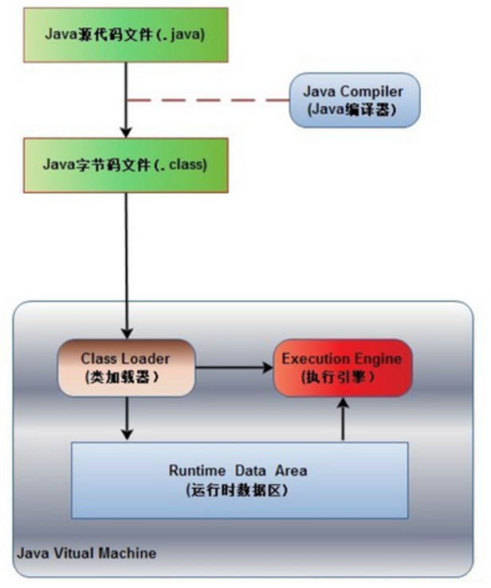
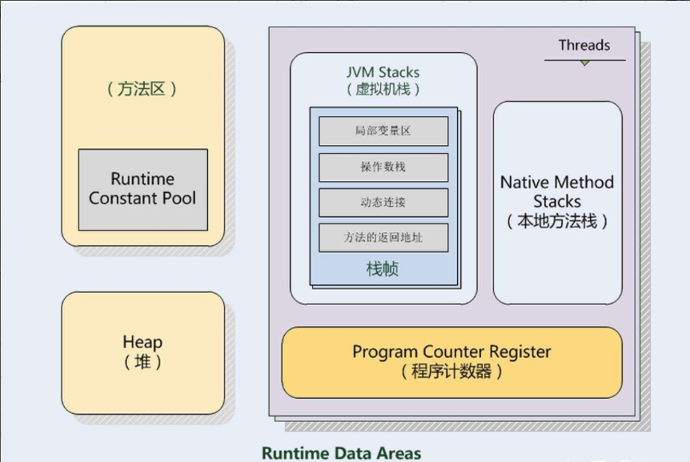
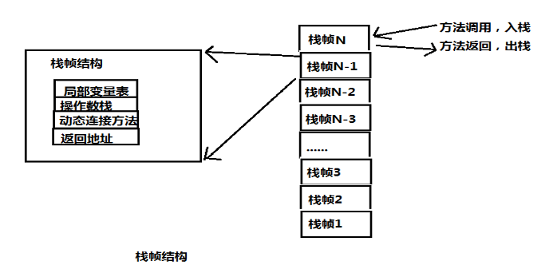

### Java程序执行流程

1. 首先Java源代码文件(.java后缀)会被Java编译器编译为字节码文件(.class后缀)

2. 然后由JVM中的类加载器加载各个类的字节码文件，

3. 加载完毕之后，交由JVM执行引擎执行。

>Java内存模型指的就是Runtime Data Area（运行时数据区），即程序执行期间用到的数据和相关信息保存区。

### Java内存模型

<code>PC程序计数器</code>

* 每个线程对应有一个程序计数器。
* 各线程的程序计数器是线程私有的，互不影响，是线程安全的。
* 程序计数器记录线程正在执行的内存地址，以便被中断线程恢复执行时再次按照中断时的指令地址继续执行

<code>Java栈JavaStack（虚拟机栈JVM Stack）</code>

* 每个线程会对应一个Java栈；
* 每个Java栈由若干栈帧组成；
* 每个方法对应一个栈帧；
* 栈帧在方法运行时，创建并入栈；方法执行完，该栈帧弹出栈帧中的元素作为该方法返回值，该栈帧被清除；
* 栈顶的栈帧叫活动栈，表示当前执行的方法，才可以被CPU执行；
* 线程请求的栈深度大于虚拟机所允许的深度，将抛出StackOverflowError异常；
* 栈扩展时无法申请到足够的内存，就会抛出OutOfMemoryError异常；

<code>方法区MethodArea</code>

* 方法区（也叫静态区）是Java堆的永久区（PermanetGeneration）很少做gc
*	方法区存放了要加载的类的信息（名称、修饰符等）、类中的静态常量、类中定义为final类型的常量、类中的Field信息、类中的方法信息，
*	方法区是被Java线程共享的，多线程中主要保证该区域变量安全
*	方法区要使用的内存超过其允许的大小时，会抛出OutOfMemoryError: PremGen space的错误信息。

<code>常量池ConstantPool</code>

*	常量池是方法区的一部分。
*	常量池中存储两类数据：字面量和引用量。
字面量：字符串、final变量等。
引用量：类/接口、方法和字段的名称和描述符，
*	常量池在编译期间就被确定，并保存在已编译的.class文件中(final方法和static方法属于前期绑定，因此不能改变。其余方法都为后期绑定)

<code>本地方法栈Native Method Stack</code>

*	本地方法栈和Java栈所发挥的作用非常相似，区别不过是Java栈为JVM执行Java方法服务，而本地方法栈为JVM执行Native方法服务。
*	本地方法栈也会抛出StackOverflowError和OutOfMemoryError异常。

### 三个地方会抛出OutOfMemoryError

>1. Java栈扩展时无法申请到足够的内存，就会抛出OutOfMemoryError异常

>2. 方法区要使用的内存超过其允许的大小时，会抛出OutOfMemoryError: PremGen space

>3. 本地方法栈也会抛出StackOverflowError和OutOfMemoryError异常
