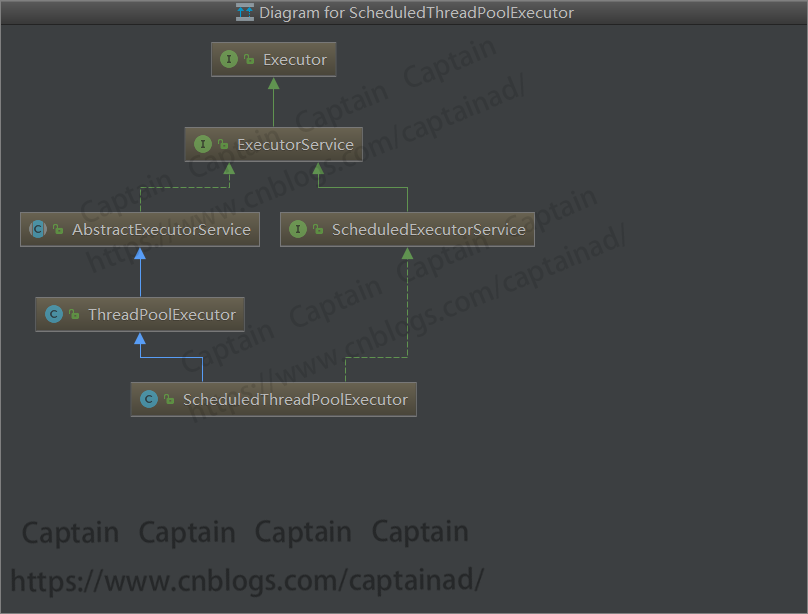

###1、 继承Thread类
```java
public class ThreadCreate extends Thread{
    public void run(){
        for (int i=0;i<=10;i++){
            System.out.println("子线程执"+Thread.currentThread().getName()+"执行时间："+new Date().getTime()+"执行次数："+i);
        }
    }
}
##test
ThreadCreate create=new ThreadCreate();
create.start();
```
Thread类常用方法
>start();//启动线程
getId();//获得线程ID
getName();//获得线程名字
getPriority();//获得优先权
setPriority（设置线程优先级（只能在线程开始前设置））
isAlive();//判断线程是否活动
isDaemon();//判断是否守护线程
getState();//获得线程状态
sleep(long mill);//休眠线程
join();//等待线程结束
yield();//放弃cpu使用权利
interrupt();//中断线程
currentThread();//获得正在执行的线程对象

    守护线程：也叫精灵线程，当程序只剩下守护线程的时候就会退出。

    守护线程 的作用类似在后台静默执行，比如JVM的垃圾回收机制，这个就是一个守护线程。而非守护线程则不会

###2、 实现Runnable接口
```java
public class RunableCreate implements Runnable {

    @Override
    public void run() {
        for (int i=0;i<=10;i++){
            System.out.println("子线程执"+Thread.currentThread().getName()+"执行时间："+new Date().getTime()+"执行次数："+i);
        }
    }
}
##test
for (int i=0;i<10;i++){
            System.out.println("主线程"+Thread.currentThread().getName()+"执行时间:"+new Date().getTime()+"执行次数："+i);
        }
RunableCreate create=new RunableCreate();
Thread thread=new Thread(new RunableCreate(),"myRunable");
thread.start();
```
###3、 实现Callable接口

Callable接口类似于Runnable，从名字就可以看出来了，但是Runnable不会返回结果，并且无法抛出返回结果的异常，而Callable功能更强大一些，被线程执行后，可以返回值，这个返回值可以被Future拿到，也就是说，Future可以拿到异步执行任务的返回值
```java
public class CallableCreate implements Callable<String> {

    @Override
    public String call() throws Exception {
        for (int i=0;i<=10;i++){
            System.out.println("子线程执"+Thread.currentThread().getName()+"执行时间："+new Date().getTime()+"执行次数："+i);
        }
        Thread.sleep(2000);
        return "callable执行完成";
    }
}
##test
FutureTask<String> task=new FutureTask<>(new CallableCreate());
Thread thread=new Thread(task,"callabel");
thread.start();
for (int i=0;i<10;i++){
    System.out.println("主线程"+Thread.currentThread().getName()+"执行时间:"+new Date().getTime()+"执行次数："+i);

}
while (!task.isDone()){
    try {
        Thread.sleep(500);
    } catch (InterruptedException e) {
        e.printStackTrace();
    }
    System.out.println("callable子线程正在执行。。。");
}
System.out.println("callable子线程执行完"+task.isDone());
try {
    System.out.println("callable子线程执行结果："+task.get());
} catch (InterruptedException e) {
    e.printStackTrace();
} catch (ExecutionException e) {
    e.printStackTrace();
}
```
>>判断任务是否完成：isDone()
能够中断任务：cancel()
能够获取任务执行结果：get()


###4、 线程池

  

* Executor接口：

        声明了execute(Runnable runnable)方法，执行任务代码

* ExecutorService接口：

        继承Executor接口，声明方法：submit、invokeAll、invokeAny以及shutDown等

* AbstractExecutorService抽象类：

        实现ExecutorService接口，基本实现ExecutorService中声明的所有方法

* ScheduledExecutorService接口：

        继承ExecutorService接口，声明定时执行任务方法

* ThreadPoolExecutor类：

        继承类AbstractExecutorService，实现execute、submit、shutdown、shutdownNow方法
* ScheduledThreadPoolExecutor类：

        继承ThreadPoolExecutor类，实现ScheduledExecutorService接口并实现其中的方法

* Executors类：

        提供快速创建线程池的工具类

```java
//使用线程池来获取线程
ExecutorService executorService = Executors.newFixedThreadPool(10);
FutureTask<String> task=new FutureTask<>(new CallableCreate());
//callable
executorService.execute(task);
for (int i=0;i<10;i++){
    System.out.println("主线程"+Thread.currentThread().getName()+"执行时间:"+new Date().getTime()+"执行次数："+i);
}
while (!task.isDone()){
    try {
        Thread.sleep(500);
    } catch (InterruptedException e) {
        e.printStackTrace();
    }
    System.out.println("callable子线程正在执行。。。");
}
System.out.println("callable子线程执行完"+task.isDone());
try {
    System.out.println("callable子线程执行结果："+task.get());
} catch (InterruptedException e) {
    e.printStackTrace();
} catch (ExecutionException e) {
    e.printStackTrace();
}
//runnable
//executorService.execute(new RunableCreate());
```
>>。。。
子线程执pool-1-thread-1执行时间：1583758853924执行次数：7
子线程执pool-1-thread-1执行时间：1583758853924执行次数：8
子线程执pool-1-thread-1执行时间：1583758853924执行次数：9
子线程执pool-1-thread-1执行时间：1583758853924执行次数：10
callable子线程正在执行。。。
callable子线程正在执行。。。
callable子线程正在执行。。。
callable子线程正在执行。。。
callable子线程执行完true
callable子线程执行结果：callable执行完成


### 5.5.2.	Runnable和Callable接口比较

相同点：

* 两者都是接口；
* 两者都可用来编写多线程程序；
* 两者都需要调用Thread.start()启动线程；

不同点：

* 实现Callable接口的线程能返回执行结果；而实现Runnable接口的线程不能返回结果；
* Callable接口的call()方法允许抛出异常；而Runnable接口的run()方法的不允许抛异常；
* 实现Callable接口的线程可以调用Future.cancel取消执行 ，而实现Runnable接口的线程不能

注意点：

* <code><font color=FF00FF>Callable接口支持返回执行结果，此时需要调用FutureTask.get()方法实现，此方法会阻塞主线程直到获取‘将来’结果；当不调用此方法时，主线程不会阻塞！</font></code>
