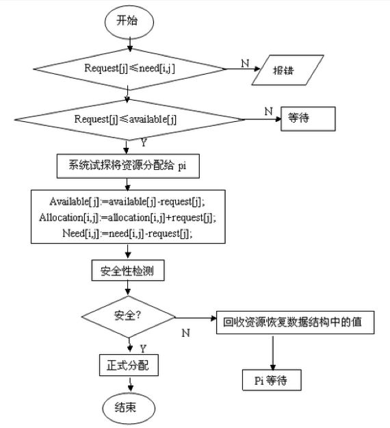
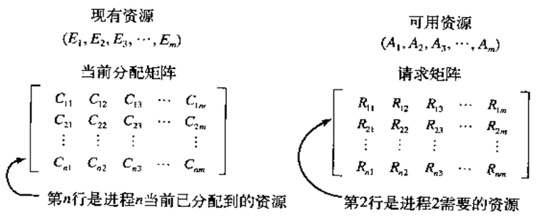

### 什么是死锁

多线程以及多进程改善了系统资源的利用率并提高了系统的处理能力。然而，并发执行也带来了新的问题--死锁。
所谓死锁是指多个线程因竞争资源而造成的一种僵局（互相等待），若无外力作用，这些进程都将无法向前推进。

### 死锁产生的条件

1.	互斥条件

进程要求对所分配的资源（如打印机）进行排他性控制，即在一段时间内某资源仅为一个进程所占有。此时若有其他进程请求该资源，则请求进程只能等待。

2.	不可剥夺条件

进程所获得的资源在未使用完毕之前，不能被其他进程强行夺走，即只能由获得该资源的进程自己来释放（只能是主动释放)。

3.	请求与保持条件

进程已经保持了至少一个资源，但又提出了新的资源请求，而该资源已被其他进程占有，此时请求进程被阻塞，但对自己已获得的资源保持不放。

4.	循环等待条件

存在一种进程资源的循环等待链，链中每一个进程已获得的资源同时被 链中下一个进程所请求。即存在一个处于等待状态的进程集合{Pl, P2, …, pn}，其中Pi等 待的资源被P(i+1)占有（i=0, 1, …, n-1)，Pn等待的资源被P0占有
```Java
public class DeathLock implements Runnable{
    static Object ob1=new Object();//锁对象1
    static Object ob2=new Object();//锁对象2
    public int bool=1;//控制线程走向
    @Override
    public void run() {
        while (true){
            if(bool==1){
                synchronized (ob1){
                    System.out.println(Thread.currentThread().getName()+"获取到锁对象 obj1执行代码后并获取锁对象obj2");
//                    bool++;
//                    System.out.println("bool>>"+bool);
                    //已获取到锁1，给机会其余线程执行下面代码以获取锁2，然后相互获取对方已获得锁对象，从而造成死锁
                    try {
                        Thread.sleep(1000);
                    } catch (InterruptedException e) {
                        e.printStackTrace();
                    }
                    synchronized (ob2){
                        System.out.println(Thread.currentThread().getName()+"获取锁对象obj2");
                    }
                }
            }
            if(bool==2){
                synchronized (ob2){
                    System.out.println(Thread.currentThread().getName()+"获取到锁对象 obj2执行代码后并获取锁对象obj1");
//                    bool--;
//                    System.out.println("bool>>"+bool);
                    //已获取到锁2，给机会其余线程执行下面代码以获取锁1，然后相互获取对方已获得锁对象，从而造成死锁
                    try {
                        Thread.sleep(1000);
                    } catch (InterruptedException e) {
                        e.printStackTrace();
                    }
                    synchronized (ob1){
                        System.out.println(Thread.currentThread().getName()+"获取锁对象obj1");
                    }
                }
            }
        }
    }
}
###test

DeathLock deathLock1=new DeathLock();
DeathLock deathLock2=new DeathLock();
deathLock2.bool=2;
Thread thread1=new Thread(deathLock1,"线程①");
Thread thread2=new Thread(deathLock2,"线程②");
thread1.start();
thread2.start();
```
>>线程①获取到锁对象 obj1执行代码后并获取锁对象obj2
线程②获取到锁对象 obj2执行代码后并获取锁对象obj1
陷入死循环并不再继续执行。。


### 死锁处理

*	预防死锁：通过设置某些限制条件，去破坏产生死锁的四个必要条件中的一个或几个条件，来防止死锁的发生。
*	避免死锁：在资源的动态分配过程中，用某种方法去防止系统进入不安全状态，从而避免死锁的发生。
*	检测死锁：允许系统在运行过程中发生死锁，但可设置检测机构及时检测死锁的发生，并采取适当措施加以清除。
*	解除死锁：当检测出死锁后，便采取适当措施将进程从死锁状态中解脱出来。

### 死锁预防

1. 破坏“互斥”条件
<code><font color=FF00FF>“互斥”条件是无法破坏的</font></code>。因此，在死锁预防里主要是破坏其他几个必要条件，而不去涉及破坏“互斥”条件。

2.	破坏“占有并等待”条件
破坏“占有并等待”条件，就是在系统中不允许进程在已获得某种资源的情况下，申请其他资源。即要想出一个办法，阻止进程在持有资源的同时申请其他资源。

* 方法一：一次性分配资源，即创建进程时，要求它申请所需的全部资源，系统或满足其所有要求，或什么也不给它。

* 方法二：要求每个进程提出新的资源申请前，释放它所占有的资源。这样，一个进程在需要资源S时，须先把它先前占有的资源R释放掉，然后才能提出对S的申请，即使它可能很快又要用到资源R。

3.	破坏“不可抢占”条件
破坏“不可抢占”条件就是允许对资源实行抢夺。

* 方法一：如果占有某些资源的一个进程进行进一步资源请求被拒绝，则该进程必须释放它最初占有的资源，如果有必要，可再次请求这些资源和另外的资源。

* 方法二：如果一个进程请求当前被另一个进程占有的一个资源，则操作系统可以抢占另一个进程，要求它释放资源。只有在任意两个进程的优先级都不相同的条件下，方法二才能预防死锁。

4. 8.3.1.4.	破坏“循环等待”条件

破坏“循环等待”条件的一种方法，是将系统中的所有资源统一编号，进程可在任何时刻提出资源申请，但所有申请必须按照资源的编号顺序（升序）提出。这样做就能保证系统不出现死锁。


### 死锁避免

避免死锁不严格限制产生死锁的必要条件的存在,因为即使死锁的必要条件存在,也不一定发生死锁。

1.	有序资源分配法(预测你将要用到的所有资源)
该算法实现步骤如下：
* 必须为所有资源统一编号，例如打印机为1、传真机为2、磁盘为3等
* 同类资源必须一次申请完，例如打印机和传真机一般为同一个机器，必须同时申请
* 不同类资源必须按顺序申请

例如：有两个进程P1和P2，有两个资源R1和R2
P1请求资源：R1、R2(全部获取)
P2请求资源：R1、R2(获取不到则等待，等到p1资源r1和r2全部释放后获取)
这样就破坏了环路条件，避免了死锁的发生。

2.	银行家算法
银行家算法（Banker's Algorithm）是一个避免死锁（Deadlock）的著名算法，是由艾兹格·迪杰斯特拉在1965年为T.H.E系统设计的一种避免死锁产生的算法。它以银行借贷系统的分配策略为基础，判断并保证系统的安全运行。流程图如下：



银行家算法的基本思想是分配资源之前，判断系统是否是安全的；若是，才分配。它是最具有代表性的避免死锁的算法。
>设进程i提出请求REQUEST [i]，则银行家算法按如下规则进行判断。
    >>1)如果REQUEST [i]<= NEED[i，j]，则转（2)；否则，出错。
    2)如果REQUEST [i]<= AVAILABLE[i]，则转（3)；否则，等待。
    3)系统试探分配资源，修改相关数据：
    AVAILABLE[i]-=REQUEST[i];//可用资源数-请求资源数
    ALLOCATION[i]+=REQUEST[i];//已分配资源数+请求资源数
    NEED[i]-=REQUEST[i];//需要资源数-请求资源数
    4)	系统执行安全性检查，如安全，则分配成立；否则试探险性分配作废，系统恢复原状，进程等待。

3.	顺序加锁

当多个线程需要相同的一些锁，但是按照不同的顺序加锁，死锁就很容易发生。
例如以下两个线程就会死锁：
```java
Thread 1:
lock A (when C locked)
lock B (when C locked)
wait for C
Thread 2:
wait for A
wait for B
lock C (when A locked)
```
如果能确保所有的线程都是按照相同的顺序获得锁，那么死锁就不会发生。	例如以下两个线程就不会死锁
```Java
Thread 1:
lock A
lock B
lock C
Thread 2:
wait for A
wait for B
wait for C
又或者
Thread 1:
lock A
Thread 2:
wait for A
Thread 1:
lock B
lock C
Thread 2:
wait for B
wait for C
即多个线程获取锁的顺序是一样的。
```
按照顺序加锁是一种有效的死锁预防机制。但是，这种方式需要事先知道所有可能会用到的锁，但总有些时候是无法预知的，所以该种方式只适合特定场景。

4.	限时加锁

限时加锁是线程在尝试获取锁的时候加一个超时时间，若超过这个时间则放弃对该锁请求，并回退并释放所有已经获得的锁，然后等待一段随机的时间再重试

以下是一个例子，展示了两个线程以不同的顺序尝试获取相同的两个锁，在发生超时后回退并重试的场景：
```Java
Thread 1 locks A
Thread 2 locks B
Thread 1 attempts to lock B but is blocked
Thread 2 attempts to lock A but is blocked
Thread 1’s lock attempt on B times out
Thread 1 backs up and releases A as well
Thread 1 waits randomly (e.g. 257 millis) before retrying.
Thread 2’s lock attempt on A times out
Thread 2 backs up and releases B as well
Thread 2 waits randomly (e.g. 43 millis) before retrying.
```

在上面的例子中，线程2比线程1早200毫秒进行重试加锁，因此它可以先成功地获取到两个锁。这时，线程1尝试获取锁A并且处于等待状态。当线程2结束时，线程1也可以顺利的获得这两个锁。
这种方式有两个缺点：
1)	当线程数量少时，该种方式可避免死锁，但当线程数量过多，这些线程的加锁时限相同的概率就高很多，可能会导致超时后重试的死循环。
2)	Java中不能对synchronized同步块设置超时时间。你需要创建一个自定义锁，或使用Java5中java.util.concurrent包下的工具。

### 死锁检测

``预防和避免死锁系统开销大且不能充分利用资源，更好的方法是不采取任何限制性措施，而是提供检测和解脱死锁的手段，这就是死锁检测和恢复``。

死锁检测数据结构：
* E是现有资源向量（existing resource vector），代码每种已存在资源的总数
* A是可用资源向量（available resource vector），那么Ai表示当前可供使用的资源数（即没有被分配的资源）
* C是当前分配矩阵（current allocation matrix），C的第i行代表Pi当前所持有的每一种类型资源的资源数
* R是请求矩阵（request matrix），R的每一行代表P所需要的资源的数量
 

死锁检测步骤：

1)	寻找一个没有结束标记的进程Pi，对于它而言R矩阵的第i行向量小于或等于A。
2)	如果找到了这样一个进程，执行该进程，然后将C矩阵的第i行向量加到A中，标记该进程，并转到第1步
3)	如果没有这样的进程，那么算法终止
4)	算法结束时，所有没有标记过的进程都是死锁进程。

### 死锁恢复

1. 利用抢占恢复。

        临时将某个资源从它的当前所属进程转移到另一个进程。
        这种做法很可能需要人工干预，主要做法是否可行需取决于资源本身的特性。
2. 利用回滚恢复

        周期性的将进程的状态进行备份，当发现进程死锁后，根据备份将该进程复位到一个更早的，还没有取得所需的资源的状态，接着就把这些资源分配给其他死锁进程。
3. 通过杀死进程恢复

        最直接简单的方式就是杀死一个或若干个进程。
        尽可能保证杀死的进程可以从头再来而不带来副作用。
