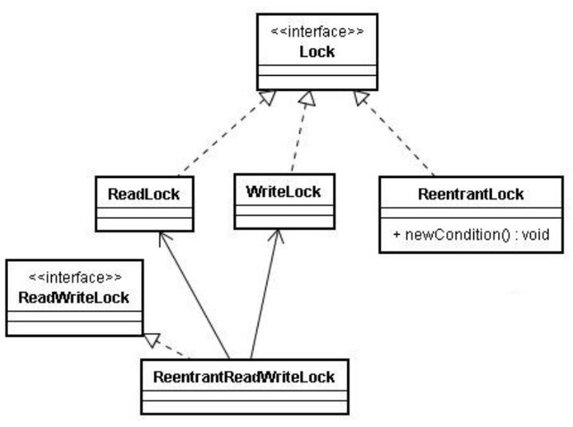
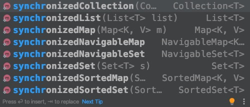

### 特性

多线程编程要保证满足三个特性：原子性、可见性、有序性。来达到线程安全

1.	原子性
原子性，即一个操作或者多个操作 要么全部执行并且执行的过程不会被任何因素打断，要么就都不执行。

2.	可见性
可见性是指当多个线程访问同一个变量时，一个线程修改了这个变量的值，其他线程能够立即看得到修改的值。显然，对于单线程来说，可见性问题是不存在的。

3.	有序性
有序性即程序执行的顺序按照代码的先后顺序执行。

> 在线程安全章节中提到的锁机制旧属于满足了多线程有序性和可见性而得以线程安全。

以下内容均围绕这三大特性来实现线程安全。


### 多线程控制类

<code><font color=ff00ff size=4>1、ThreadLocal</font></code>

ThreadLocal提供线程局部变量，即为使用相同变量的每一个线程维护一个该变量的副本。
<font color=EEB422>当某些数据是以线程为作用域并且不同线程具有不同的数据副本的时候，就可以考虑采用ThreadLocal</font>，比如数据库连接Connection，每个请求处理线程都需要，但又不相互影响，就是用ThreadLocal实现。

```java
package thread_lean.thread_local;

/**
 * TODO:<p>  <p/>
 *
 * @package: thread_lean.thread_local
 * @Author mac
 * @Date 2020/3/22 6:00 下午
 * @Version V1.0
 **/
public class Bank {
    /** 金额*/
    ThreadLocal<Double> balance=new ThreadLocal<Double>(){
        protected Double initialValue(){
            return 0.0;
        };
    };
    public Double get(){
        return balance.get();
    };
    public void set(){
        balance.set(balance.get()+10);
    }

}
package thread_lean.thread_local;

/**
 * TODO:<p> 转账 <p/>
 *
 * @package: thread_lean.thread_local
 * @Author mac
 * @Date 2020/3/22 5:57 下午
 * @Version V1.0
 **/
public class TransferAccounts {
   private Bank bank;
   public TransferAccounts(Bank bank){
       this.bank=bank;
   }
   public void run(){
       for(int i=0;i<10;i++){
           bank.set();
           System.out.println(Thread.currentThread().getName()+">"+bank.get());
       }
   }
}
### test

Bank bank=new Bank();
TransferAccounts transferAccounts=new TransferAccounts(bank);
new Thread(new Runnable() {
    @Override
    public void run() {
        transferAccounts.run();
    }
},"线程一").start();
new Thread(new Runnable() {
    @Override
    public void run() {
        transferAccounts.run();
    }
},"线程2").start();
```
>	在ThreadLocal类中定义了一个ThreadLocalMap，
	每一个Thread都有一个ThreadLocalMap类型的变量threadLocals
	threadLocals内部有一个Entry，Entry的key是ThreadLocal对象实例，value就是共享变量副本
	ThreadLocal的get方法就是根据ThreadLocal对象实例获取共享变量副本
	ThreadLocal的set方法就是根据ThreadLocal对象实例保存共享变量副本


<code><font color=ff00ff size=4>2、原子类</font></code>

Java的java.util.concurrent.atomic包里面提供了很多可以进行原子操作的类，分为以下四类：
* 原子更新基本类型：AtomicInteger、AtomicBoolean、AtomicLong
* 原子更新数组：AtomicIntegerArray、AtomicLongArray
* 原子更新引用：AtomicReference、AtomicStampedReference等
* 原子更新属性：AtomicIntegerFieldUpdater、AtomicLongFieldUpdater
提供这些原子类的目的就是为了解决基本类型操作的非原子性导致在多线程并发情况下引发的问题。

问题：
```java
package thread_lean.Atomic;

/**
 * TODO:<p>  <p/>
 *
 * @package: thread_lean.Atomic
 * @Author mac
 * @Date 2020/3/22 8:10 下午
 * @Version V1.0
 **/
public class AtomicClass{

    static int n=0;
    public static void main(String[] args) throws InterruptedException {
        int j = 0;
        while(j<100){
            n = 0;
            Thread t1 = new Thread(){
                public void run(){
                    for(int i=0; i<1000; i++){
                        n++;
                    }
                }
            };
            Thread t2 = new Thread(){
                public void run(){
                    for(int i=0; i<1000; i++){
                        n++;
                    }
                }
            };
            t1.start();
            t2.start();
            t1.join();
            t2.join();
            System.out.println("n的最终值是："+n);
            j++;
        }


    }
}

```
>n的最终值是：2000
n的最终值是：1603
n的最终值是：2000
n的最终值是：2000

解决：
```java
package thread_lean.Atomic;

import java.util.concurrent.atomic.AtomicInteger;

/**
 * TODO:<p>  <p/>
 *
 * @package: thread_lean.Atomic
 * @Author mac
 * @Date 2020/3/22 8:10 下午
 * @Version V1.0
 **/
public class AtomicClass{

    static AtomicInteger n;
    public static void main(String[] args) throws InterruptedException {
        int j = 0;
        while(j<100){
            n = new AtomicInteger(0);
            Thread t1 = new Thread(){
                public void run(){
                    for(int i=0; i<1000; i++){
                        n.getAndIncrement();
                    }
                }
            };
            Thread t2 = new Thread(){
                public void run(){
                    for(int i=0; i<1000; i++){
                        n.getAndIncrement();
                    }
                }
            };
            t1.start();
            t2.start();
            t1.join();
            t2.join();
            System.out.println("n的值永远是："+n);
            j++;
        }
    }
}

```


<code><font color=ff00ff size=4>3、Lock类以及同步关键字Synchronized</font></code>



Lock和ReadWriteLock是两大锁的根接口
Lock 接口支持重入、公平等的锁规则：实现类 ReentrantLock、ReadLock和WriteLock。
ReadWriteLock 接口定义读取者共享而写入者独占的锁，实现类：ReentrantReadWriteLock

    可重入锁：线程可以进入已经用有锁的同步代码块中。即可以多次获取已经获得的锁，并且获得几次锁则需要释放几次锁直至获得锁全部释放。
    不可重入锁：线程请求已经拥有的锁是会阻塞。
    读写锁：读写锁，即可以同时读，读的时候不能写；不能同时写，写的时候不能读

```java
package thread_lean.readWriteLock;

import java.util.Date;
import java.util.HashMap;
import java.util.Map;
import java.util.concurrent.locks.Lock;
import java.util.concurrent.locks.ReadWriteLock;
import java.util.concurrent.locks.ReentrantReadWriteLock;

/**
 * TODO:<p>  <p/>
 *
 * @package: thread_lean.readWriteLock
 * @Author mac
 * @Date 2020/3/22 8:32 下午
 * @Version V1.0
 **/
public class ReadWriteLockDemo {
    private static Map map=new HashMap();
    ReadWriteLock rw=new ReentrantReadWriteLock();
    //创建一个读锁
    private Lock r=rw.readLock();
    //创建一个写锁
    private Lock w=rw.writeLock();

    public Object get(String key){
        r.lock();
        try {
            System.out.println(Thread.currentThread().getName()+"执行读操作"+new Date().getTime());
            try {
                Thread.sleep(3000);
            } catch (InterruptedException e) {
                e.printStackTrace();
            }
            System.out.println(Thread.currentThread().getName()+"读操作执行完毕。。。"+new Date().getTime());
        }finally {
            r.unlock();
        }
        return map.get(key);
    }

    public void set(String key,String value){
        w.lock();
        System.out.println(Thread.currentThread().getName()+"执行写操作"+new Date().getTime());
        try {
            Thread.sleep(3000);
        } catch (InterruptedException e) {
            e.printStackTrace();
        }
        System.out.println(Thread.currentThread().getName()+"写操作执行完毕。。。"+new Date().getTime());
        try {
            map.put(key,value);
        }catch (Exception e){
            e.printStackTrace();
        }finally {
            w.unlock();
        }

    }
}
### test
ReadWriteLockDemo writeLockDemo=new ReadWriteLockDemo();
new Thread(new Runnable() {
    @Override
    public void run() {
        writeLockDemo.set("key1","5646");
    }
},"写线程").start();
new Thread(new Runnable() {
    @Override
    public void run() {
        writeLockDemo.get("key1");
    }
},"读线程1").start();
new Thread(new Runnable() {
    @Override
    public void run() {
        writeLockDemo.get("key1");
    }
},"读线程2").start();
new Thread(new Runnable() {
    @Override
    public void run() {
        writeLockDemo.get("key1");
    }
},"读线程3").start();

```
>写线程执行写操作1584881411883
写线程写操作执行完毕。。。1584881414906
读线程1执行读操作1584881414907
读线程2执行读操作1584881414907
读线程3执行读操作1584881414907
读线程2读操作执行完毕。。。1584881417912
读线程3读操作执行完毕。。。1584881417912
读线程1读操作执行完毕。。。1584881417912    

<code><font color=ff00ff size=4>4、Volatile关键字</font></code>

一个共享变量（类的成员变量、类的静态成员变量）被volatile修饰之后，那么就具备了两层语义：
* 保证了不同线程对这个变量进行操作时的可见性，即一个线程修改了某个变量的值，这新值对其他线程来说是立即可见的。（注意：不保证原子性）
* 禁止进行指令重排序。（保证变量所在行的有序性）
当程序执行到volatile变量的读操作或者写操作时，在其前面的操作的更改肯定全部已经进行，且结果已经对后面的操作可见；在其后面的操作肯定还没有进行；
在进行指令优化时，不能将在对volatile变量访问的语句放在其后面执行，也不能把volatile变量后面的语句放到其前面执行。

```java
//线程1
boolean stop = false;
while(!stop){
    doSomething();
}

//线程2
stop = true;
```
>这段代码是很典型的一段代码，很多人在中断线程时可能都会采用这种标记办法。但是事实上，这段代码会完全运行正确么？即一定会将线程中断么？不一定，也许在大多数时候，这个代码能够把线程中断，但是也有可能会导致无法中断线程（虽然这个可能性很小，但是只要一旦发生这种情况就会造成死循环了）。
　　下面解释一下这段代码为何有可能导致无法中断线程。在前面已经解释过，每个线程在运行过程中都有自己的工作内存，那么线程1在运行的时候，会将stop变量的值拷贝一份放在自己的工作内存当中。
　　那么当线程2更改了stop变量的值之后，但是还没来得及写入主存当中，线程2转去做其他事情了，那么线程1由于不知道线程2对stop变量的更改，因此还会一直循环下去。
　　但是用volatile修饰之后就变得不一样了：
　　第一：使用volatile关键字会强制将修改的值立即写入主存；
　　第二：使用volatile关键字的话，当线程2进行修改时，会导致线程1的工作内存中缓存变量stop的缓存行无效（反映到硬件层的话，就是CPU的L1或者L2缓存中对应的缓存行无效）；
　　第三：由于线程1的工作内存中缓存变量stop的缓存行无效，所以线程1再次读取变量stop的值时会去主存读取。


```java
package thread_lean.volatle;

import java.util.Date;

import static java.lang.Thread.sleep;

/**
 * TODO:<p>  <p/>
 *
 * @package: thread_lean.volatle
 * @Author mac
 * @Date 2020/3/22 8:54 下午
 * @Version V1.0
 **/
public class VolatileClass {
    private volatile static boolean flag=true;

    public static void main(String[] args) {
        new Thread(new Runnable() {
            @Override
            public void run() {
                while (flag){
                    System.out.println("执行线程一...."+new Date().getTime());

                }

            }
        }).start();
        new Thread(new Runnable() {
            @Override
            public void run() {
                while (flag){
                    try {
                        sleep(2000);
                    } catch (InterruptedException e) {
                        e.printStackTrace();
                    }
                    flag=false;
                    System.out.println("线程二等待2s后将flag改为flase    "+new Date().getTime());
                }
            }
        }).start();
    }
}

```
>执行线程一....1584882995431
执行线程一....1584882995431
线程二等待2s后将flag改为flase    1584882995431
线程二修改标志位flag后线程一立即停止，时间几乎保持一致都为1584882995431

### HashMap并发问题解决

1. Synchronized或者使用hashtable替代
2. Lock锁
3. 同步类容器
4. 并发类容器


### 同步类容器

在Java中，同步容器主要包括2类：

    Vector、Stack、HashTable（可以独立创建）

    Collections类中提供的静态工厂方法创建的类（借助工具类创建）

Vector

    实现了List接口，Vector实际上就是一个数组，和ArrayList类似，但是Vector中的方法都是synchronized方法，即进行了同步措施。
Stack

    也是一个同步容器，它的方法也用synchronized进行了同步，它实际上是继承于Vector类。
HashTable

    实现了Map接口，它和HashMap很相似，但是HashTable进行了同步处理，而HashMap没有。
Collections

    Collections类是一个工具提供类，注意，它和Collection不同，Collection是一个顶层的接口。在Collections类中提供了大量的方法，比如对集合或者容器进行排序、查找等操作。最重要的是，在它里面提供了几个静态工厂方法来创建同步容器类



### 并发容器

<font color=EEB422>因为同步容器将几乎所有方法添加的synchronized进行同步，这样保证了线程的安全性，但代价就是严重降低了并发性能，当多个线程竞争容器时，吞吐量严重降低。</font>

Java5.0开始针对多线程并发访问重新设计，提供了并发性能较好的并发容器，引入了java.util.concurrent包

<code><font color=ff00ff size=4>ConcurrentHashMap</font></code>

    对应的非并发容器：HashMap
    目标：代替Hashtable、synchronizedMap，支持复合操作
    原理：JDK6中采用一种更加细粒度的加锁机制Segment“分段锁”，JDK8中采用CAS无锁算法。

<code><font color=ff00ff size=4>CopyOnWriteArrayList</font></code>

    对应的非并发容器：ArrayList
    目标：代替Vector、synchronizedList
    原理：利用高并发往往是读多写少的特性，对读操作不加锁，对写操作，先复制一份新的集合，在新的集合上面修改，然后将新集合赋值给旧的引用，并通过volatile 保证其可见性，当然写操作的锁是必不可少的了。

<code><font color=ff00ff size=4>CopyOnWriteArraySet</font></code>

    对应的费并发容器：HashSet
    目标：代替synchronizedSet
    原理：基于CopyOnWriteArrayList实现，其唯一的不同是在add时调用的是CopyOnWriteArrayList的addIfAbsent方法，其遍历当前Object数组，如Object数组中已有了当前元素，则直接返回，如果没有则放入Object数组的尾部，并返回。

<code><font color=ff00ff size=4>ConcurrentSkipListMap</font></code>

    对应的非并发容器：TreeMap
    目标：代替synchronizedSortedMap(TreeMap)
    原理：Skip list（跳表）是一种可以代替平衡树的数据结构，默认是按照Key值升序的。Skip list让已排序的数据分布在多层链表中，以0-1随机数决定一个数据的向上攀升与否，通过”空间来换取时间”的一个算法。ConcurrentSkipListMap提供了一种线程安全的并发访问的排序映射表。内部是SkipList（跳表）结构实现，在理论上能够在O（log（n））时间内完成查找、插入、删除操作。

<code><font color=ff00ff size=4>ConcurrentSkipListSet</font></code>

    对应的非并发容器：TreeSet
    目标：代替synchronizedSortedSet
    原理：内部基于ConcurrentSkipListMap实现

<code><font color=ff00ff size=4>ConcurrentLinkedQueue</font></code>

    不会阻塞的队列
    对应的非并发容器：Queue
    原理：基于链表实现的FIFO队列（LinkedList的并发版本）

<code><font color=ff00ff size=4>LinkedBlockingQueue、ArrayBlockingQueue、PriorityBlockingQueue</font></code>

    对应的非并发容器：BlockingQueue
    特点：拓展了Queue，增加了可阻塞的插入和获取等操作
    原理：通过ReentrantLock实现线程安全，通过Condition实现阻塞和唤醒

<code><font color=ff00ff size=4>实现类： </font></code>
LinkedBlockingQueue：基于链表实现的可阻塞的FIFO队列
ArrayBlockingQueue：基于数组实现的可阻塞的FIFO队列
PriorityBlockingQueue：按优先级排序的队列
