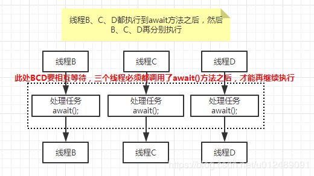
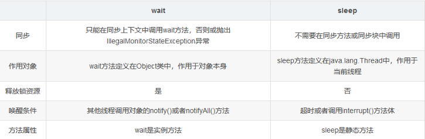

### 为什么要线程通信

多个线程并发执行时，在默认情况下CPU是随机切换线程的，有时我们希望CPU按我们的规律执行线程，此时就需要线程之间线程通信。

### 线程通讯方式
线程间通信常用方式如下：

休眠唤醒方式：

    Object的wait、notify、notifyAll

>>如果对象调用了wait方法就会使持有该对象的线程把该对象的控制权交出去，然后处于等待状态。
    如果对象调用了notify方法就会通知某个正在等待这个对象的控制权的线程可以继续运行。
    如果对象调用了notifyAll方法就会通知所有等待这个对象控制权的线程继续运行。

    Condition的await、signal、signalAll

    CountDownLatch：用于某个线程A等待若干个其他线程执行完之后，它才执行
>>CountDownLatch是在java1.5被引入的，存在于java.util.concurrent包下。
CountDownLatch这个类能够使一个线程等待其他线程完成各自的工作后再执行。
CountDownLatch是通过一个计数器来实现的，计数器的初始值为线程的数量。
每当一个线程完成了自己的任务后，计数器的值就会减1。当计数器值到达0时，它表示所有的线程已经完成了任务，然后在闭锁上等待的线程就可以恢复执行任务

    CyclicBarrier：一组线程等待至某个状态(改组线程都执行了了await()后才全部执行)之后再全部同时执行

    Semaphore：用于控制对某组资源的访问权限


### 示例 :Object的wait、notify、notifyAll(与synchronized搭配处于jvm层面)

需求：进水口出水口。当水箱加满水，出水口出水并且进水口停止进水。当水箱为空时，进水口进水并且出水口停止出水

```Java
package threadCommunication;

/**
 * TODO:<p> <p/>
 *
 * @package: threadCommunication
 * @Author mac
 * @Date 2020/3/14 9:01 下午
 * @Version V1.0
 **/
public class demo{
    private Object in = new Object();
    private Object out=new Object();
    private Integer i=0;//i=10时开启出水口
    public void intake() {
        while(true){
            synchronized (in){
                i++;
                System.out.println(Thread.currentThread().getName()+"进水> >"+i);
                try {
                    Thread.sleep(500);
                } catch (InterruptedException e) {
                    e.printStackTrace();
                }
                if (i>=10){//1:如果小于10则进水口线程一直加水
                    try {
                        in.wait();//2：持有该对象的进水口线程关闭等待唤醒，出水口线程抢到in锁出水
                    } catch (InterruptedException e) {
                        e.printStackTrace();
                    }

                }else{
                    in.notify();
                }

            }
        }
    }

    public void outlet(){
        while(true){
            synchronized (in){
                if(i>0){
                    i--;
                    System.out.println(Thread.currentThread().getName()+"出水>"+i);
                    try {
                        Thread.sleep(250);
                    } catch (InterruptedException e) {
                        e.printStackTrace();
                    }
                    in.notify();//3：出水口线程在i>0一直被运行，
                }else {
                    try {
                        in.wait();//4：水箱没水，此时拥有锁对象的出水口线程阻塞。
                    } catch (InterruptedException e) {
                        e.printStackTrace();
                    }
                    try {
                        Thread.sleep(1000);
                    } catch (InterruptedException e) {
                        e.printStackTrace();
                    }
                    System.out.println("水箱水量为空,");
                }
            }
        }
    }
}
### test
final demo runnable = new demo();
Thread t1 = new Thread(new Runnable() {
    public void run() {
        runnable.intake();
    }
}, "进水管线程");
Thread t2 = new Thread(new Runnable() {
    public void run() {
        runnable.outlet();
    }
}, "出水管线程");

t1.start();
t2.start();
```
>> 进水管线程进水> >1 进水管线程进水> >2 进水管线程进水> >3 进水管线程进水> >4 进水管线程进水> >5 进水管线程进水> >6 进水管线程进水> >7 进水管线程进水> >8 进水管线程进水> >9 进水管线程进水> >10
出水管线程出水>9 出水管线程出水>8出水管线程出水>7 出水管线程出水>6 出水管线程出水>5 出水管线程出水>4 出水管线程出水>3 出水管线程出水>2 出水管线程出水>1 出水管线程出水>0
进水管线程进水> >1
进水管线程进水> >2
...

需求：一个通知线程三个等待线程，通知线程在3s后通知三个等待线程执行

```Java
package threadCommunication;

import java.util.Date;

/**
 * TODO:<p><p/>
 *
 * @package: threadCommunication
 * @Author mac
 * @Date 2020/3/15 8:35 下午
 * @Version V1.0
 **/
public class demo1 {
    Object obj=new Object();
    public void notifyThread(){
        synchronized (obj){
            System.out.println("线程>"+Thread.currentThread().getName()+"等待3s后通知等待线程！！");
            try {
                Thread.sleep(3000);
            } catch (InterruptedException e) {
                e.printStackTrace();
            }
            obj.notifyAll();
        }
    }

    public void waitThread(){
        synchronized (obj){

            System.out.println("线程>"+Thread.currentThread().getName()+"从等待中获得解脱。do somthing。。"+new Date().getTime());

            try {
                obj.wait();
                Thread.sleep(1000);
            } catch (InterruptedException e) {
                e.printStackTrace();
            }
        }
    }

}

```
>>线程>通知等待3s后通知等待线程！！
线程>等待C从等待中获得解脱。do somthing。。1584277312908
线程>等待B从等待中获得解脱。do somthing。。1584277312921
线程>等待A从等待中获得解脱。do somthing。。1584277312921

### 注意点：

1. 任何一个时刻，对象的控制权（monitor）只能被一个线程拥有。
2. 无论是执行对象的wait、notify还是notifyAll方法，必须保证当前运行的线程取得了该对象的控制权（monitor）即获得锁对象
3. 如果在没有控制权的线程里执行对象的以上三种方法，就会报java.lang.IllegalMonitorStateException异常。
4. JVM基于多线程，默认情况下不能保证运行时线程的时序性

### 示例 Condition的await、signal、signalAll(与lock类搭配，处于代码层面)

```Java
package threadCommunication;

import java.util.concurrent.locks.Condition;
import java.util.concurrent.locks.Lock;
import java.util.concurrent.locks.ReentrantLock;

/**
 * TODO:<p>  <p/>
 *
 * @package: threadCommunication
 * @Author mac
 * @Date 2020/3/16 6:57 上午
 * @Version V1.0
 **/
public class demo2 {
    private Lock lock=new ReentrantLock(true);
    private Condition condition=lock.newCondition();
    private Integer i=0;//i=10时开启出水口
    public void intake() {
        while(true){
            lock.lock();
            try {
                i++;
                System.out.println(Thread.currentThread().getName()+"进水> >"+i);
                try {
                    Thread.sleep(250);
                } catch (InterruptedException e) {
                    e.printStackTrace();
                }
                if (i>=10){//1:如果小于10则进水口线程一直加水
                    condition.signal();

                }
            }finally {
                lock.unlock();
            }
        }
    }

    public void outlet(){
        while(true){
            lock.lock();
            try {
                if(i>0){
                    try {
                        condition.await();
                    } catch (InterruptedException e) {
                        e.printStackTrace();
                    }
                    i--;
                    System.out.println(Thread.currentThread().getName()+"出水>"+i);
                    try {
                        Thread.sleep(500);
                    } catch (InterruptedException e) {
                        e.printStackTrace();
                    }
                }else {
                    try {
                        Thread.sleep(1000);
                    } catch (InterruptedException e) {
                        e.printStackTrace();
                    }
                    System.out.println("水箱水量为空,");
                }
            }finally {
                lock.unlock();
            }
        }
    }
}

```
### 示例 CountDownLatch：用于某个线程A等待若干个其他线程执行完之后，它才执行
需求：三个等待线程全部执行完毕后，执行通知线程

```java
package threadCommunication;

import java.util.Date;
import java.util.concurrent.CountDownLatch;
import java.util.concurrent.locks.Condition;
import java.util.concurrent.locks.Lock;
import java.util.concurrent.locks.ReentrantLock;

/**
 * TODO:<p> 需求：三个等待线程执行完毕后告知通知线程 <p/>
 *
 * @package: threadCommunication
 * @Author mac
 * @Date 2020/3/16 6:57 上午
 * @Version V1.0
 **/
public class demo3 {
    private Object obj=new Object();
    CountDownLatch count=new CountDownLatch(3);
    public void notifyThread(){
        System.out.println("线程>"+Thread.currentThread().getName()+" is waiting....");
        try {
            count.await();
        } catch (InterruptedException e) {
            e.printStackTrace();
        }
        System.out.println("线程>"+Thread.currentThread().getName()+"执行完毕！！");
    }

    public void waitThread(){
        try {
            Thread.sleep(1000);
        } catch (InterruptedException e) {
            e.printStackTrace();
        }
        System.out.println("线程>"+Thread.currentThread().getName()+"执行完毕！！"+new Date().getTime());
        count.countDown();
    }
}
### test

demo3 demo1=new demo3();
//一个通知线程.通知线程先执行则必定通知线程先抢到锁
new Thread(new Runnable() {
    @Override
    public void run() {
        demo1.notifyThread();
    }
},"通知").start();

//三个等待线程
new Thread(new Runnable() {
    @Override
    public void run() {
        demo1.waitThread();
    }
},"等待A").start();
//三个等待线程
new Thread(new Runnable() {
    @Override
    public void run() {
        demo1.waitThread();
    }
},"等待B").start();
//三个等待线程
new Thread(new Runnable() {
    @Override
    public void run() {
        demo1.waitThread();
    }
},"等待C").start();
```
>>线程>通知 is waiting....
线程>等待C执行完毕！！1584316617153
线程>等待B执行完毕！！1584316617153
线程>等待A执行完毕！！1584316617153
线程>通知执行完毕！！


### 示例 CyclicBarrier：一组线程等待至某个状态(改组线程都执行了了await()后才全部执行)之后再全部同时执行



```java
package threadCommunication;

import java.util.Date;
import java.util.concurrent.BrokenBarrierException;
import java.util.concurrent.CyclicBarrier;
import java.util.concurrent.TimeUnit;
import java.util.concurrent.TimeoutException;

/**
 * TODO:<p>  <p/>
 *
 * @package: threadCommunication
 * @Author mac
 * @Date 2020/3/16 8:39 下午
 * @Version V1.0
 **/
public class CyclicBarrierDemo {
    CyclicBarrier cyclicBarrier=new CyclicBarrier(3);//三个线程都执行了await后继续执行
    public void thread1(){
        System.out.println("线程"+Thread.currentThread().getName()+"   id:"+Thread.currentThread().getId()+"开始执行。。。。");
        try {
            //模拟执行代码
            Thread.sleep(1000);
        } catch (InterruptedException e) {
            e.printStackTrace();
        }
        try {
            cyclicBarrier.await(2000, TimeUnit.SECONDS);
        } catch (InterruptedException e) {
            e.printStackTrace();
        } catch (BrokenBarrierException e) {
            e.printStackTrace();
        } catch (TimeoutException e) {
            e.printStackTrace();
        }
        System.out.println("线程"+Thread.currentThread().getName()+"   id:"+Thread.currentThread().getId()+"执行完毕。。。。"+new Date().getTime());
    }
    public void thread2(){
        System.out.println("线程"+Thread.currentThread().getName()+"   id:"+Thread.currentThread().getId()+"开始执行。。。。");
        try {
            //模拟执行代码
            Thread.sleep(2000);
        } catch (InterruptedException e) {
            e.printStackTrace();
        }
        try {
            cyclicBarrier.await(3000, TimeUnit.SECONDS);
        } catch (InterruptedException e) {
            e.printStackTrace();
        } catch (BrokenBarrierException e) {
            e.printStackTrace();
        } catch (TimeoutException e) {
            e.printStackTrace();
        }
        System.out.println("线程"+Thread.currentThread().getName()+"   id:"+Thread.currentThread().getId()+"执行完毕。。。。"+new Date().getTime());
    }
    public void thread3(){
        System.out.println("线程"+Thread.currentThread().getName()+"   id:"+Thread.currentThread().getId()+"开始执行。。。。");
        try {
            //模拟执行代码
            Thread.sleep(3000);
        } catch (InterruptedException e) {
            e.printStackTrace();
        }
        try {
            cyclicBarrier.await(4000, TimeUnit.SECONDS);
        } catch (InterruptedException e) {
            e.printStackTrace();
        } catch (BrokenBarrierException e) {
            e.printStackTrace();
        } catch (TimeoutException e) {
            e.printStackTrace();
        }
        System.out.println("线程"+Thread.currentThread().getName()+"   id:"+Thread.currentThread().getId()+"执行完毕。。。。"+new Date().getTime());
    }
}
###test

CyclicBarrierDemo cyclicBarrierDemo=new CyclicBarrierDemo();
new Thread(new Runnable() {
    @Override
    public void run() {
        cyclicBarrierDemo.thread1();
    }
}).start();
new Thread(new Runnable() {
    @Override
    public void run() {
        cyclicBarrierDemo.thread2();
    }
}).start();
new Thread(new Runnable() {
    @Override
    public void run() {
        cyclicBarrierDemo.thread3();
    }
}).start();
```
>>线程Thread-0   id:12开始执行。。。。
线程Thread-1   id:13开始执行。。。。
线程Thread-2   id:14开始执行。。。。
线程Thread-1   id:13执行完毕。。。。1584362999027
线程Thread-2   id:14执行完毕。。。。1584362999027
线程Thread-0   id:12执行完毕。。。。1584362999027

### 示例  Semaphore：用于控制对某组资源的访问权限

```java
package threadCommunication;

import java.util.Date;
import java.util.concurrent.Semaphore;

/**
 * TODO:<p> n个工人使用3个机器，工人之间不能同时使用机器 <p/>
 *
 * @package: threadCommunication
 * @Author mac
 * @Date 2020/3/16 8:53 下午
 * @Version V1.0
 **/
public class SemaphoreDemo implements Runnable{
    private int workerNum;
    private Semaphore semaphore;
    SemaphoreDemo(int workerNum,Semaphore semaphore){
        this.workerNum=workerNum;
        this.semaphore=semaphore;
    }

    @Override
    public void run() {
        try {
            semaphore.acquire();//获取许可(获取机器使用权)
        } catch (InterruptedException e) {
            e.printStackTrace();
        }
        System.out.println("工人："+workerNum+"开始使用机器"+new Date().getTime());
        try {
            Thread.sleep(2000);
        } catch (InterruptedException e) {
            e.printStackTrace();
        }
        semaphore.release();//释放许可(释放机器使用权)
    }
}
### test
int num=8;
Semaphore semaphore=new Semaphore(3);
for(int i=0;i<num;i++){        
    new Thread(new SemaphoreDemo(i, semaphore)).start();
}
```
>>工人：2开始使用机器1584363935059
工人：0开始使用机器1584363935059
工人：1开始使用机器1584363935059
工人：3开始使用机器1584363937094
工人：5开始使用机器1584363937094
工人：4开始使用机器1584363937094
工人：6开始使用机器1584363939094
工人：7开始使用机器1584363939094


### sleep和wait区别
 

### wait和notify区别

1. wait和notify都是Object中的方法
2. wait和notify执行前线程都必须获得对象锁(锁操作代码)
3. wait的作用是使当前线程进行等待
4. notify的作用是通知其他等待当前线程的对象锁的线程
