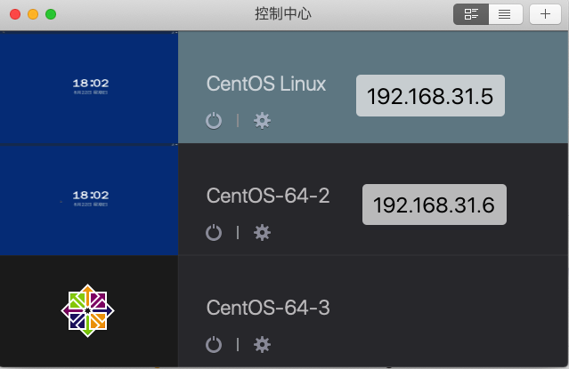

## 是什么

是一种容器编排技术，针对容器进行一系列的部署、规划、扩展和管理。Kubernets的目标是让部署容器化的应用简单并且高效


## 架构


> 至少需要两个服务器，一个服务器承载 master。另外一个承载nodes

* master

	K8S集群控制节点，用以对node集群进行调度管理，并接受用户请求去对node集群操作

* nodes

	工作节点，运行用户业务应用容器，比如Docker。nodes节点也叫工作节点(Worker Node) ，包含了**kubelet、kube proxy、Pod**


## 环境搭建

### 1、搭建方式

* minikube **（不推荐）**

	minikube可以在本地运行Kubernetes的工具，minikube可以在个人计算机（包括Windows，macOS和Linux PC）上运行一个单节点Kubernetes集群，以便您可以试用Kubernetes或进行日常开发工作

	在线互动 ： https://kubernetes.io/docs/tutorials/hello-minikube/ 

* kind **（不推荐）**

	Kind和minikube类似的工具，让你在本地计算机上运行Kubernetes，此工具需要安装并配置Docker；

	https://kind.sigs.k8s.io/ 

* kubeadm **（推荐）**

	Kubeadm是一个K8s部署工具，提供kubeadm init 和 kubeadm join两个操作命令，可以快速部署一个Kubernetes集群；

* 二进制包 **（不推荐）**

	从Github下载发行版的二进制包，手动部署安装每个组件，组成Kubernetes集群，步骤比较繁琐，但是能让你对各个组件有更清晰的认识；

* yum安装**（不推荐）**

	通过yum安装Kubernetes的每个组件，组成Kubernetes集群，不过yum源里面的k8s版本已经比较老了，所以这种方式用得也比较少了；

* 第三方工具**（不推荐）**

	有一些大神封装了一些工具，利用这些工具进行k8s环境的安装；

* 花钱购买**（不推荐）**

	直接购买类似阿里云这样的公有云平台k8s，一键搞定；


### 2、常用工具说明

* docker

	容器，承载各种服务，比如mysql、tomcat、微服务等, **docker镜像是放在nodes服务器上的**

* kubeadm

	安装k8s集群的工具

* kubelet

	k8s中工具，用以运行在cluster所有节点上，负责启动POD和容器

* kubectl

	k8s命令行工具，接受用户命令，实现对节点nodes操作

* Pod

	一个pod中运行了多个docker容器

* deployment

	控制器，里面包裹这Pod，pod里面包含了多个docker

### 3、kubeadm 环境搭建

* 本机操作环境

	

	> * 确保31.5和31.6和本机互通并相通
	> * 确保31.5和31.6都可以访问外网

* 命令

	1. 创建一个Master节点：

		```bash
		kubeadm init 
		```

	2. 将Node节点加入到Master集群中

		```bash
		kubeadm join <Master节点的IP和端口>
		```

* 操作流程

	* 服务器要求

		  (1)一台或多台机器，操作系统CentOS 7.x-86_x64

		（2）硬件配置：内存2GB或2G+，CPU 2核或CPU 2核+；

		（3）集群内各个机器之间能相互通信；

		（4）集群内各个机器可以访问外网，需要拉取镜像；

		（5）禁止swap分区；

	* 环境准备

		* 关闭防火墙

			```bash
			systemctl stop firewalld
			systemctl disable firewalld
			```

			

		* 关闭selinux

			```bash
			sed -i 's/enforcing/disabled/' /etc/selinux/config  #永久
			setenforce 0  #临时
			```

			

		* 关闭swap（k8s禁止虚拟内存以提高性能）

			```bash
			sed -ri 's/.*swap.*/#&/' /etc/fstab #永久
			swapoff -a #临时
			```

			

		* 在master添加hosts

			```bash
			cat >> /etc/hosts << EOF
			192.168.31.5 k8smaster
			192.168.31.6 k8snode
			EOF
			```

		* 设置网桥参数

			```bash
			cat > /etc/sysctl.d/k8s.conf << EOF
			net.bridge.bridge-nf-call-ip6tables = 1
			net.bridge.bridge-nf-call-iptables = 1
			EOF
			sysctl --system  #生效
			```

			

		* 时间同步

			```bash
			yum install ntpdate -y
			ntpdate time.windows.com
			```

	* 安装

		> 所有服务器节点（master/nodes）安装 Docker/kubeadm/kubelet/kubectl
		>
		> 如果没有wget 则执行 yum install wget -y

		* docker

			* 更新docker yum源

				```bash
				wget https://mirrors.aliyun.com/docker-ce/linux/centos/docker-ce.repo -O /etc/yum.repos.d/docker-ce.repo
				```

			* 安装指定版本docker

				```bash
				yum install docker-ce-19.03.13 -y
				yum install docker -y （这个安装的Docker版本偏旧） 1.13.x
				```

			* 配置docker 加速器

				```bash
				vim /etc/docker/daemon.json 
				#写入如下内容，这里的地址需要自己去阿里云查看
				{
				  "registry-mirrors": ["https://gohikpmg.mirror.aliyuncs.com"]
				}
				```

			* 添加k8s的阿里云yum源

				```bash
				cat > /etc/yum.repos.d/kubernetes.repo << EOF
				[kubernetes]
				name=Kubernetes
				baseurl=https://mirrors.aliyun.com/kubernetes/yum/repos/kubernetes-el7-x86_64
				enabled=1
				gpgcheck=0
				repo_gpgcheck=0
				gpgkey=https://mirrors.aliyun.com/kubernetes/yum/doc/yum-key.gpg https://mirrors.aliyun.com/kubernetes/yum/doc/rpm-package-key.gpg
				EOF
				```

			

		* kubeadm、kubelet 和 kubectl 

			* 安装

				```bash
				yum install kubelet-1.19.4 kubeadm-1.19.4 kubectl-1.19.4 -y
				```

			* kubelet服务置为可用

				```bash
				systemctl enable kubelet.service
				```

			* 查看是否安装成功

				```bash
				yum list installed | grep kubelet
				yum list installed | grep kubeadm
				yum list installed | grep kubectl
				```

			

		* 初始化k8s master节点 **master机器上执行**

			```bash
			kubeadm init --apiserver-advertise-address=192.168.31.5 --image-repository registry.aliyuncs.com/google_containers --kubernetes-version v1.19.4 --service-cidr=10.96.0.0/12 --pod-network-cidr=10.244.0.0/16
			```

			> <font color=ff00aa>此命令只能在master机器上执行，不需要在nodes机器上执行</font>

			* --apiserver-advertise-address

				master 节点IP地址，用以绑定master节点处理nodes

			* --image-repository

				拉取镜像地址，改为阿里云，使用原Google镜像，卡死你

			* --kubernetes-version

				k8s版本

			* --service-cidr --pod-network-cidr 

				照着写就行，其中IP并没有特殊含义

			> 这里很容易有错误，一定要解决，如下：我这个问题因为已经设置了，可能没有生效，重启后再次执行命令

			

			

			

		* master机器上执行

			```BASH
			mkdir -p $HOME/.kube
			sudo cp -i /etc/kubernetes/admin.conf $HOME/.kube/config
			sudo chown $(id -u):$(id -g) $HOME/.kube/config
			```

			> kubectl get nodes  使用k8s命令行工具查看nodes

			

			

		* 将nodes加入到master中  **在nodes机器上执行**

			```bash
			# 在master重新生成token，会输出token，记下
			kubeadm token create
			# 在master重新生成ssl，会输出，记下
			openssl x509 -pubkey -in /etc/kubernetes/pki/ca.crt | openssl rsa -pubin -outform der 2>/dev/null | openssl dgst -sha256 -hex | sed 's/^.* //'
			# 将下面token和ssl替换，切记ssl中sha256:不要去掉，只替换后面字符串即可
			kubeadm join 192.168.31.5:6443 --token 5u9w3c.2xbcbpdnmxbz5tmw \
			--discovery-token-ca-cert-hash sha256:f1354e0e8f74471d078cd9a0e527f45ae17ff09e20bfe7dfc741c3373a892a1d 
			```

			> 192.168.31.5:6443 为master节点IP
			>
			> 这里可能会报错，百度

		* 解决 NotReady，使用网络插件保证master和nodes的连通性 

			

			> 下载 文件
			>
			> wget https://raw.githubusercontent.com/coreos/flannel/master/Documentation/kube-flannel.y
			>
			> 如果下载失败 百度搜索kube-flannel.yml

		* 应用kube-flannel.yml文件得到运行时容器 **(在master机器上执行）**

			```bash
			kubectl apply -f /home/admin/kube-flannel.yml 
			```

			


## 命令

* 查看nodes

	> kubectl get nodes

* 查看pod

	```bash
	# 查看默认
	kubectl get pods 
	# 查看系统
	kubectl get pods -n kube-system
	```

* 查看svc

	```bash
	kubectl get svc
	```

* 查看控制器

	```bash
	kubectl get deployment
	```

* 查看docker容器

	> 不能再master中查看，因为master是将docker容器部署在nodes服务器上的，因此你要在查看docker容器，需要在nodes服务器中使用docker命令即可

	

* 查看当前集群信息

	```bash
	kubectl get services
	```

	


* 删除控制器/容器

	```bash
	#删除控制器
	kubectl delete deployment 控制器名称    #使用kubectl get deployment进行查询名称
	#删除pod
	kubectl delete pod pod名称   #使用kubectl get pod进行查询名称
	```

	


## Kubernetes部署容器化应用

`步骤`

1. 使用Docker容器化Java程序
2. 使用k8s部署docker


### 1、k8s部署nginx

```bash
# 拉取nginx镜像
kubectl create deployment nginx --image=nginx
													镜像别名			 镜像名称
```

```bash
# 查看拉取情况 
kubectl get pod
```


```bash
# 暴露端口提供外部访问 在master查看
kubectl expose deployment nginx --port=80 --type=NodePort
```

> 外部访问方式：http://NodeIp:Port

```bash
# 查看node信息
kubectl get svc|servicers
```


> 其中 nginx 中 80：31361
>
> * 80 为指定端口，即一个pod中有多个nginx集群(docker容器集群)，而80端口是他们容器集群相互进行访问的端口。
> * 31361 为容器自动生成的端口，每个容器都拥有独立的端口，用以外部访问(比如说宿主机使用 虚拟机IP:31361进行访问)


<font color=ff00aa>失败,下次再试，教程不完整</font>

### 2、k8s部署nginx

1. 拉取镜像

	```bash
	kubectl create deployment tomcat --image=tomcat
	```

	


### 3、k8s部署微服务

1. 项目打包(jar、war)--> 可以使用git、maven、jenkins
2. 制作Dockerfile文件、生成镜像
3. kubectl create deployment 别名 --image=镜像