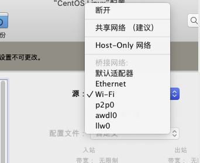
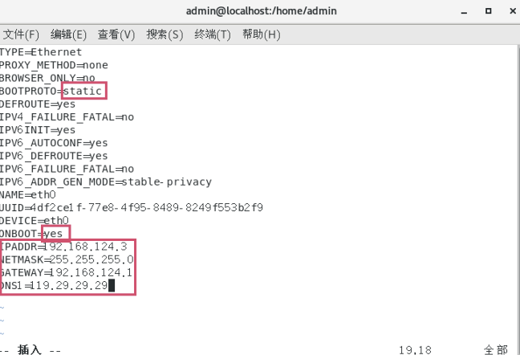
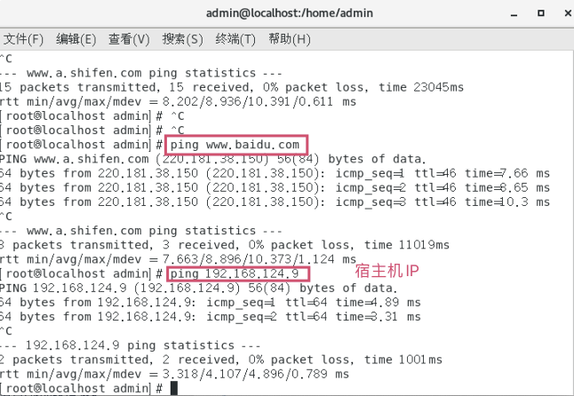
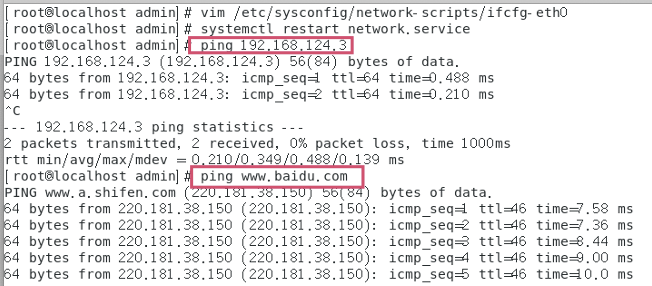
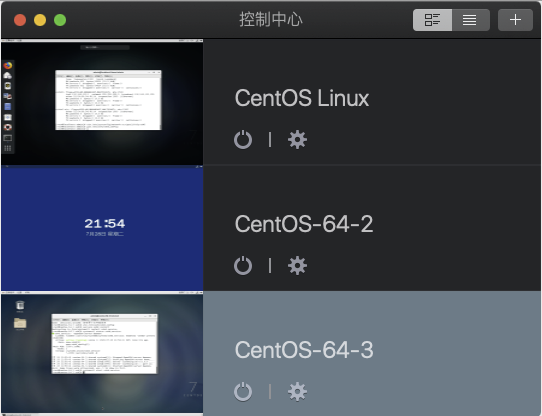
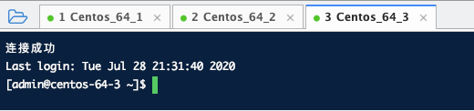

# 打造多节点Linux环境。

1. 先把虚拟机修改为何宿主机桥接模式。

2. 使用工具自动配置网络IP  sudo dhclient
3. 查看配好的IP  ifconfig (记住配好的IP，因为配好的IP每次都会变，因此配置网卡为静态IP)
4. 
5. 配置网卡静态IP   vim /etc/sysconfig/network-scripts/ifcfg-eth0（一般为eth0，选择自己网卡即可）

5. 重启网卡  systemctl restart network.service

6. 测试

	

7. Parallel Desktop在控制中心再次安装一个系统即可，并重复上诉步骤。

 小tip ：网上有人说直接在目录中复制虚拟机pvm文件，修改IP地址删除mac配置等等一系列操作，但是由于我机器上fcfg-eth0并无mac地址配置，因此就无法按照他说的那样删除那一列配置，然后进入虚拟机后能够ping通其他的虚拟机，baidu也是可以ping通的但是很卡，就是由于我的多个虚拟机节点Mac一样导致的。索性直接再重新装个虚拟机

8. 测试

	

9. 终极结果

	

	