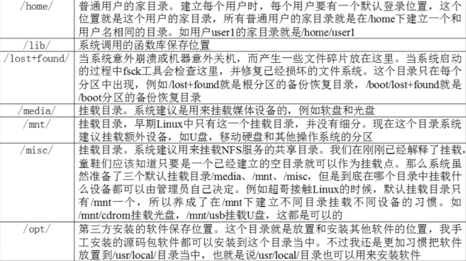
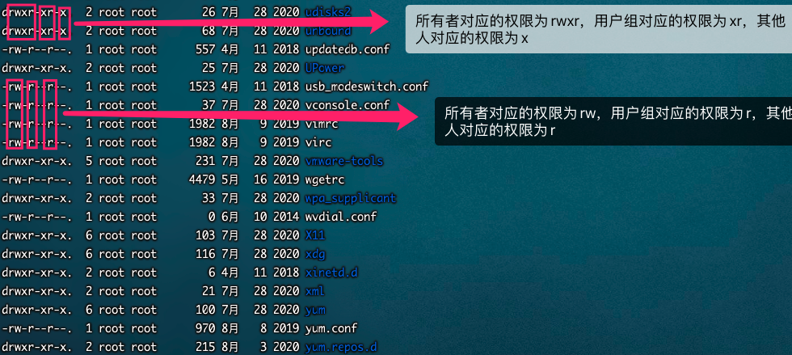

[toc]

## 桥接、NAT、Host-only

* 桥接

	拥有一个真实的IP地址。

* NAT

	与物理主机互用一个IP，并且当物理机能够上网时，他也能够

* Host-only

	与物理机户用一个IP，及时物理机能够上网，他也不能够


## 目录及其作用





## 服务器开关机

* 远程服务器不允许关机，只能重启

* 重启时应该关闭服务 

* 不要在服务器访问高峰运行高负载命令

* 远程配置防火墙时，不要把自己提出服务器

* 合理分配权限

* 定期备份重要数据和日志

	


## 所有者、所属组、其他人

> Linux 用于一般分为这三种

* 所有者

	即文件创建者

* 所属组

	即所有者创建一个组，里面包含了很多个用户，而这些用户也可以操作这台电脑

* 其他人

	既不是所有者，也不是所属组的其他用户


```bash
-rw-r--r--
```

* -文件类型

	-二进制文件

	d 目录

	l 软链接文件


rw - r -- r --

u     g    o

> 文件对应用户类型 ===》对应的权限使用-隔开

* u

	所有者

* g

	所属组

* o

	其他人

* r

	读

* w

	写

* x

	执行



## 最后访问时间、文件状态修改时间、文件数据修改时间

> Linux没有创建时间概念，如果一个文件创建后没有改过，那么时间就是它的创建时间
