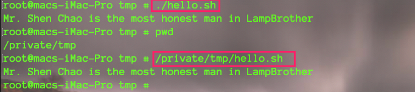

## Shell概述

### Shell是什么

- Shell是一个命令行解释器，它为用户提供了一个向Linux内核发送请求以便运行程序的界面系统级程序，用户可以用Shell来启动、挂起、停止甚至是编写一些程序。
- 类似于 JVM  ，负责将程序解释成 内核可以识别的机器语言，然后交由硬件执行。并且在执行后将返回结果返回给Shell，然后由Shell翻译为人可以识别的程序界面
- Shell还是一个功能相当强大的编程语言，易编写，易调试，灵活性较强。
- Shell是解释执行的脚本语言，在Shell中可以直接调用Linux系统命令。

> 即一是命令解释器，另外一个功能就是脚本语言


### Shell分类

- Bourne Shell：从1979起Unix就开始使用Bourne Shell，Bourne Shell的主文件名为sh。 

- C Shell： C Shell主要在BSD版的Unix系统中使用，其语法和C语言相类似而得名
- Shell的两种主要语法类型有Bourne和C，这两种语法彼此不兼容。Bourne家族主要包括sh、ksh、Bash、psh、zsh；C家族主要包括：csh、tcsh 
- Bash： Bash与sh兼容，**现在使用的Linux 就是使用Bash作为用户的基本Shell。**


## Shell脚本的执行方式

### 1、 echo输出命令

`格式`

```bash
echo [选项] [输出内容] 
```

`选项:`

* -e： 支持反斜线控制的字符转换,如下

	

`例如`

```bash
echo -e "ab\bc" 
#删除左侧字符  
```

```bash
echo -e "a\tb\tc\nd\te\tf" 
#制表符与换行符
```

```bash
echo -e   "\x61\t\x62\t\x63\n\x64\t\x65\t\x66" 
#按照十六进制ASCII码也同样可以输出
```

```bash
echo -e "\e[1;31m  abcd \e[0m" 
#输出颜色

#30m=黑色，31m=红色，32m=绿色，33m=黄色 

#34m=蓝色，35m=洋红，36m=青色，37m=白色
```


### 2、第一个脚本

> `sh文件头必须有如下内容`
>
> ```shell
> #!/bin/bash
> ```


1. 新建sh脚本

	

2. 执行

	

	> 绝对路径和相对路径都可以执行。
	>
	> 当然也可以通过 **bash hello.sh**来执行


<font color=ff00aa size=5>win 中的换行符为 ^M$  而Linux下换行符为 $。因此如果win下的shell脚本直接放到Linux下是执行报错的，需要换行符转化一下</font>

```bash
1. cat -A 文件名    #可以查看文件包含换行符
2. dos2unix 文件名    #win换行符转换为Linux，没有的可以使用yum安装 
```


## Bash的基本功能

### 历史命令和命令补全

#### 1、历史命令

`格式`

```bash
history [选项] [历史命令保存文件] 
```

`选项`  

* -c：  清空历史命令  

* -w： 把缓存中的历史命令写入历史命令保存文件   

> * 历史命令保存在     ~/.bash_history 
>
> - 历史命令默认会保存1000条,可以在环境变量配置文件/etc/profile中进行修改


`历史命令的调用`

- 使用上、下箭头调用以前的历史命令 
- 使用“!n”重复执行第n条历史命令 
- 使用“!!”重复执行上一条命令 
- 使用“!字串”重复执行最后一条以该字串开头的命令  


### 命令别名和常用快捷键

`格式`

```bash
alias 别名='原命令' 
#设定命令别名  
```

```bash
alias 
#查询命令别名  
```

`命令执行时顺序 `

1. 第一顺位执行用绝对路径或相对路径执行的命令。 
2.  第二顺位执行别名。  
3. 第三顺位执行Bash的内部命令。 
4. 第四顺位执行按照$PATH环境变量定义的目录查找顺序找到的第一个命令

`让别名永久生效`

```bash
vi /root/.bashrc 
```


#### 2、快捷键


### 输入输出重定向


### 多命令顺序执行与管道符


### 通配符和其他特俗符号


## Bash的变量


## Bash的运算符


## 环境变量配置文件

