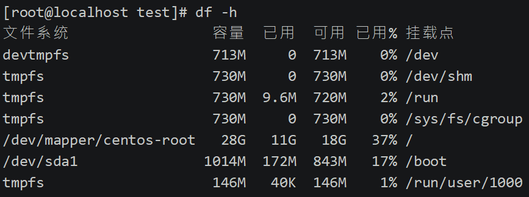

## Shell概述

### Shell是什么

- Shell是一个命令行解释器，它为用户提供了一个向Linux内核发送请求以便运行程序的界面系统级程序，用户可以用Shell来启动、挂起、停止甚至是编写一些程序。
- 类似于 JVM  ，负责将程序解释成 内核可以识别的机器语言，然后交由硬件执行。并且在执行后将返回结果返回给Shell，然后由Shell翻译为人可以识别的程序界面
- Shell还是一个功能相当强大的编程语言，易编写，易调试，灵活性较强。
- Shell是解释执行的脚本语言，在Shell中可以直接调用Linux系统命令。

> 即一是命令解释器，另外一个功能就是脚本语言


### Shell分类

- Bourne Shell：从1979起Unix就开始使用Bourne Shell，Bourne Shell的主文件名为sh。 

- C Shell： C Shell主要在BSD版的Unix系统中使用，其语法和C语言相类似而得名
- Shell的两种主要语法类型有Bourne和C，这两种语法彼此不兼容。Bourne家族主要包括sh、ksh、Bash、psh、zsh；C家族主要包括：csh、tcsh 
- Bash： Bash与sh兼容，**现在使用的Linux 就是使用Bash作为用户的基本Shell。**


## Shell脚本的执行方式

### 1、 echo输出命令

`格式`

```bash
echo [选项] [输出内容] 
```

`选项:`

* -e： 支持反斜线控制的字符转换,如下

	

`例如`

```bash
echo -e "ab\bc" 
#删除左侧字符  
```

```bash
echo -e "a\tb\tc\nd\te\tf" 
#制表符与换行符
```

```bash
echo -e   "\x61\t\x62\t\x63\n\x64\t\x65\t\x66" 
#按照十六进制ASCII码也同样可以输出
```

```bash
echo -e "\e[1;31m  abcd \e[0m" 
#输出颜色

#30m=黑色，31m=红色，32m=绿色，33m=黄色 

#34m=蓝色，35m=洋红，36m=青色，37m=白色
```


### 2、第一个脚本

> `sh文件头必须有如下内容`
>
> ```shell
> #!/bin/bash
> ```


1. 新建sh脚本

	

2. 执行

	

	> 绝对路径和相对路径都可以执行。
	>
	> 当然也可以通过 **bash hello.sh**来执行


<font color=ff00aa size=5>win 中的换行符为 ^M$  而Linux下换行符为 $。因此如果win下的shell脚本直接放到Linux下是执行报错的，需要换行符转化一下</font>

```bash
1. cat -A 文件名    #可以查看文件包含换行符
2. dos2unix 文件名    #win换行符转换为Linux，没有的可以使用yum安装 
```


## Bash的基本功能

### 历史命令和命令补全

#### 1、历史命令

`格式`

```bash
history [选项] [历史命令保存文件] 
```

`选项`  

* -c：  清空历史命令  

* -w： 把缓存中的历史命令写入历史命令保存文件   

> * 历史命令保存在     ~/.bash_history 
>
> - 历史命令默认会保存1000条,可以在环境变量配置文件/etc/profile中进行修改


`历史命令的调用`

- 使用上、下箭头调用以前的历史命令 
- 使用“!n”重复执行第n条历史命令 
- 使用“!!”重复执行上一条命令 
- 使用“!字串”重复执行最后一条以该字串开头的命令  


### 命令别名和常用快捷键

`格式`

```bash
alias 别名='原命令' 
#设定命令别名  
```

```bash
alias 
#查询命令别名  
```

`命令执行时顺序 `

1. 第一顺位执行用绝对路径或相对路径执行的命令。 
2.  第二顺位执行别名。  
3. 第三顺位执行Bash的内部命令。 
4. 第四顺位执行按照$PATH环境变量定义的目录查找顺序找到的第一个命令

`让别名永久生效`

```bash
vi /root/.bashrc 
```


#### 2、快捷键


### 输入输出重定向

>   输出重定向适合于**有输出结果**得命令将结果进行输出到文件。日志就是这个原理，我们可以在脚本中进行日志监控。
>
>   当然并不是所有的命令都适合输出重定向，必须得有输出内容的命令，例如ls等就可以，cd就不信

#### 标准输入输出


*   输出重定向

    

    >   上图中即可达到将命令正确结果或者错误结果进行输出重定向，如下

    

    

    

    

    `问题分析`

    >   上面输出重定向能够帮我们将正确结果和错误结果重定向到文件，但是我们写脚本的时候也不知道命令是错误的啊，这如何解决呢？

    

    

    

*   输入重定向

    >   本来是接受键盘灯外设输出信号，经过输入重定向可以修改为从文件或者网络等地来获取输入信息

    `命令`

    ```bash
    wc [选项] [文件名] 
    ```

    `选项：`  

    *   c   统计字节数  

    *   w   统计单词数  

    -   l   统计行数  

    `统计文件信息`

    ```bash
    wc < 文件名
    ```

    


### 多命令顺序执行与管道符

#### 命令连接符


>   顺序执行 ；如果期间有命令报错也不会影响后续的命令执行，如下案例

`案例`

```bash
ls ; date ; cd /user ; pwd
```


#### 数据拷贝命令

>   主要用作磁盘拷贝

`格式`

```bash
dd if=输入文件 of=输出文件 bs=字节数 count=个数  
```

`选项`

*   if=输入文件  指定源文件或源设备  

*   of=输出文件  指定目标文件或目标设备  

*   bs=字节数  指定一次输入/输出多少字节，即把这些字节看做一个数据块 

*   count=个数  指定输入/输出多少个数据块  即多少个bs

`案例`

```bash
date ; dd if=/dev/zero of=/tmp/test/testfile bs=1k count=100000 ; date
# 创建一个100mb的testfile文件，从/dev/zero文件中拷贝数据到testfile文件100mb数据，并且在前后都加上时间，从而计算出任务执行时间
ls anaconda-ks.cfg && echo yes  
ls /root/test || echo "no   
命令 && echo yes || echo no
#命令正确执行则实行yes，如果echo yes没有执行则执行 echo no。因此可以使用&&达到if的效果
```


#### 管道符

`格式`

```bash
命令1  |  命令2 
#命令1的正确输出作为命令2的操作对象 
```

`案例`

```bash
 ll -a /etc/  | more
```


#### grep

>   搜索文件中有关键字的行，悠久显示出

`格式`

```bash
grep [选项] "搜索内容" 文件名
```

`案例`

```bash
grep "root" /etc/passwd
#显示出 passwd文件中 包含“root”的行
netstat -an | grep "ESTABLISHED"
#将netstat -an查询出本机启用端口数据，并将此数据通过管道符交给 grep进行查询出包含ESTABLISHED的行。
```


`选项：  `

*   -i：  忽略大小写  

*   -n：  输出行号  

*   -v：  反向查找  

*   --color=auto 搜索出的关键字用颜色显示


### 通配符和其他特俗符号

#### 通配符


`举例`

```shell
[root@localhost ~]# cd /tmp/ 
[root@localhost tmp]# rm -rf * 
[root@localhost tmp]# touch abc 
[root@localhost tmp]# touch abcd 
[root@localhost tmp]# touch 012 
[root@localhost tmp]# touch 0abc 
[root@localhost tmp]# ls ?abc 
[root@localhost tmp]# ls [0-9]* 
[root@localhost tmp]# ls [^0-9]*
```


#### 其他特殊符号


`举例`

```bash
反引号与$() 
[root@localhost ~]# echo `ls`  
[root@localhost ~]# echo $(date)  

单引号与双引号 
[root@localhost ~]# name=sc 
[root@localhost ~]# echo '$name' 
[root@localhost ~]# echo "$name" 
[root@localhost ~]# echo ‘$(date)' 
[root@localhost ~]# echo “$(date)"
```


## Bash的变量

### 变量设置规则

-   变量名称可以由字母、数字和下划线组成，但是不能以数字开头。如果变量名是“2name”则是错误的。 

-   在Bash中，变量的默认类型都是字符串型，如果要进行数值运算，则必修指定变量类型为数值型。
-   变量用等号连接值，等号左右两侧不能有空格。 

-   变量的值如果有空格，需要使用单引号或双引号包括。 

-   在变量的值中，可以使用“\”转义符。 

-   如果需要增加变量的值，那么可以进行变量值的叠加。不过变量需要用双引号包含“$变量名”或用${变量名}包含。 

-   如果是把命令的结果作为变量值赋予变量，则需要使用反引号或$()包含命令。 

-   环境变量名建议大写，便于区分。

### 用户自定义变量

>   只在当前shell(终端)生效，如果是其他终端或者子shell则不能使用
>
>   怎么理解子shell呢？
>
>   ​	我打开一个终端比如说是bansh，然后申明了变量在执行 csh，进入子shell，此时csh就是bash的子shell

-   变量定义

    name="shen chao"

-   变量叠加

    aa=123 

    a="$aa"456 

    aa=${aa}789

-   变量调用 

    echo $name  

-   变量查看 

    set  #查看当前系统全部变量，包括自定义、环境等边浪

-   变量删除

    unset name

### 环境变量

>   环境变量在当前shell和子shell都会生效，如果写入到相应的配置文件，那么该变量在所有的shell中生效

*   申明变量  

    export 变量名=变量值 

    export  用户自定义变量    #将自定义变量升级为环境变量

*   查询变量  

    env

*   删除变量

    unset 变量名 

`系统常见环境变量`

-   系统查找命令的路径 

    ```bash
    echo $PATH
    #/usr/lib/qt3.3/bin:/usr/local/sbin:/usr/local/bin:/sbin:/bin:/usr/sbin:/usr/bin:/root/bin 
    ```

-   PATH变量叠加

    ```bash
    PATH="$PATH":/root/sh 
    ```

-   定义系统提示符的变量  $PS1

    

    -   \d：显示日期，格式为“星期 月 日” 
    -   \h：显示简写主机名。如默认主机名“localhost” 
    -   \t：显示24小时制时间，格式为“HH:MM:SS” 
    -   \T：显示12小时制时间，格式为“HH:MM:SS”
    -   \A：显示24小时制时间，格式为“HH:MM” 
    -   \u：显示当前用户名 
    -   \w：显示当前所在目录的完整名称 
    -   \W：显示当前所在目录的最后一个目录 
    -   \\#：执行的第几个命令 
    -   \\$：提示符。如果是root用户会显示提示符为“#”，如果是普通用户会显示提示符为“$”

    

    >   u 对应用户admin，@，h对应主机名，

    `修改举例`

    ```bash
    PS1='[\u@\t \w]\$' 
    PS1='[\u@\@ \h \# \W]\$‘  
    PS1='[\u@\h \W]\$ '
    ```

    

### 位置参数变量


### 预定义变量


### 接收键盘输入

`格式`

```bash
read [选项] [变量名] 
```

`选项：`  

*   -p “提示信息”：在等待read输入时，输出提示信息  

*   -t 秒数：  read命令会一直等待用户输入，使用此选项可以指定等待时间  

*   -n 字符数： read命令只接受指定的字符数，就会 执行  

*   -s：   隐藏输入的数据，适用于机密信息的输入  , 类似与html中password属性

`案例`

```bash
#!/bin/bash 

read -t 30 -p "Please input your name: " name 
#提示“请输入姓名”并等待30秒，把用户的输入保存入变量name中 
echo "Name is $name "  
read -s -t 30 -p "Please enter your age: " age 
#年龄是隐私，所以我们用“-s”选项隐藏输入 
echo -e "\n" 
echo "Age is $age "  
read -n 1 -t 30 -p "Please select your gender[M/F]: " gender
#使用“-n 1”选项只接收一个输入字符就会执行（都不用输入回车） 
echo -e "\n" 
echo "Sex is $gender"
```


## Bash的运算符

### 数值运算

**declare声明变量类型 **

`格式`

```bash
declare [+/-][选项] 变量名 
```


`选项：  `

*   -：  给变量设定类型属性  
*   +:  取消变量的类型属性  
*   -i:  将变量声明为整数型（integer） 
*   -x: 将变量声明为环境变量  
*   -p:  显示指定变量的被声明的类型 

`数值运算方法一`

```bash
aa=11 
bb=22 #给变量aa和bb赋值
declare -i cc=$aa+$bb
#33
```


`数值运算方法二`

```bash
方法2：expr或let数值运算工具
aa=11 
bb=22 
#给变量aa和变量bb赋值 
dd=$(expr $aa + $bb) 
#dd的值是aa和bb的和。注意“+”号左右两侧必须有空格 
```

`数值运算方法三`

```bash
方法3：“$((运算式))”或“$[运算式]” (推荐)
aa=11 
bb=22 
ff=$(( $aa+$bb )) 
gg=$[ $aa+$bb ]
```


### 运算符


## 环境变量配置文件

>   环境变量配置文件中主要是定义对系统的操作环境生效的系统默认环境变量，比如PATH、HISTSIZE、PS1、HOSTNAME等默认环境变量。
>
>   环境变量配置文件需要重启后再回重新读取配置文件，很是麻烦，因此有了source命令

### 简介

*   环境变量可以在所有的父子shell中生效，但是开关机后失效
*   要想永久生效，必须要保存进入配置文件

### source命令

`格式`

```bash
source 配置文件 
或
. 配置文件  
```


### 环境变量配置文件有哪些

-   /etc/profile 

-   /etc/profile.d/*.sh 

-   /etc/bashrc

    >   以上三个命令对所有用户都有效

-   ~/.bash_profile 

-   ~/.bashrc 

    >   以上两个用户只对个人用户有效，比如你是test用户修改了环境变量，则只会test用户有效


### 配置文件读取顺序


/etc/profile的作用： 

-   USER变量： 
-   LOGNAME变量： 
-   MAIL变量： 
-   PATH变量： 
-   HOSTNAME变量： 
-   HISTSIZE变量： 
-   umask： 
-   调用/etc/profile.d/*.sh文件  

~/.bash_profile的作用 

-   用了~/.bashrc文件。 

-   在PATH变量后面加入了“:$HOME/bin”这个目录


###  **其他配置文件和登录信息**

*   注销时生效的环境变量配置文件 

    ~/.bash_logout  

*   其他配置文件

    ~/bash_history

*   Shell登录信息 

    本地终端欢迎信息： /etc/issue

    

*   远程终端欢迎信息： /etc/issue.net 
    -   转义符在/etc/issue.net文件中不能使用 
    -   是否显示此欢迎信息，由ssh的配置文件/etc/ssh/sshd_config决定，加入“Banner /etc/issue.net”行才能显示（记得重启SSH服务）   

*   登陆后欢迎信息：/etc/motd 

    不管是本地登录，还是远程登录，都可以显示此欢迎信息


## 字符截取命令

>   grep提取模糊匹配到关键字的行

### cut字段提取

`格式`

```bash
cut [选项] 文件名 
```


`选项：`  

*   -f  列号：  	   提取第几列  
*   -d 分隔符：  按照指定分隔符分割列

`案例`

```bash
cut -d ":" -f 1,3 /etc/passwd
#以：为分隔符提取第一第三列
```

`cut命令的局限 `


>   为什么没有输出第二列呢？因为默认cut是按照制表符中的tab来分割的。因为student.txt列中间是使用的空格，因此无效，那如果使用-d “ ”，也不行，因为空格个数是不确定的。
>
>   可以使用awk命令进行解决cut命令。

### printf命令

>   格式化输出内容，很鸡肋，不如cat，为什么学呢？因为awk中没有cat等输出命令，只有printf

`格式`

```bash
printf   '输出类型输出格式'    输出内容 
```


`输出类型：  `

*   %ns ：  输出字符串。n是数字指代输出几个字符  

*   %ni ：  输出整数。n是数字指代输出几个数字  

*   %m.nf ： 输出浮点数。m和n是数字，指代输出的整数   位数和小数位数。如%8.2f代表共输出8位数，   其中2位是小数，6位是整数。 


`输出格式： ` 

*   \a :    输出警告声音  
*   \b :    输出退格键，也就是Backspace键 
*   \f :    清除屏幕  
*   \n :    换行  
*   \r :    回车，也就是Enter键  
*   \t :    水平输出退格键，也就是Tab键  
*   \v :    垂直输出退格键，也就是Tab键


`案例`

```bash
printf %s 1 2 3 4 5 6  
#123456
printf %s %s %s 1 2 3 4 5 6  
#%s%s123456
## 输出类型必须加单引号，否则如上两个错误
printf  '%s %s %s' 1 2 3 4 5 6  
#1 2 34 5 6
printf '%s %s %s\n' 1 2 3 4 5 6
#1 2 3
#4 5 6
```

### awk命令

>   比cut更加强大，可以实现更为复杂的字符串截取操作，并且可以编程(流程控制、函数等)

`格式`

```bash
awk ‘条件1{动作1} 条件2{动作2}…’ 文件名 
#判断条件如果条件1符合则执行动作1，如果条件2符合则执行动作2。。。。
```

`条件（Pattern）：`  

*   一般使用关系表达式作为条件  
*   x > 10 判断变量 x是否大于10  
*   x>=10 大于等于 
*   x<=10 小于等于 

`动作（Action）：  `

*   格式化输出  
*   流程控制语句   


`案例`


```bash
awk '{printf $2 "\t" $6 "\n"}' student.txt   
#直接执行动作printf，输出sutdnet.txt中第二列和第六列
#一行一行的读取，每行都执行符合的动作
```


```bash
df -h
```



```bash
df -h | awk '{print $1 "\t" $3}'
```


**BEGIN** 

```bash
awk 'BEGIN{printf "This is a transcript \n" }  {printf $2 "\t" $6 "\n"}' student.txt
```

**END** 

```bash
awk 'END{printf "The End \n" } {printf $2 "\t" $6 "\n"}' student.txt
```


**FS内置变量** 

```bash
cat /etc/passwd | grep "/bin/bash" | awk 'BEGIN {FS=":"} {printf $1 "\t" $3 "\n"}'
```

**关系运算符** 

```bash
cat student.txt | grep -v Name |  awk '$6 >= 87 {printf $2 "\n" }'
```


### sed命令

>   sed 是一种几乎包括在所有 UNIX 平台（包括 Linux）的轻量级流编辑器。sed主要是用来将数据进行选取、替换、删除、新增的命令。

`格式`

```bash
sed [选项] ‘[动作]’ 文件名 
```


`选项：`  

*   -n：  一般sed命令会把所有数据都输出到屏幕 ，  如果加入此选择，则只会把经过           		sed命令处  理的行输出到屏幕。 
*    -e： 允许对输入数据应用多条sed命令编辑 
*   -i：  用sed的修改结果直接修改读取数据的文件，  而不是由屏幕输出


`动作： ` 

*   a \：  追加，在当前行后添加一行或多行。添加多行时，除最后 一行  外，每行末尾需要用“\”代	     		表数据未完结。 
*   c \：  行替换，用c后面的字符串替换原数据行，替换多行时，除最  后一行外，每行末尾需“\”代   		表数据未完结。
*   i \：  插入，在当期行前插入一行或多行。插入多行时，除最后 一行  外，每行末尾需要“\”代表数据未完结。 
*   d：  删除，删除指定的行。 
*   p：  打印，输出指定的行。 
*   s：  字串替换，用一个字符串替换另外一个字符串。格式为“行范  围s/旧字串/新字串/g”（和vim中的替换格式类似）。 

`案例`


**行数据操作** 

*   查看文件的第二行  

    ```bash
    sed '2p' student.txt  
    #查看文件的第二行  
    ```


*   

    >   输出了第二行，然后又把整个文件输出，如果只是单纯输出第二行可以使用如下命令

    ```bash
    sed -n '2p' student.txt   
    ```


*   删除第二行到第四行的数据，但不修改文件本身

    ```bash
    sed '2,4d' student.txt  
    #删除第二行到第四行的数据，但不修改文件本身
    ```


*   在第二行后追加hello  

    ```bash
    sed '2a hello' student.txt     
    ```

    

*   在第二行前插入两行数据  

    ```bash
    sed '2i hello \ world' student.txt 
    # \表示没有输入完
    ```

*   数据替换

    ```bash
     sed '2c No such person' student.txt 
    ```

    

    >   整行都替换了，如何替换某行某列呢？，下面内容：字符串替换

**字符串替换** 

`格式`

```bash
sed 's/旧字串/新字串/g’ 文件名
```

*   \#在第三行中，把90换成99 

    ```bash
    sed '3s/74/99/g' student.txt  
    ```

    

*   sed操作的数据直接写入文件

    ```bash
    sed -i '3s/74/99/g' student.txt  
    ```

*   同时把“Liming”和“Gao”替换为空

    ```bash
    sed -e 's/Liming//g ; s/Gao//g' student.txt  
    ```

    

## 字符处理命令

### 排序命令sort  

`格式`

```bash
sort [选项] 文件名 
```


`选项：` 

*   -f：  忽略大小写  

*   -n：  以数值型进行排序，默认使用字符串型排序  

*   -r：  反向排序  
*   -t：  指定分隔符，默认是分隔符是制表符  
*   -k n[,m]： 按照指定的字段范围排序。从第n字段开始，  m字段结束（默认到行尾）  

`案例`

*   排序用户信息文件  

    ```bash
    sort /etc/passwd 
    ```

*   反向排序

    ```bash
    sort -r /etc/passwd 
    ```

*   指定分隔符是“：”，用第三字段开头，第三字段结尾排序，就是只用第三字段排序 

    ```bash
    sort -t ":" -k 3,3 /etc/passwd 
    #第三字符按照了字符串排序
    sort -n -t ":" -k 3,3 /etc/passwd  
    #第三字符按照了数值排序
    ```

### 统计命令wc 

`格式`

```bash
wc [选项] 文件名 
```


`选项：` 

*   -l： 只统计行数  
*   -w： 只统计单词数  
*   -m： 只统计字符数


## 条件判断

### 按照文件类型进行判断


>   标蓝为常用

`判断方式`

*   test -e /root/install.log  
*   [ -e /root/install.log ] 


>   使用 $? 判断结果，shell中这样写也太麻烦了吧，如何解决呢？

*   [ -d /root ] && echo "yes" || echo "no"  


### 按照文件权限判断


```bash
[ -w student.txt ] && echo "yes" || echo "no"                   
#判断文件是拥有写权限的,只要有一个用户是有写权限则OK。
```


### 两个文件之间进行比较


### 两个整数之间比较


```bash
[ 23 -ge 22 ] && echo "yes" || echo "no"                                   yes 
#判断23是否大于等于22，当然是了  
[ 23 -le 22 ] && echo "yes" || echo "no"  no 
#判断23是否小于等于22，当然不是了
```


### 字符串的判断


```bash
name=sc 
#给name变量赋值 
[ -z "$name" ] && echo "yes" || echo "no"  
no 
#判断name变量是否为空，因为不为空，所以返回no  

aa=11 
bb=22 
#给变量aa和变量bb赋值 
[ "$aa" == "bb" ] && echo "yes" || echo "no"            
no 
#判断两个变量的值是否相等，明显不相等，所以返回no

```


### 多重条件判断


```bash
aa=11 
[ -n "$aa"  -a "$aa" -gt 23 ] && echo "yes" || echo "no" 
no 
#判断变量aa是否有值，同时判断变量aa的是否大于23 
#因为变量aa的值不大于23，所以虽然第一个判断值为真，返回的结果也是假  

aa=24 
[ -n "$aa"  -a "$aa" -gt 23 ] && echo "yes" || echo "no" yes

```


## 流程控制

### if语句

*   单分支if条件语句 

    ```shell
    if  [ 条件判断式 ] ; then
    	程序 
    fi  
    #或者
    if  [ 条件判断式 ]  
        then
            	程序 
    fi 
    ```

    >   没有else情况，只有符合条件则执行  程序

    单分支条件语句需要注意几个点

    -   if语句使用fi结尾，和一般语言使用大括号结尾不同 
    -   [ 条件判断式 ]就是使用test命令判断，所以中括号和条件判断式之间必须有空格
    -   then后面跟符合条件之后执行的程序，可以放在[]之后，用“；”分割。也可以换行写入，就不需要“；”了

    `案例`

    ```shell
    #!/bin/basn
    统计根分区使用率 
    Author: shenchao （E-mail: shenchao@qq.com）  
     rate=$(df -h | grep "/dev/sda3" | awk '{print $5}' | cut -d "%" -f 1)  
     # 把根分区使用率作为变量值赋予变量rate  
     if [ $rate -ge 80]
        then
            echo "Warning! /dev/sda3 is full!"
     fi
    ```

*   双分支if条件语句 

    ```bash
    if [ 条件判断式 ] 
        then   
            条件成立时，执行的程序  
        else 
            条件不成立时，执行的另一个程序 
    fi
    ```

    `案例`

    *   备份mysql数据库

        ```bash
        #!/bin/bash
        #备份mysql数据库。
        # Author:shenchao（E-mail:shenchao@lampbrother.net）
        ntpdateasia.pool.ntp.org&>/dev/null
        #同步系统时间
        date=$(date+%y%m%d)
        #把当前系统时间按照“年月日”格式赋予变量
        datesize=$(du-sh/var/lib/mysql)
        #统计mysql数据库的大小，并把大小赋予size变量
        if [ -d/tmp/dbbak ]
            then
                echo"Date:$date!" > /tmp/dbbak/dbinfo.txt
                echo"Datasize$size">>/tmp/dbbak/dbinfo.txt
                cd/tmp/dbbak
                tar -zcf mysql-lib-$date.tar.gz /var/lib/mysql dbinfo.txt &>/dev/null
                rm -rf /tmp/dbbak/dbinfo.txt
            else
                mkdir /tmp/dbbak
                echo"Date:date!">/tmp/dbbak/dbinfo.txt
                echo"Datasize:size">>/tmp/dbbak/dbinfo.txt
                cd/tmp/dbbak
                tar -zcf mysql-lib-$date.tar.gz /var/lib/mysql  
                 dbinfo.txt &> /dev/null
                 rm -rf /tmp/dbbak/dbinfo.txt
         fi
        ```

    *   判断apache是否启动

        ```shell
        #!/bin/bash
        #Author:shenchao（E-mail:shenchao@lampbrother.net）
        port=$(nmap -sT 192.168.1.156 | grep tcp | grep http |awk'{print$2}')
        #使用nmap命令扫描服务器，并截取apache服务的状态，赋予变量port
        if [ "$port"=="open" ]
            then
                echo“$(date)httpdisok!” >> /tmp/autostart-acc.log
            else
                /etc/rc.d/init.d/httpdstart &> /dev/null
                echo"$(date)restarthttpd!!" >> /tmp/autostart-err.log
        fi
        ```

*   多分支if条件语句

    ```shell
    if [ 条件判断式1 ]
        then
            当条件判断式1成立时，执行程序1
    elif [ 条件判断式2 ]
        then
            当条件判断式2成立时，执行程序2
    „省略更多条件…
    else
        当所有条件都不成立时，最后执行此程序
    fi
    ```

    `案例`

    ```bash
    #!/bin/bash
    #判断用户输入的是什么文件
    #Author:shenchao（E-mail:shenchao@lampbrother.net）
    read-p"Pleaseinputafilename:"file
    #接收键盘的输入，并赋予变量file
    if [ -z "$file" ]
    #判断file变量是否为空       
        then
            echo "Error,pleaseinputafilename"
            exit 1
    elif [ ! -e "$file" ]
    #判断file的值是否存在
        then
            echo "Yourinputisnotafile!"
            exit 2
    elif [ -f "$file" ]
    #判断file的值是否为普通文件
        then 
        echo "$fileisaregularefile!"
    elif [ -d "$file" ]
    #判断file的值是否为目录文件  
        then
            echo "$fileisadirectory!"
    else
        echo"$fileisanotherfile!"
    fi
    ```

    

### **case语句** 

*   **多分支case条件语句**

    >   case语句和if…elif…else语句一样都是多分支条件语句，不过和if多分支条件语句不同的是，case语句只能判断一种条件关系，而if语句可以判断多种条件关系。

    ```bash
    case $ 变量名 in  
        " 值1"）   
             如果变量的值等于值1，则执行程序1   
            ; ;
         " 值2"）   
             如果变量的值等于值2，则执行程序2  
              ; ;  
          …省略其他分支…  
          * ）   
          如果变量的值都不是以上的值，则执行此程序 
          ; ;
    esac 
    ```

    `案例`

    ```bash
    #!/bin/bash
    #判断用户输入
    #Author:shenchao（E-mail:shenchao@lampbrother.net）
    read -p"Pleasechooseyes/no:" -t 30 cho
    case $cho in
        "yes")
            echo"Yourchooseisyes!"
            ;;       
        "no")
            echo"Yourchooseisno!"
            ;;
        *)
        echo"Yourchooseiserror!"
        ;;
    esac
    ```

###  **for循环**

```bash
for 变量 in 值1 值2 值3
    do 
        程序
    done
```

`案例`

```bash
#!/bin/bash
for city in beijing nanjing shanghai 
    do
        echo "this city is $city "
    done 
```


### **while循环**

```bash
while [ 条件判断式 ]
    do
        程序
    done
```

`案例`

```bash
#!/bin/bash
#从1加到100
#Author:shenchao（E-mail:shenchao@lampbrother.net）
i=1
s=0
while [ $i -le 100 ] 
#如果变量i的值小于等于100，则执行循环
    do
        s=$(($s+$i))
        i=$(($i+1))
    done
echo"Thesumis:$s"
```


### until循环

```bash
until [ 条件判断式 ]
    do
        程序
    done
```

`案例`

```shell
#!/bin/bash
#从1加到100
#Author:shenchao（E-mail:shenchao@lampbrother.net）
i=1
s=0
until [ $i -gt 100 ]
#循环直到变量i的值大于100，就停止循环
    do
        s=$(($s+$i))i=$(($i+1))
    done
echo"Thesumis:$s"
```


