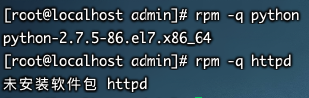
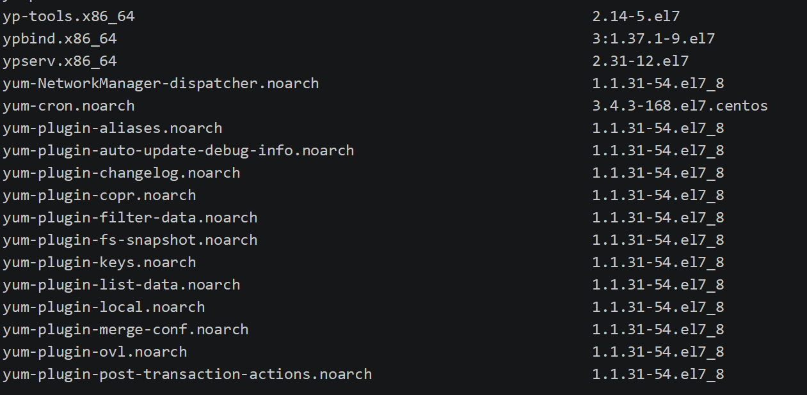
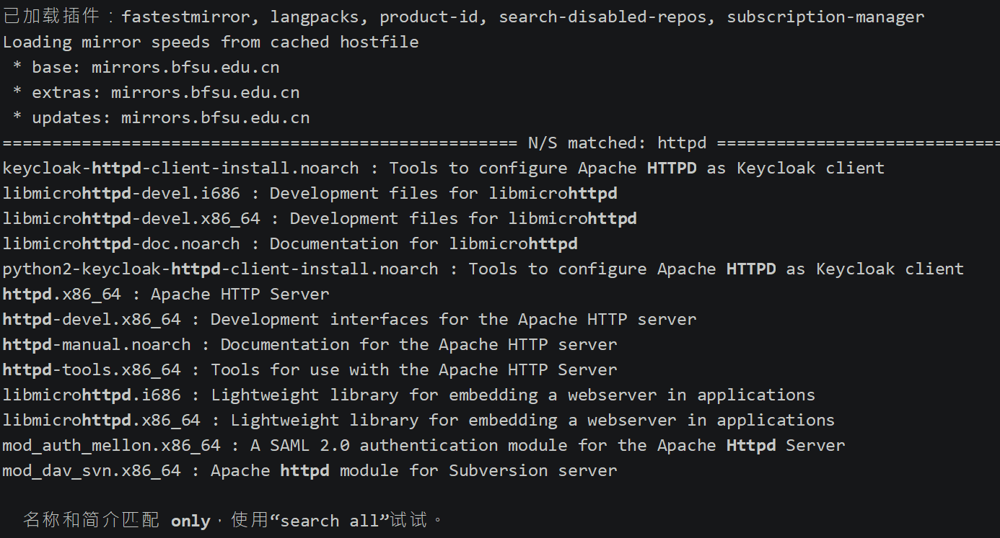
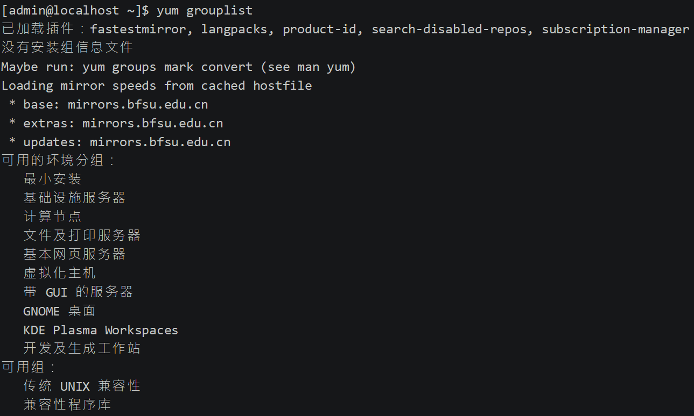

## 简介

### 1、软件包分类

- 源码包 

 	脚本安装包 ，需要编译为二进制包后安装，时间长

- 二进制包（RPM包、系统默认包）

   

### 2、源码包的优点是： 

- 开源，如果有足够的能力，可以修改源代码 

- 可以自由选择所需的功能 

- 软件是编译安装，所以更加适合自己的系统，更加稳定也效率更高 

- 卸载方便，直接删除安装目录即可 


### 3、源码包的缺点 

- 安装过程步骤较多，尤其安装较大的软件集合时（如LAMP环境搭建），容易出现拼写错误

- 编译过程时间较长，安装比二进制安装时间长 

- 因为是编译安装，安装过程中一旦报错新手很难解决

 


### 4、二进制包的优点 

- 包管理系统简单，只通过几个命令就可以实现包的安装、升级、查询和卸载 

- 安装速度比源码包安装快的多

### 5、二进制包缺点：

- 经过编译，不再可以看到源代码 
- 功能选择不如源码包灵活 
- 依赖性

> **rpm**是由红帽公司开发的软件包管理方式，使用rpm我们可以方便的进行软件的安装、查询、卸载、升级等工作。但是rpm软件包之间的依赖性问题往往会很繁琐,尤其是软件由多个rpm包组成时。**yum**（全称为 Yellow dog Updater, Modified）是一个在Fedora和RedHat以及SUSE中的Shell前端软件包管理器。基於RPM包管理，能够从指定的服务器自动下载RPM包并且安装，可以自动处理依赖性关系，并且一次安装所有依赖的软体包，无须繁琐地一次次下载、安装。


## rpm命名规则

httpd-2.2.15-15.el6.centos.1.i686.rpm 

* httpd   软件包名 

* 2.2.15  软件版本 

* 15   软件发布的次数 

* el6.centos  适合的Linux平台 

* i686   适合的硬件平台 

* rpm   rpm包扩展名


## rpm包依赖性

- 树形依赖： a→b→c 
- 环形依赖： a→b→c→a 
- 模块依赖： 模块依赖查询网站：[www.rpmfind.net](http://www.rpmfind.net)

> 如果安装软件过程中提示缺少 XXXX.so.xx    这种属于模块依赖，需要去网站中进行下载，而不像环形树形依赖一样直接在系统依赖库中下载


## 解决包依赖问题-yum在线管理

> 上面我们发现 安装软件过程中会有许多的依赖，并且如果是模块依赖的话还需要在线下载，手动解决依赖非常的麻烦，因此出现了 想Maven类似的依赖网站，即YUM在线管理。而不必需要rmp安装

* 当然yum依赖库也可以使用本地光盘使用文件依赖服务器
* 红帽 yum依赖库收费，centos免费


## rpm使用(不推荐)

>   只有rpm这里才会区分包名和包全名，其他地方都是包名

### 1、包全名与包名 

- 包全名：操作的包是没有安装过的软件包时， 使用包全名。而且要注意路径

	即操作安装和升级的包需要用到包全名

- 包名：操作已经安装的软件包时，使用包名。

​        是搜索/var/lib/rpm/中的数据库


### 2、RPM安装

rpm –ivh 包全名 

选项：  

-i（install）   安装   

-v（verbose） 显示详细信息     

-h（hash）  显示进度   

--nodeps  不检测依赖性


### 3、RPM包升级

rpm  -Uvh  包全名 

选项：   

-U（upgrade）   升级


### 4、卸载 

rpm  -e  包名 

选项：   

-e（erase） 卸载   

--nodeps  不检查依赖性


## yum使用<font color=ff00aa>(推荐)</font>

> 由于 yum 没有包查询命令，因此需要借助rmp包的查询命令

### 1、查询包


* 查询是否安装

	```bash
	rpm  -q  包名
	```

	选项：  

	​	 -q 查询（query） 



* 查询所有已经安装的RPM包

	```bash
	rpm –qa
	```

	选项：   

	​	-a 所有（all）

* 查询软件包详细信息 

	```bash
	rpm –qi 包名 
	```

	选项：   

	​	-i 查询软件信息（information）   

	​	-p 查询未安装包信息（package）

* 查询包中文件安装位置 

	```bash
	rpm –ql 包名 
	```

	选项：   

	​	-l 列表（list）   

	​	-p 查询未安装包信息（package）

* 查询系统文件属于哪个RPM包 

	> 系统文件名必须是安装包时安装的系统文件，如果是自定义文件则反查不出

	```bash
	rpm –qf 系统文件名 
	```

	选项：  

	​	-f 查询系统文件属于哪个软件包（file）

* 查询软件包的依赖性  

	```bash
	rpm –qR 包名 
	```

	选项：  

	​	-R 查询软件包的依赖性（requires）  

	​	-p 查询未安装包信息（package）

	> 可以通过 rpm -qRp   查看要按照的软件包需要的依赖包


### 2、rpm包校验

**RPM包校验** 

```bash
rpm –V 已安装的包名
```

选项：  

-V 校验指定RPM包中的文件（verify）


> 如果文件没有发生修改则 没有提示信息。

验证内容中的8个信息的具体内容如下：

- S 文件大小是否改变 
- M 文件的类型或文件的权限（rwx）是否被改变 
- 5 文件MD5校验和是否改变（可以看成文件内容是否改变） 
- D 设备的中，从代码是否改变 
- L 文件路径是否改变 
- U 文件的属主（所有者）是否改变 
- G 文件的属组是否改变 
- T 文件的修改时间是否改变

文件类型 

- c 配置文件（config file） 
- d 普通文档（documentation） 
- g “鬼”文件（ghost file），很少见，就是该文件不应该被这个RPM包包含
-  l 授权文件（license file） 
- r 描述文件（read me）


**RPM包中文件提取**

> 用以恢复误删除的文件，然后拷贝出包中此文件进行替换即可

```bash
rpm2cpio 包全名 | cpio -idv .文件绝对路径   
```


### 3、yum在线安装包

>   yum不仅可以在线安装包，也可以使用其他包括光盘本地包服务器等安装

`基操`

1.  查询所有可用软件包列表

    ```bash
    yum list
    ```

    


2.  查询服务器上和关键字相关的包

    ```bash
    yum search 关键字
    ```

    

3.  包安装

    ```bash
    yum –y install 包名 
    ```

    *    install 安装  
    *   -y  自动回答yes

4.  包升级（<font color=ff00aa>最好不要用</font>）

    ```bash
    yum -y update 包名 
    ```

    *   update 升级  

    *   -y  自动回答yes

    >   如果没有添加包名，则是更新所有包括系统核，切勿操作

5.  包卸载（<font color=ff00aa>最好不要用</font>）

    ```bash
    yum -y remove 包名 
    ```

    *   remove  卸载  
    *   -y  自动回答yes

`yum软件组管理`

>   就是我们安装系统时，是否安装的自带软件。比如网络、调试、字体、性能工具等

1.  查看自带软件可选项

    ```bash
    yum grouplist
    ```

    

2.  安装工作组

    ```bash
    yum groupinstall  软件组名  #切记不能是用中文名来安装，上面grouplist是中文，因为是远程，进入虚拟机内部执行即是英文，并且如果组名英文中有空格，要使用""括起来
    ```

3.  卸载工作组

    ```bash
    yum groupremove  软件组名 
    ```

    

### 4、局域网使用yum

>   百度搜索   “centos搭建局域网yum”