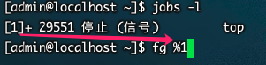
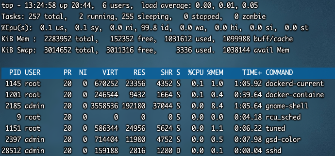

## 工作管理

### 把进程放入后台

> 使用 &   和     ctrl+z快捷键

```bash
tar -zcf etc.tar.gz /etc &  [程序还在运行]
top 
#在top命令执行的过程中，按下ctrl+z快捷键  [程序已经暂停，除非恢复]
```


### 查看后台的工作

`格式`

```bash
jobs [-l]
```

`选项`

* -l: 显示工作的PID


> 注："+"号表示最近一个放入后台的工作，也是工作恢复时，默认恢复的工作。"-"号代表倒数第二个放入后台的工作


### 将后台暂停的工作恢复到前台执行

`格式`

```shell
fg %工作号
```

`参数`

* %工作号：%号可以省略，但是注意工作号和PID的区别

`案例`






### 把后台暂停的工作恢复到后台执行

`格式`

```shell
bg %工作号
```

> 注：后台恢复执行的命令，是不能和前台有交互的，否则不能恢复到后台执行。因为有交互的命令本身设计本身就是要和用户交互，你放到后台执行没意义了
>
> 即：命令和前台有交互是不能恢复到后台运行。例如：top，vi


### 系统资源查看