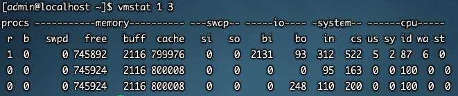
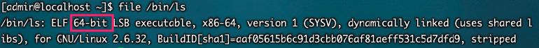
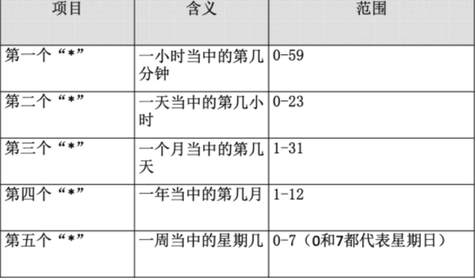
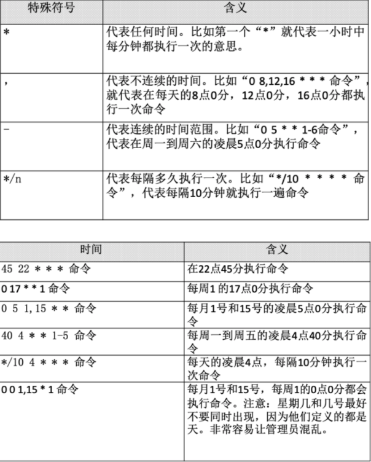
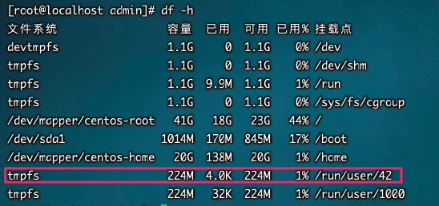

## 工作管理

### 把进程放入后台

> 使用 &   和     ctrl+z快捷键

```bash
tar -zcf etc.tar.gz /etc &  [程序还在运行]
top 
#在top命令执行的过程中，按下ctrl+z快捷键  [程序已经暂停，除非恢复]
```


### 查看后台的工作

`格式`

```bash
jobs [-l]
```

`选项`

* -l: 显示工作的PID


> 注："+"号表示最近一个放入后台的工作，也是工作恢复时，默认恢复的工作。"-"号代表倒数第二个放入后台的工作


### 将后台暂停的工作恢复到前台执行

`格式`

```shell
fg %工作号
```

`参数`

* %工作号：%号可以省略，但是注意工作号和PID的区别

`案例`


### 把后台暂停的工作恢复到后台执行

`格式`

```shell
bg %工作号
```

> 注：后台恢复执行的命令，是不能和前台有交互的，否则不能恢复到后台执行。因为有交互的命令本身设计本身就是要和用户交互，你放到后台执行没意义了
>
> 即：命令和前台有交互是不能恢复到后台运行。例如：top，vi


### 系统资源查看

* 监控系统资源

	`格式`

	```bash
	vmstat [刷新延时 刷新次数]  
	```

	

	`例如`

	```bash
	vmstat 1 3
	```

	

* 开机时内核检测信息

	`格式`

	```bash
	dmesg
	dmesg | grep CPU
	```

* 查看内存使用状态

	`格式`

	```bash
	free [-b|-k|-m|-g] 
	```

	`选项`

	* -b： 以字节为单位显示  
	* -k： 以KB为单位显示，默认就是以   KB为单位显示  
	* -m： 以MB为单位显示  
	* -g： 以GB为单位显示  

	`案例`

	


* 查看CPU信息

	```bash
	cat /proc/cpuinfo  
	```

* uptime命令

	```bash
	uptime  
	#显示系统的启动时间和平均负载，也就是top命令的第一行。w命令也可以看到这个数据。
	```

* 查看系统与内核相关信息

	```bash
	uname [选项] 
	```

	`选项`： 
	-a： 查看系统所有相关信息；  
	-r： 查看内核版本；  
	-s： 查看内核名称。 

* 判断当前系统的位数

	```bash
	file /bin/ls
	```

	


* 查询当前Linux系统的发行版本

	```bash
	 lsb_release -a 
	 或者
	 cat /etc/os-release
	```

* 列出进程打开或使用的文件信息 

	```bash
	lsof [ 选项] 
	# 列出进程调用或打开的文件的信息 
	```

	`选项： `

	- c  字符串： 只列出以字符串开头的进程打开的文件  
	- u  用户名： 只列出某个用户的进程打开的文   件  
	- p  pid ：  列出某个PID进程打开的文件


## 系统定时任务

> 工具 ： crond服务，默认自启

* crond服务启动

	```bash
	service crond restart   
	chkconfig crond on
	```

	


* 使用

	```bash
	crontab [选项] 
	```

	`选项：`  

	-e：  编辑crontab定时任务  

	-l：  查询crontab任务  

	-r：  删除当前用户所有的crontab任务


1. 编辑任务

	```bash
	crontab -e
	#进入crontab编辑界面。会打开vim编辑你的工作。 
	#文件书写格式如下 ：* * * * * 执行的任务      #可以是命令也可以是脚本
	```

	

	

2. 举例

	```bash
	*/5 * * * * /bin/echo ”11” >> /tmp/test 
	# 每隔五分钟 在/tmp/test文件中写入11
	5 5 * * 2 /sbin/shutdown -r now  
	# 没周二 五点五分 关机
	0 5 1,10,15 * * /root/sh/autobak.sh
	# 每月1，10，15号五点执行autobak.sh脚本
	```


3. 查询

	```bash
	crontab -l
	```

	

## 备份和恢复

### Linux系统需要备份的数据 

- /root/目录： 
- /home/目录：
- /var/spool/mail/目录： 
- /etc/目录： 
- 其他目录： 


### **安装服务的数据** 

- apache需要备份的数据 

- - 配置文件 
	- 网页主目录 
	- 日志文件 

* mysql需要备份的数据
	* 源码包安装的mysql：/usr/local/mysql/data/ 
	* RPM包安装的mysql：/var/lib/mysql/


### **dump和restore命令**

#### dump命令

```
dump [选项] 备份之后的文件名 原文件或目录 
```

> 默认没有安装，使用rpm -qa |grep dump查询，
>
> 安装：

`选项：`  

* -level： 就是我们说的0-9十个备份级别  如果 -0 则完全备份，-1，-2，-3。。。则为第几次增量备份，最好支持9次
* -f 文件名： 指定备份之后的文件名  
* -u：  备份成功之后，把备份时间记录在/etc/dumpdates文件  
* -v：  显示备份过程中更多的输出信息  
* -j：  调用bzlib库压缩备份文件，其实就是把备份文件压缩  为.bz2格式，默认压缩等级是2  
* -W： 显示允许被dump的分区的备份等级及备份时间  


`备份文件或目录`

```bash
dump -0j -f /root/etc.dump.bz2 /etc/
#完全备份/etc/目录，只能使用0级别进行完全备份，而不再支持增量备份 
```

 

`备份分区` 

```bash
dump -0uj -f /root/boot.bak.bz2 /boot/ 
#备份命令。先执行一次完全备份，并压缩和更新备份时间 
```


```bash
cat /etc/dumpdates 
#查看备份时间文件 

cp install.log /boot/ 
#复制日志文件到/boot分区 

dump -1uj -f /root/boot.bak1.bz2 /boot/ 
#增量备份/boot分区，并压缩 

dump –W 
#查询分区的备份时间及备份级别的
```

`案例`



> 备份最小的

```bash
dump -0uj -f /tmp/user42.bak.bz2 /run/user/42
```


#### restore命令 

```bash
restore [模式选项] [选项]
```

`模式选项：`

> restore命令常用的模式有以下四种，这四个模式不能混用。 

* -C：比较备份数据和实际数据的变化  
* -i： 进入交互模式，手工选择需要恢复的文件。 
* -t： 查看模式，用于查看备份文件中拥有哪些数据。 
* -r： 还原模式，用于数据还原。 

`选项`： 

* -f： 指定备份文件的文件名


